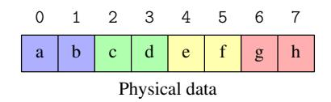
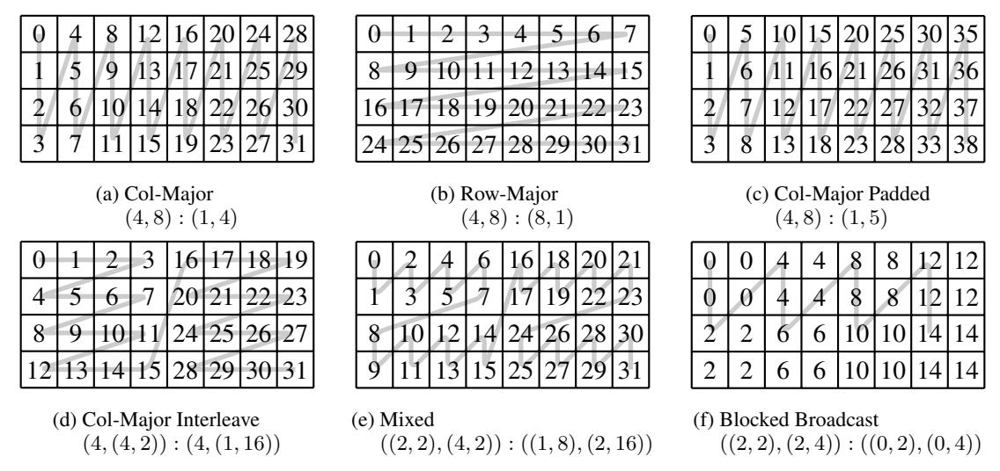
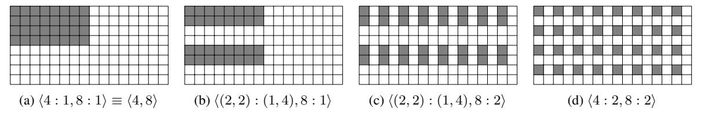
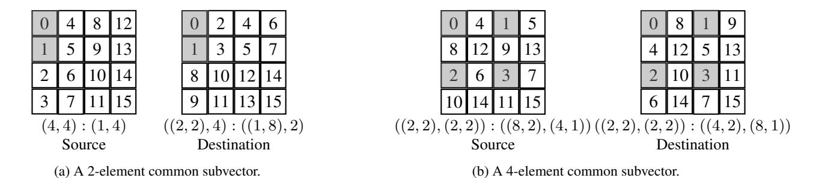
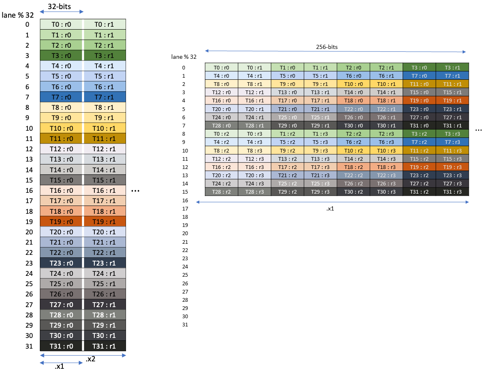
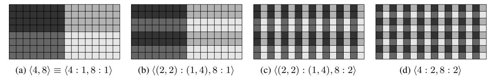

# CUTE LAYOUT REPRESENTATION AND ALGEBRA / CUTE 布局表示与代数

#### A PREPRINT / 预印本

### Cris Cecka, NVIDIA Research, ccecka@nvidia.com

---

## Abstract / 摘要

> Modern architectures for high-performance computing and deep learning increasingly incorporate specialized tensor instructions, including tensor cores for matrix multiplication and hardware-optimized copy operations for multi-dimensional data. These instructions prescribe fixed, often complex data layouts that must be correctly propagated through the entire execution pipeline to ensure both correctness and optimal performance. We present CUTE, a novel mathematical specification for representing and manipulating tensors. CUTE introduces two key innovations: (1) a hierarchical layout representation that directly extends traditional flat-shape and flat-stride tensor representations, enabling the representation of complex mappings required by modern hardware instructions, and (2) a rich algebra of layout operations – including concatenation, coalescence, composition, complementation, division, tiling, and inversion – that enables sophisticated layout manipulation, derivation, verification, and static analysis. CUTE layouts provide a framework for managing both data layouts and thread arrangements in GPU kernels, while the layout algebra enables powerful compile-time reasoning about layout properties and the expression of generic tensor transformations.

现代高性能计算和深度学习架构越来越多地采用专用张量指令，包括用于矩阵乘法的张量核心（Tensor Cores）和用于多维数据的硬件优化拷贝操作。这些指令规定了固定且通常复杂的数据布局，必须在整个执行管线中正确传播，以确保正确性和最优性能。我们提出了 CUTE——一种用于表示和操作张量的新型数学规范。CUTE 引入了两项关键创新：(1) 层次化布局表示（hierarchical layout representation），直接扩展了传统的扁平形状和扁平步长张量表示，能够表示现代硬件指令所需的复杂映射；(2) 丰富的布局运算代数——包括连接（concatenation）、合并（coalescence）、组合（composition）、补运算（complementation）、除法（division）、分块（tiling）和求逆（inversion）——支持复杂的布局操作、推导、验证和静态分析。CUTE 布局为管理 GPU 核函数中的数据布局和线程排列提供了框架，而布局代数则支持对布局属性的强大编译期推理和通用张量变换的表达。

> In this work, we demonstrate that CUTE's abstractions significantly aid software development compared to traditional approaches, promote compile-time verification of architecturally prescribed layouts, facilitate the implementation of algorithmic primitives that generalize to a wide range of applications, and enable the concise expression of tiling and partitioning patterns required by modern specialized tensor instructions.

在本文中，我们证明 CUTE 的抽象相比传统方法显著提升了软件开发效率，促进了架构规定布局的编译期验证，便于实现可泛化到广泛应用的算法原语，并能简洁地表达现代专用张量指令所需的分块和分区模式。

> CUTE has been successfully deployed in production systems, forming the foundation of NVIDIA's CUTLASS library and a number of related efforts including CuTe DSL.

CUTE 已成功部署于生产系统，构成了 NVIDIA CUTLASS 库及相关项目（包括 CuTe DSL）的基础。

---

## Contents / 目录

1. Introduction and Motivation / 引言与动机
   - 1.1 Related Work / 相关工作
   - 1.2 Canonical Loops and Loop Transformations / 规范循环与循环变换
   - 1.3 Tensors and Folding / 张量与折叠
2. Layout Representation / 布局表示
   - 2.1 Tuples and HTuples / 元组与层次元组
   - 2.2 Shape / 形状
     - 2.2.1 Coordinate Sets and Compatibility / 坐标集与相容性
     - 2.2.2 Coordinates / 坐标
   - 2.3 Stride / 步长
     - 2.3.1 Integer-Semimodules / 整数半模
   - 2.4 Layout / 布局
     - 2.4.1 Notations and Operations / 符号与运算
     - 2.4.2 Layout Examples / 布局示例
     - 2.4.3 Completeness / 完备性
     - 2.4.4 Semi-Linearity / 半线性性
   - 2.5 Tensor / 张量
     - 2.5.1 Slicing / 切片
   - 2.6 Applications / 应用
     - 2.6.1 COPY
     - 2.6.2 GEMM
3. Layout Algebra / 布局代数
   - 3.1 Concatenate / 连接
   - 3.2 Coalesce / 合并
   - 3.3 Composition / 组合
     - 3.3.1 Composition Properties / 组合性质
     - 3.3.2 Evaluation and Restrictions / 求值与限制
     - 3.3.3 Intuition and Divisibility / 直觉与可整除性
     - 3.3.4 Application: Partitioning Example / 应用：分区示例
     - 3.3.5 By-mode Composition and Tilers / 逐模组合与分块器
   - 3.4 Inverse / 逆
     - 3.4.1 Right-Inverse / 右逆
     - 3.4.2 Application: Vectorization Example / 应用：向量化示例
     - 3.4.3 Left-Inverse / 左逆
     - 3.4.4 Application: Admissibility Example / 应用：可容性示例
   - 3.5 Complement / 补
     - 3.5.1 Application: Logical Product / 应用：逻辑积
     - 3.5.2 Application: Logical Divide / 应用：逻辑除
4. Conclusion / 结论

---

### Acknowledgments / 致谢

> The authors thank Vijay Thakkar for being an early adopter of CUTE, for his pivotal role in its popularization and integration into CUTLASS, and for substantial contributions to its foundational design and deployment. They also thank Andrew Kerr, Pradeep Ramani, and Manish Gupta for their insights into using CUTE within CUTLASS and for driving its early adoption in the development of high-performance kernels. They thank Muhammad Osama and Duane Merrill for early experimental work with CUTE prototypes and low-level performance optimizations in initial CUTE examples. Finally, the authors thank Michael Garland, Bastian Hagedorn, Jay Shah, and Amanda Liu for insightful feedback and for repeatedly challenging the CUTE specifications.

作者感谢 Vijay Thakkar 作为 CUTE 的早期采用者，在其推广和集成到 CUTLASS 中发挥了关键作用，并对其基础设计和部署做出了重要贡献。还要感谢 Andrew Kerr、Pradeep Ramani 和 Manish Gupta 对在 CUTLASS 中使用 CUTE 的见解以及推动其在高性能核函数开发中的早期采用。感谢 Muhammad Osama 和 Duane Merrill 对 CUTE 原型的早期实验工作和初始 CUTE 示例中的底层性能优化。最后感谢 Michael Garland、Bastian Hagedorn、Jay Shah 和 Amanda Liu 的深刻反馈以及对 CUTE 规范的反复检验。

---

## 1 Introduction and Motivation / 引言与动机

> Modern GPUs are increasingly optimized for tensor-centric computations, driven by the demands of deep learning and scientific computing. NVIDIA's Volta architecture [1] introduced Tensor Cores, enabling efficient small-matrix multiplications directly in hardware. This capability expanded in Turing [2] and Ampere [3] with specialized instructions for structured matrix movement within the GPU memory hierarchy. The Hopper [4] and Blackwell [5] architectures further advance this paradigm, introducing copy instructions for efficiently transferring rank-5 tensors between global and shared memory and further expanding tensor core capabilities. Fully harnessing these tensor-oriented hardware features is critical for peak GPU performance, motivating high-performance programming models that can represent and manipulate these tensors efficiently.

现代 GPU 在深度学习和科学计算需求的驱动下，越来越多地针对以张量为中心的计算进行优化。NVIDIA 的 Volta 架构 [1] 引入了张量核心（Tensor Cores），实现了高效的硬件级小矩阵乘法。Turing [2] 和 Ampere [3] 架构通过 GPU 存储层次中结构化矩阵搬运的专用指令进一步扩展了这一能力。Hopper [4] 和 Blackwell [5] 架构引入了在全局内存和共享内存之间高效传输秩-5 张量的拷贝指令，并进一步扩展了张量核心的能力。充分利用这些面向张量的硬件特性对于实现 GPU 峰值性能至关重要，这推动了能够高效表示和操作这些张量的高性能编程模型的发展。

> The existing and emerging hardware depends critically on how multidimensional data is stored and accessed in multiple hierarchical memory spaces and in multiple hierarchical levels of parallelism. Data storage layouts have always affected performance by dictating how and when memory accesses occur, but as hardware instructions become larger and prescribe fixed layouts for inputs and outputs the effect on correctness also becomes vital. These layouts must be propagated through the entire execution pipeline to ensure correct invocation of hardware instructions and ensure optimized memory access patterns.

现有和新兴硬件的性能关键取决于多维数据在多层次存储空间和多层次并行结构中的存储和访问方式。数据存储布局一直通过决定内存访问的方式和时机来影响性能，但随着硬件指令变得更大并规定了输入输出的固定布局，对正确性的影响也变得至关重要。这些布局必须在整个执行管线中传播，以确保硬件指令的正确调用和优化的内存访问模式。

> In this work, we present the foundational concepts of CUTE, a specification for CUDA Tensors, or Compute Unified Tensors, designed to provide building blocks for writing peak-performance linear algebra libraries. At its core, CUTE introduces two key innovations:

在本文中，我们介绍了 CUTE 的基础概念——CUDA Tensors（CUDA 张量）或 Compute Unified Tensors（计算统一张量）的规范，旨在为编写峰值性能线性代数库提供基础构建模块。其核心引入了两项关键创新：

> - A *novel representation for tensor layouts*: CUTE shapes, layouts, and tensors are inherently hierarchical, constructed from smaller nested instances. This hierarchy provides the means to represent complex mappings required by modern tensor instructions, but remains a strict extension of existing flat-shape and flat-stride representations found in libraries like BLAS, torch.tensor, numpy.ndarray, and MATLAB.
> - A *novel algebra of operations defined over layouts*: CUTE layouts support a rich set of operations, including concatenation, coalescence, composition, complementation, division, tiling, and inversion, which all result in new CUTE layouts. These operations enable sophisticated partitioning, manipulation, verification, and derivation of tensor layouts demanded by modern tensor instructions.

- **张量布局的新型表示**：CUTE 的形状、布局和张量本质上是层次化的，由更小的嵌套实例构建而成。这种层次结构提供了表示现代张量指令所需复杂映射的手段，同时仍然是 BLAS、torch.tensor、numpy.ndarray 和 MATLAB 等库中现有扁平形状和扁平步长表示的严格扩展。
- **定义在布局上的新型运算代数**：CUTE 布局支持丰富的运算集，包括连接、合并、组合、补运算、除法、分块和求逆，所有这些运算都产生新的 CUTE 布局。这些运算支持现代张量指令所需的复杂分区、操作、验证和布局推导。

> CUTE's layout representation provides an intuitive framework for managing threads and data in writing generic algorithms. CUTE's layout algebra provides an expressive approach for manipulating layouts and generating new layouts in the development of high-performance linear algebra kernels. These approaches enable:
> - Support for complex layouts and partitioning
> - Separation of concerns
> - Static analysis and optimization

CUTE 的布局表示为编写通用算法时管理线程和数据提供了直观框架。CUTE 的布局代数为高性能线性代数核函数开发中的布局操作和生成提供了富有表达力的方法。这些方法实现了：
- **支持复杂布局和分区**：CUTE 便于表示应用特定的数据模式和专用张量指令所需的复杂分区模式。
- **关注点分离**：数据布局独立于算法逻辑声明，促进清晰性和模块化。
- **静态分析和优化**：复杂的代数技术支持根据架构约束对张量参数进行检查、重排和分区。

### 1.1 Related Work / 相关工作

> CUTE is motivated by the need to support development of efficient tensor contractions, which are at the core of many scientific computing and machine learning applications. Conventional approaches for computing general tensor contractions rely on matricization, which involves logically or explicitly restructuring tensor data to perform computations using a sequence of calls to a Basic Linear Algebra Subprograms (BLAS) library.

CUTE 的开发动机源于支持高效张量收缩（tensor contractions）开发的需求，张量收缩是许多科学计算和机器学习应用的核心。计算通用张量收缩的传统方法依赖于矩阵化（matricization），即对张量数据进行逻辑或显式重构，通过一系列 BLAS（基本线性代数子程序）库调用来执行计算。

> BLAS provides efficient and portable implementations of core linear algebra operations, with highly optimized versions available for a wide range of architectures [6]. Among BLAS primitives, the GEneral Matrix Multiply (GEMM) routine is easily the most optimized and widely used operation in all of scientific computing and machine learning.

BLAS 提供了核心线性代数运算的高效可移植实现，有面向各种架构的高度优化版本 [6]。在 BLAS 原语中，通用矩阵乘法（GEMM）是科学计算和机器学习中最经优化和最广泛使用的运算。

> The BLAS-like Library Instantiation Software (BLIS) framework [7] extends GEMM by supporting non-unit strides in both row and column modes simultaneously, which addresses some challenges in handling irregular memory layouts without resorting to explicit memory copies. The strided-batched GEMM extension to BLAS further generalizes the primitive and allows its application to even more tensor contractions [8]. Abstracting matrix layouts even further, a key insight motivating CUTE is the use of multi-indices in tensor notation to enable the transformation of arbitrary tensor contractions into a canonical batched-GEMM primitive.

BLIS 框架 [7] 通过同时支持行和列方向的非单位步长来扩展 GEMM，解决了在不进行显式内存拷贝的情况下处理不规则内存布局的部分挑战。BLAS 的步长批处理 GEMM 扩展进一步泛化了该原语，使其可应用于更多的张量收缩 [8]。更进一步抽象矩阵布局，驱动 CUTE 的一个关键洞察是使用张量记号中的多重索引（multi-indices），将任意张量收缩转换为规范的批处理 GEMM 原语。

> Many existing libraries rely on tensors and nearly all of them are based on the flat-shape and flat-stride representation.

许多现有库依赖张量，几乎所有这些库都基于扁平形状和扁平步长表示。在 Python 中包括 numpy.ndarray 和 torch.tensor：

```
>>> import numpy
>>> a = numpy.ndarray([3,7,5])
>>> a.dtype
dtype('float64')
>>> a.shape
(3, 7, 5)
>>> a.strides
(280, 40, 8)
```

```
>>> import torch
>>> a = torch.empty(3,7,5)
>>> a.dtype
torch.float32
>>> a.shape
torch.Size([3, 7, 5])
>>> a.stride()
(35, 5, 1)
```

在 C++ 中包括 std::mdspan：

```
std::mdspan a = std::mdspan(data, 3, 7, 5);
a.extent(0);  // 3
a.extent(1);  // 7
a.extent(2);  // 5
a.stride(0);  // 35
a.stride(1);  // 5
a.stride(2);  // 1
```

> CUTE supports these representations and strictly expands on them with generalizations to hierarchical shapes and strides to represent more complex layouts, non-integral strides, and non-integral layout codomains.

CUTE 支持这些表示，并通过泛化为层次化形状和步长来严格扩展它们，以表示更复杂的布局、非整数步长和非整数布局陪域。

> Independent generalizations of dense tensor representations include HeLayers [9], ThunderKittens [10], and the Linear Layouts [11] approach used in OpenAI's Triton compiler [12]. Thunderkittens implements a wide variety of bespoke types for register memory, shared memory, row/column-major tiles, row/column-major tiles of row/column-major subtiles, and prescribed access patterns for warps and threads. Linear Layouts are based on $\mathbb{F}_2$ linear algebra and provide a more general representation of tensor layouts. Linear Layouts' strict reliance on $\mathbb{F}_2$ makes some of the operators difficult for humans to inspect and limits the work to power-of-two shapes and strides, which is unacceptable to many applications.

稠密张量表示的独立泛化工作包括 HeLayers [9]、ThunderKittens [10] 以及 OpenAI Triton 编译器 [12] 中的线性布局（Linear Layouts）[11] 方法。ThunderKittens 为寄存器内存、共享内存、行/列主序分块等实现了多种专用类型。线性布局基于 $\mathbb{F}_2$ 线性代数，提供了更通用的张量布局表示。但线性布局对 $\mathbb{F}_2$ 的严格依赖使得部分算子难以人工检查，并将工作限制在二的幂次形状和步长上，这对许多应用来说是不可接受的。

> The design and concepts of CuTe have already demonstrated utility in several applications. For instance, CuTe has been used within the Graphene tensor compiler [20], the Stream-K algorithm [21], CUTLASS v3 [22], FlashAttention [23, 24, 25], and CuTe DSL [26].

CUTE 的设计和概念已在多个应用中证明了其价值，包括 Graphene 张量编译器 [20]、Stream-K 算法 [21]、CUTLASS v3 [22]、FlashAttention [23, 24, 25] 及 CuTe DSL [26]。

### 1.2 Canonical Loops and Loop Transformations / 规范循环与循环变换

> The explicit calculation of loop indices is a common challenge in the development of high-performance linear algebra kernels. These calculations are difficult for programmers to get right and even more challenging to maintain. Rather than coupling information about data access with algorithmic logic, we prefer to write algorithmic logic clearly in terms of matrix/vector coordinates and abstract the data access patterns to the data layouts.

显式计算循环索引是高性能线性代数核函数开发中的常见难题。这些计算不仅程序员难以写对，更难以维护。我们倾向于用矩阵/向量坐标清晰地编写算法逻辑，而将数据访问模式抽象到数据布局中。

> We consider a *standard loop form* to be a loop with a single index, starting at zero, bounded by a constant, and incremented by 1 each iteration.

我们将**标准循环形式**定义为单索引、从零开始、上界为常数、每次迭代加 1 的循环。

例如以下循环：

```
f o r ( i n t m = 2; m <= 50; m += 3)
  A [ m ] = e ( m );
```

该循环设置 A[2], A[5], A[8], ... 的值。可以变换为规范循环形式：

```
f o r ( i n t i = 0; i < 17; ++ i )
  ( A + 2)[3* i ] = g ( i );
```

> It is now intuitive to interpret the above example as iterating through a logically 17-element vector, where the logical coordinate is strided by 3 to index the data at base address A + 2. This program can be represented with the following data: Accessor: A + 2, Shape: 17, Stride: 3.

现在直觉上可以将上述示例解释为遍历一个逻辑上的 17 元素向量，其逻辑坐标以步长 3 索引基地址 A+2 处的数据。该程序可用以下数据表示：访问器：A+2，形状：17，步长：3。

> A key observation is that the 4×20 matrix can also be interpreted as an 80-element vector with non-uniform, semi-affine striding. The shape representation can accept both 2D coordinates and 1D coordinates, providing a flexible and rank-agnostic framework for indexing data.

关键观察是 4×20 矩阵也可视为具有非均匀半仿射步长的 80 元素向量。形状表示既可接受 2D 坐标也可接受 1D 坐标，为数据索引提供了灵活的、与秩无关的框架。

> Because there is a one-to-one correspondence between the Shape:Stride information and the loop nest itself, we can ask "What are valid ways to transform the Shape:Stride representation?" These transformation operators P are the same objects that we use to represent the data access and loop nests themselves.

由于 Shape:Stride 信息与循环嵌套本身存在一一对应关系，我们可以问"Shape:Stride 表示有哪些合法变换？"这些变换算子 $P$ 与我们用来表示数据访问和循环嵌套的是同一类对象。

$$\mathbf{L}' = P(\mathbf{L}) = \mathbf{L} \circ P$$

### 1.3 Tensors and Folding / 张量与折叠

> Tensors are denoted by bold letters, indices by lowercase letters, and the bounds of those indices by their corresponding uppercase letters. Summation is implied over repeated indices (Einstein notation).

张量用粗体字母表示，索引用小写字母，索引的上界用相应大写字母。对重复索引隐含求和（爱因斯坦约定）。

张量收缩的一个实例为：

$$\mathbf{C}_{stap} = \mathbf{A}_{stupr} \, \mathbf{B}_{atru}$$

> The above tensor contraction can be rewritten by grouping modes into four types: Row modes (appear in A and C), Column modes (appear in B and C), Reduction modes (appear in A and B), and Batch modes (appear in A, B, and C). This is referred to as tensor *folding*.

上述张量收缩可通过将模（mode）分为四类来重写：行模（出现在 A 和 C 中）、列模（出现在 B 和 C 中）、归约模（出现在 A 和 B 中）和批模（出现在 A、B 和 C 中）。这称为张量**折叠**（folding）。

> Folding a tensor need not require any explicit copy, but can instead simply be a change of view of the data. The CUTE representation emphasizes that tensor folding is just grouping modes together.

折叠张量未必需要显式拷贝，可仅为数据视图的变换。CUTE 表示强调张量折叠本质上只是将模进行分组。

> This generalized form of tensor folding allows all tensor contractions to be written in a single canonical contraction form:

这种推广形式的张量折叠使所有张量收缩都可写为单一规范收缩形式：

$$\mathbf{C}_{\widehat{m}\widehat{n}\widehat{\ell}} = \mathbf{A}_{\widehat{m}\widehat{k}\widehat{\ell}} \mathbf{B}_{\widehat{n}\widehat{k}\widehat{\ell}}$$

> Any tensor contraction can be folded into a canonical batched-GEMM and evaluated with a trivial reference implementation composed of four nested loops.

任意张量收缩都可折叠为规范的批处理 GEMM，并用由四层嵌套循环组成的简单参考实现来求值。

```
f o r ( i n t l = 0; l < L ; ++ l )
  f o r ( i n t m = 0; m < M ; ++ m )
     f o r ( i n t n = 0; n < N ; ++ n )
        f o r ( i n t k = 0; k < K ; ++ k )
          C (m ,n , l ) += A (m ,k , l ) * B (n ,k , l );
```



> **Figure 1.** Tensor folding examples showing flat and CUTE representations.
>
> **图 1.** 张量折叠示例，展示了扁平表示和 CUTE 表示。

---

## 2 Layout Representation / 布局表示

> CUTE layouts are versatile objects that are capable of representing a wide range of data and thread arrangements and have great utility in abstracting physical addresses and separating iteration order from storage order.

CUTE 布局是用途广泛的对象，能够表示各种数据和线程排列，善于抽象物理地址、分离迭代次序与存储次序。

### 2.1 Tuples and HTuples / 元组与层次元组

> **Definition 2.1.** A Tuple(T) is a finite, ordered list of elements selected from a set T.

**定义 2.1.** 元组 Tuple(T) 是从集合 T 中选取的有限有序列表。

> **Definition 2.2.** An HTuple(T) is either an element of set T or a Tuple(HTuple(T)) — a "hierarchical tuple of Ts".

**定义 2.2.** 层次元组 HTuple(T) 要么是集合 T 的一个元素，要么是 Tuple(HTuple(T))——"T 的层次化元组"。

> **Definition 2.3.** *Congruence*, ∼, is an equivalence relation on HTuples. P ∼ S iff both are atoms or both are tuples of the same rank with congruent elements.

**定义 2.3.** **全等**（Congruence）∼ 是 HTuple 上的等价关系。$P \sim S$ 当且仅当两者都是原子，或两者都是相同秩的元组且各元素全等。

> **Definition 2.4.** *Weak Congruence*, ≲, is a partial order. P ≲ S iff P is an atom, or both are tuples of the same rank with P_i ≲ S_i.

**定义 2.4.** **弱全等**（Weak Congruence）≲ 是偏序关系。$P \lesssim S$ 当且仅当 P 是原子，或两者都是相同秩的元组且 $P_i \lesssim S_i$。

### 2.2 Shape / 形状

> **Definition 2.5.** A *shape* is an HTuple($\mathbb{Z}^+$). The size of a shape S is the product of its elements, denoted |S|.

**定义 2.5.** **形状**是 HTuple($\mathbb{Z}^+$)。形状 S 的大小是其各元素之积，记为 |S|。

> What makes hierarchical shapes particularly useful is that they can be indexed by multiple coordinate systems.

层次化形状特别有用的原因在于它们可以被多种坐标系索引。

> **Definition 2.7.** *Compatibility*, ⪯, is a partial order on shapes. P ⪯ S iff P = |S| (for integers) or rank(P) = rank(S) and $P_i \preceq S_i$ for all i.

**定义 2.7.** **相容性**（Compatibility）⪯ 是形状上的偏序。$P \preceq S$ 当且仅当 $P = |S|$（整数情形）或 $\text{rank}(P) = \text{rank}(S)$ 且对所有 $i$ 有 $P_i \preceq S_i$。

> The function idx2crd maps integral coordinates to natural coordinates (colexicographic ordering). The inverse crd2idx maps back.

函数 idx2crd 将整型坐标映射到自然坐标（反字典序）：

$$\text{idx2crd: } \mathbb{Z}_{|S|} \to \mathbb{Z}_{(|S_0|,|S_1|,\dots,|S_{r-1}|)}$$

$$i \mapsto \left(i \bmod |S_0|, \left\lfloor \frac{i}{|S_0|} \right\rfloor \bmod |S_1|, \dots\right)$$

逆函数 crd2idx 反向映射。二者仅在界内坐标上互为逆。

### 2.3 Stride / 步长

> **Definition 2.15.** A *stride* D for a shape S is an HTuple($\mathcal{D}$) congruent with S. This stride defines a mapping from natural coordinates to the codomain $\mathcal{D}$ via inner_product.

**定义 2.15.** 形状 S 的**步长** D 是与 S 全等的 HTuple($\mathcal{D}$)。步长通过 inner_product 定义从自然坐标到陪域 $\mathcal{D}$ 的映射。

$$\text{inner\_product: } \mathbb{Z} \cdot \mathcal{D} \to \mathcal{D}, \quad c \cdot d \mapsto cd$$

$$\text{inner\_product: } \text{HTuple}(\mathbb{Z}) \cdot \text{HTuple}(\mathcal{D}) \to \mathcal{D}, \quad c \cdot d \mapsto \sum_{i} \text{inner\_product}(c_{i}, d_{i})$$

#### 2.3.1 Integer-Semimodules / 整数半模

> **Definition 2.16.** An *integer-semimodule* is a set M equipped with an associative addition and a scalar multiplication $\mathbb{Z} \cdot M \to M$.

**定义 2.16.** **整数半模**是具有结合加法和标量乘法 $\mathbb{Z} \cdot M \to M$ 的集合 M。

> The integers $\mathbb{Z}$, rationals $\mathbb{Q}$, field $\mathbb{F}_2 = (\{0,1\}, \text{XOR}, \text{AND})$, and any Cartesian product of integer-semimodules are all integer-semimodules.

整数 $\mathbb{Z}$、有理数 $\mathbb{Q}$、域 $\mathbb{F}_2 = (\{0,1\}, \text{XOR}, \text{AND})$ 以及整数半模的任意笛卡尔积均为整数半模。

### 2.4 Layout / 布局

> **Definition 2.17.** A layout $\mathbf{L} = D \circ S$ is the functional composition of a shape S and a stride D, where $S \sim D$, and defines a mapping $Z \to \mathcal{D}$ for each $Z \in \mathbb{Z}(S)$.

**定义 2.17.** **布局** $\mathbf{L} = D \circ S$ 是形状 S 和步长 D 的函数复合，其中 $S \sim D$，为每个 $Z \in \mathbb{Z}(S)$ 定义映射 $Z \to \mathcal{D}$。

布局的记法：

$$S : D \quad \text{或} \quad D \circ S$$

> Since the domain(s) of a layout are determined by its shape, layout properties align closely with shape properties.

由于布局的定义域由其形状决定，布局的性质与形状性质紧密相关：
- $\text{rank}(\mathbf{L}) = \text{rank}(S)$：布局的秩即其形状的秩。
- $|\mathbf{L}| = |S|$：布局的大小即其形状的大小。
- $\mathbf{L}_i = S_i : D_i$：第 $i$ 个子布局。

#### 2.4.2 Layout Examples / 布局示例



> Figure 3 illustrates examples of data layouts commonly encountered in dense linear algebra libraries. Each layout is represented as a mapping from logical coordinates to an offset. The common row-major, column-major, and padded layouts are trivially represented by CUTE layouts, while the interleaved and mixed layouts demonstrate that the representation set is strictly expanded by using nested shapes and strides.

图 3 展示了稠密线性代数库中常见数据布局的示例。每个布局表示为从逻辑坐标到偏移量的映射。常见的行主序、列主序和填充布局可被 CUTE 布局简单表示，而交错和混合布局则证明了使用嵌套形状和步长严格扩展了布局表示集。

> Figure 4 illustrates layouts constructed with integer-semimodule strides: coordinate layouts and binary swizzle patterns.

图 4 展示了使用整数半模步长构建的布局：坐标布局和二进制 swizzle 模式。

#### 2.4.3 Completeness / 完备性

> Every function f with f(0) = 0 and finite domain $\mathbb{Z}_N$ can be represented as the functional composition of CUTE layouts. This means that CUTE layouts are a generating set under functional composition.

每个满足 $f(0) = 0$ 且定义域有限 $\mathbb{Z}_N$ 的函数 $f$，都可以表示为 CUTE 布局的函数复合。这意味着 CUTE 布局在函数复合下构成一个生成集。

#### 2.4.4 Semi-Linearity / 半线性性

> The layout function is linear in the natural coordinates but nonlinear in arbitrary coordinates.

布局函数对自然坐标 $\widetilde{c} \in \mathbb{Z}^S$ 是线性的，但对任意坐标 $c \in \mathbb{Z}(S)$ 一般是非线性的。

$$\mathbf{L}(\alpha \widetilde{c}_0 + \beta \widetilde{c}_1) = \alpha \mathbf{L}(\widetilde{c}_0) + \beta \mathbf{L}(\widetilde{c}_1)$$

> In the natural coordinates, $d \cdot \widetilde{c}$ can be interpreted as a generalized matrix-vector product. When strides are integers, $\mathbf{D} \in \mathbb{Z}^{1 \times n}$. When strides are coordinates, $\mathbf{D} \in \mathbb{Z}^{m \times n}$. When strides are binary sequences, $\mathbf{D} \in \mathbb{F}_2^{m \times n}$.

在自然坐标中，$d \cdot \widetilde{c}$ 可解释为广义矩阵-向量积。当步长为整数时，$\mathbf{D} \in \mathbb{Z}^{1 \times n}$；当步长为坐标时，$\mathbf{D} \in \mathbb{Z}^{m \times n}$；当步长为二进制序列时，$\mathbf{D} \in \mathbb{F}_2^{m \times n}$。

### 2.5 Tensor / 张量

> **Definition 2.18.** An *accessor* is an object that supports offset and dereference operations.

**定义 2.18.** **访问器**是支持偏移和解引用操作的对象。

> **Definition 2.19.** A *tensor* is defined by the composition of an accessor e with a layout $\mathbf{L}$: $T = e \circ \mathbf{L}$. Formally, $T(c) = e[\mathbf{L}(c)]$.

**定义 2.19.** **张量**由访问器 $e$ 与布局 $\mathbf{L}$ 的复合定义：$T = e \circ \mathbf{L}$。形式上，$T(c) = e[\mathbf{L}(c)]$。

#### 2.5.1 Slicing / 切片

> A tensor may be either *fully evaluated* or *partially evaluated* through *slicing*. When slicing with an incomplete coordinate $c = c' + c^*$, the result is a new tensor:

张量可以通过**切片**进行**完全求值**或**部分求值**。当用不完全坐标 $c = c' + c^*$ 切片时，结果是一个新张量：

$$T(c) = (e \circ \mathbf{L})(c' + c^*) = (e + \mathbf{L}(c')) \circ \mathbf{L}(c^*) = T'(c^*)$$

> CUTE does not support ranged slicing (like Python's `my_matrix[2:4,1:3]`). Instead, CUTE prefers a compose-and-slice approach using `logical_divide` followed by slicing.

CUTE 不支持区间切片（如 Python 的 `my_matrix[2:4,1:3]`）。CUTE 更倾向于使用 `logical_divide` 后接切片的**复合-切片**方法，将静态分块大小与动态线程索引分离：

```
tiled_data = logical_divide ( my_data , TILE_SIZE ) # ( TILE_SIZE , NumTiles )
thr_data = thr_tile_data [None , thr_id ]            # TILE_SIZE
```

### 2.6 Applications / 应用

> CUTE provides a compact representation for a set of layouts that is strictly larger than can be represented with traditional flat shapes and strides. The CUTLASS v2 code base contains nearly 300 separately implemented layouts in ~55,000 lines of code. CUTE's core requires only ~3,000 lines and represents all of them and more.

CUTE 用紧凑表示覆盖了比传统扁平形状和步长严格更大的布局函数集。CUTLASS v2 包含近 300 个单独实现的布局，分布在 87 个文件中，约 55,000 行代码。CUTE 核心仅需约 3,000 行即可表示所有这些布局及更多。

#### 2.6.1 COPY

> A generic COPY algorithm iterates through integral coordinates and copies elements.

通用 COPY 算法遍历整型坐标并拷贝元素：

```
// @pre size (src ) == size (dst )
void copy ( Tensor const & src , Tensor & dst ) {
  for ( int i = 0; i < size ( dst ); ++ i )
     dst ( i ) = src ( i );
}
```

> This simple implementation accommodates gather, scatter, broadcast, transpose, and tensor transpose by varying source and destination layouts. COPY is rank-agnostic.

通过改变源和目标布局，这个简单实现可适应聚集（gather）、散布（scatter）、广播（broadcast）、转置（transpose）和张量转置。COPY 与秩无关。

| 应用 / Application | 源布局 / Source Layout | 目标布局 / Dest Layout |
|---|---|---|
| 1D Arrays | 8 : 1 | 8 : 1 |
| Gather | (2, 3, 2) : (42, 1, 128) | 12 : 1 |
| Scatter | 12 : 1 | (2, 3, 2) : (42, 1, 128) |
| Broadcast | 7 : 0 | 7 : 1 |
| Transpose | (8, 3) : (1, 8) | (8, 3) : (3, 1) |

#### 2.6.2 GEMM

> A generic GEMM algorithm with three nested loops can encompass NT/TN/NTT BLAS GEMM, BLIS GEMM, GETT, and CONV (via im2col) by varying tensor layouts.

具有三层嵌套循环的通用 GEMM 算法可通过改变张量布局涵盖 NT/TN/NTT BLAS GEMM、BLIS GEMM、GETT 和 CONV（通过 im2col）：

```
void gemm ( Tensor const & A , // (M,K)
            Tensor const & B , // (N,K)
            Tensor       & C ) // (M,N) {
  for ( int k = 0; k < size<1>( B ); ++k )
    for ( int n = 0; n < size<0>( B ); ++n )
      for ( int m = 0; m < size<0>( A ); ++m )
        C (m,n) += A (m,k) * B (n,k);
}
```

| 应用 / Application | A 布局 | B 布局 | C 布局 |
|---|---|---|---|
| NT GEMM | (M, K) : (1, lda) | (N, K) : (1, ldb) | (M, N) : (1, ldc) |
| TN GEMM | (M, K) : (lda, 1) | (N, K) : (ldb, 1) | (M, N) : (1, ldc) |
| BLIS GEMM | (M, K) : (dma, dka) | (N, K) : (dnb, dkb) | (M, N) : (dmc, dnc) |
| GETT | ((M1, M2), K) : ((1, W), X) | (N, K) : (K, 1) | ((M1, M2), N) : ((1, Y), Z) |
| CONV | (K,(C, T, R, S)) : DA | ((N, Z, P, Q),(C, T, R, S)) : DB | (K,(N, Z, P, Q)) : DC |

---

## 3 Layout Algebra / 布局代数

> CUTE layouts support algebraic operations that take layouts and produce new layouts satisfying functional properties. These are layout homomorphisms.

CUTE 布局支持代数运算——输入布局、输出满足特定函数性质的新布局。这些是布局同态。

### 3.1 Concatenate / 连接

> A layout can be expressed as the concatenation of its sublayouts:

布局可表示为其子布局的连接：

$$\mathbf{L}(c) = \mathbf{L}_0(c_0) + \mathbf{L}_1(c_1) + \dots + \mathbf{L}_n(c_n)$$

> Any algebraic operation can be applied by-mode using the combinator:

所有代数运算都可通过 by-mode 组合子逐模应用：

$$\mathbf{A} \star \langle \mathbf{B}, \mathbf{C} \rangle = (\mathbf{A}_0 \star \mathbf{B}, \mathbf{A}_1 \star \mathbf{C})$$

### 3.2 Coalesce / 合并

> Given a layout A, a *coalesced* layout R satisfies: $|\mathbf{R}| = |\mathbf{A}|$, $\text{depth}(\mathbf{R}) \leq 1$, and $\mathbf{R}(\bar{c}) = \mathbf{A}(\bar{c})$ for all integral coordinates.

给定布局 A，**合并**布局 R 满足：$|\mathbf{R}| = |\mathbf{A}|$，$\text{depth}(\mathbf{R}) \leq 1$，且对所有整型坐标 $\mathbf{R}(\bar{c}) = \mathbf{A}(\bar{c})$。

> The coalesce operation "simplifies" the layout by treating it as a function over integers and potentially collapsing its shape to a shallower representation.

合并运算通过将布局视为整数上的函数并将其形状"压缩"为更浅的表示来"简化"布局，在保持整数上函数一致的同时"扁平化"布局。

示例：$(2,(1, 6)) : (1,(6, 2))$ 合并后为 $12 : 1$。

### 3.3 Composition / 组合

> Given layouts A and B, the *group composition* R = A ∘ B satisfies: $\mathbf{B} \preceq \mathbf{R}$ and $\mathbf{R}(c) = \mathbf{A}(\mathbf{B}(c))$ for all $c \in \mathbb{Z}(\mathbf{B})$.

给定布局 A 和 B，**群组合** $R = A \circ B$ 满足：$\mathbf{B} \preceq \mathbf{R}$ 且对所有 $c \in \mathbb{Z}(\mathbf{B})$ 有 $\mathbf{R}(c) = \mathbf{A}(\mathbf{B}(c))$。B 决定结果的定义域，A 决定陪域。

#### 3.3.1 Composition Properties / 组合性质

> **Identity Layouts.** For any shape S, an identity layout $\mathbf{I}_S$ satisfies $\mathbf{I}_S(c) = c$. For a layout A with domain $\mathbb{Z}_S$, $\mathbf{A} \circ \mathbf{I}_S = \mathbf{A}$.

**恒等布局。** 对任意形状 S，恒等布局 $\mathbf{I}_S$ 满足 $\mathbf{I}_S(c) = c$。例如，以下均为恒等布局 $\mathbf{I}_{24}$：

$$24:1, \quad (4,6):(1,4), \quad (3,(4,2)):(1,(3,12))$$

> **Associative Property.** Given condition $\text{image}(\mathbf{C}) \subseteq \mathbb{Z}(\mathbf{B})$ and $\text{image}(\mathbf{B}) \subseteq \mathbb{Z}(\mathbf{A})$, then $\mathbf{A} \circ (\mathbf{B} \circ \mathbf{C}) = (\mathbf{A} \circ \mathbf{B}) \circ \mathbf{C}$.

**结合律。** 在条件 $\text{image}(\mathbf{C}) \subseteq \mathbb{Z}(\mathbf{B})$ 且 $\text{image}(\mathbf{B}) \subseteq \mathbb{Z}(\mathbf{A})$ 下，$\mathbf{A} \circ (\mathbf{B} \circ \mathbf{C}) = (\mathbf{A} \circ \mathbf{B}) \circ \mathbf{C}$。

#### 3.3.2 Evaluation and Restrictions / 求值与限制

> The evaluation of group composition can be constructively derived. We impose the **stride divisibility condition** and **shape divisibility condition**.

群组合的求值可以构造性地推导。我们施加**步长可整除条件**和**形状可整除条件**：

**步长可整除条件：** $\overline{S}_r \mid d \text{ 或 } d \mid \overline{S}_r$，对每个 $r = 0, \dots, R$。

**形状可整除条件：** $\left\lceil \frac{\overline{S}_r}{d} \right\rceil \mid s$，对每个 $r = 0, \dots, R$。

结果的形状和步长为：

$$S'_r = \frac{S_r}{\delta_r}, \quad D'_r = D_r \cdot \delta_r$$

> CUTE layouts are not strictly closed under group composition. However, violations are often due to conceptual errors and can be caught at compile time.

CUTE 布局在群组合下并非严格封闭。但违反条件通常源于概念性错误，且往往可在编译期捕获，从而有助于程序安全性和开发速度。

#### 3.3.3 Intuition and Divisibility / 直觉与可整除性

> The intuitive strategy involves: (1) determine an intermediate layout that produces every dth element of A by "dividing out" the first d elements; (2) fix the size to s by "keeping" the first s elements.

直觉策略包括两步：(1) 通过"除去"前 d 个元素确定产生 A 中每第 d 个元素的中间布局；(2) 通过"保留"前 s 个元素固定大小为 s。

示例：

$$(4,6,8,10):(2,3,5,7) \circ 6:12 = (2,3):(9,5)$$

#### 3.3.4 Application: Partitioning Example / 应用：分区示例

> Composition lies at the heart of the CUTE layout algebra, enabling reshaping, restriding, permuting, partitioning, tiling, and extracting sublayouts.

组合是 CUTE 布局代数的核心，支持重塑、重步长、置换、分区、分块和子布局提取。

> Consider the thread-value partitioning pattern of a specific Ampere Tensor Core: `ThrValLayoutC: ((4, 8), 2) : ((16, 1), 8)`, which maps (thread_idx, value_idx) to the 1D coordinate within an 8×8 matrix.

考虑 Ampere 张量核心的线程-值分区模式：`ThrValLayoutC: ((4, 8), 2) : ((16, 1), 8)`，将 (thread_idx, value_idx) 映射到 8×8 矩阵的 1D 坐标。

> Any 8×8 data layout can be permuted by composing it with this thread-value layout. This compose-and-slice pattern separates the partitioning pattern from the realized slice of data.

任意 8×8 数据布局都可通过与此线程-值布局组合来置换。这种复合-切片模式将分区模式与实际的数据切片分离：

```
smem_data = Tensor ( MyAccessor , MyLayout8x8 )
tv_layout = Layout ((( 4 , 8 ) ,2 ) , (( 16 , 1 ) ,8 ))
smem_tv = composition ( smem_data , tv_layout )
smem_v = smem_tv [thr_id , None ]
copy ( smem_v , rmem_data )
```

#### 3.3.5 By-mode Composition and Tilers / 逐模组合与分块器

> **Definition 3.1.** A *Tiler* is an HTuple(Tile), where each Tile is a Layout or Integer. Shapes like (4, 8) can be used as tilers.

**定义 3.1.** **分块器**（Tiler）是 HTuple(Tile)，每个 Tile 为布局或整数。形状如 (4, 8) 可用作分块器。

> There is an equivalence: $(4,8) \equiv \langle 4,8 \rangle \equiv (4:1,8:1) \equiv (4,8):(e_0,e_1)$.

等价关系：$(4,8) \equiv \langle 4,8 \rangle \equiv (4:1,8:1) \equiv (4,8):(e_0,e_1)$。



> **Figure 7.** Examples of tilers T that extract a 4×8 sublayout from an arbitrary 8×16 layout L via L ∘ T.
>
> **图 7.** 分块器 T 的示例，通过 L ∘ T 从任意 8×16 布局 L 中提取 4×8 子布局。

### 3.4 Inverse / 逆

> Layouts may be injective, surjective, or bijective and admit right-, left-, full-, and quasi-inverses. When layouts are interpreted as functions from coordinates to offsets, inverse layouts may be interpreted as functions from offsets to coordinates.

布局可以是单射、满射或双射的，并具有右逆、左逆、全逆和准逆。当布局被解释为从坐标到偏移量的函数时，逆布局可以被解释为从偏移量到坐标的函数。

#### 3.4.1 Right-Inverse / 右逆

> A *right-inverse* of a layout $\mathbf{L}$ is an injective layout $\mathbf{L}^\ddagger$ that satisfies $\mathbf{L}(\mathbf{L}^\ddagger(k)) = k$.

布局 $\mathbf{L}$ 的**右逆** $\mathbf{L}^\ddagger$ 是满足 $\mathbf{L}(\mathbf{L}^\ddagger(k)) = k$ 的单射布局。

> When the layout L is a bijection, the right-inverse is the full *inverse* $\mathbf{L}^{-1}$. Such a layout is called *compact*.

当布局 L 是双射时，右逆即为全**逆** $\mathbf{L}^{-1}$。这样的布局称为**紧凑**（compact）的。

右逆示例：

| 布局 $\mathbf{L}$ | 右逆 $\mathbf{L}^\ddagger$ | 说明 |
|---|---|---|
| (4,8):(1,4) | 32:1 | 紧凑布局 |
| (4,8):(8,1) | (8,4):(4,1) | 行主序 |
| (4,8):(1,5) | 4:1 | 非连续像，结果更小 |

#### 3.4.2 Application: Vectorization Example / 应用：向量化示例



> **Figure 8.** Examples of common subvectors between layouts.
>
> **图 8.** 布局间公共子向量的示例。

> Right inverses are extremely useful in inspecting data layouts and determining if and where contiguous elements exist.

右逆在检查数据布局、确定是否存在连续元素及其位置方面极为有用。

> A common pattern for copy, called *vectorizing-copy*, attempts to find the maximum number of elements that can be copied at once between two tensors. The right-inverse allows determining the *maximum common sublayout* between two layouts.

拷贝中的常见模式——**向量化拷贝**（vectorizing-copy），尝试找到两个张量之间一次可拷贝的最大元素数。右逆可以确定两个布局之间的**最大公共子布局**。

> For layouts A and B with |A| = |B|, we find the largest K such that $\forall k \in \mathbb{Z}_K, \mathbf{A}^\ddagger(k) = \mathbf{B}^\ddagger(k)$, computed via $K = \text{size of identity portion of } \mathbf{A} \circ \mathbf{B}^\ddagger$.

对于 $|A| = |B|$ 的布局 A 和 B，找到最大 K 使得 $\forall k \in \mathbb{Z}_K, \mathbf{A}^\ddagger(k) = \mathbf{B}^\ddagger(k)$，可通过 $\mathbf{A} \circ \mathbf{B}^\ddagger$ 的恒等部分（步长为 1 的模）大小高效计算。这提供了**自动向量化**（AutoVectorization）优化的框架。

#### 3.4.3 Left-Inverse / 左逆

> A *left-inverse* of a layout $\mathbf{L}$ is a layout $\mathbf{L}^\dagger$ that satisfies: when L is injective, $\mathbf{L}^\dagger(\mathbf{L}(k)) = k$.

布局 $\mathbf{L}$ 的**左逆** $\mathbf{L}^\dagger$ 在 L 为单射时满足 $\mathbf{L}^\dagger(\mathbf{L}(k)) = k$。

左逆示例：

| 布局 $\mathbf{L}$ | 左逆 $\mathbf{L}^\dagger$ | 说明 |
|---|---|---|
| (4, 8) : (1, 4) | 32 : 1 | 与右逆相同 |
| (4, 8) : (1, 5) | (5, 8) : (1, 4) | 非连续像，结果更大 |
| ((2, 2),(2, 4)) : ((0, 2),(0, 4)) | (2, 2, 4) : (0, 2, 8) | 结果不唯一 |

#### 3.4.4 Application: Admissibility Example / 应用：可容性示例



> **Figure 9.** TMEM load/store instructions access specific offsets and assign data to thread-local registers.
>
> **图 9.** TMEM 加载/存储指令访问特定偏移量并将数据分配到线程局部寄存器。

> Left-inverses are useful for determining the existence and location of specific offsets produced by a data layout.

左逆用于确定数据布局产生的特定偏移量的存在性和位置。

> Loading and storing data to and from Blackwell "tensor memory" (TMEM) uses instructions that access TMEM at predefined specific offsets. Given a data layout A and an instruction layout T, we wish to determine whether all offsets T(i) exist in the image of A, computed via $\mathbf{A}(\mathbf{A}^\dagger(\mathbf{T}(i))) = \mathbf{T}(i)$.

Blackwell 架构的"张量内存"（TMEM）加载/存储指令访问预定义的特定偏移量。给定数据布局 A 和指令布局 T，我们希望确定所有偏移量 $T(i)$ 是否存在于 A 的像中，可通过计算 $\mathbf{A}(\mathbf{A}^\dagger(\mathbf{T}(i))) = \mathbf{T}(i)$ 来高效验证。布局 $\mathbf{A}^\dagger \circ \mathbf{T}$ 将指令坐标映射到逻辑数据坐标。

### 3.5 Complement / 补

> The *complement* of a layout $\mathbf{L}$ is a layout $\mathbf{L}^*$ that satisfies: (1) weak congruence with codomain, (2) disjoint images with $\mathbf{L}$, (3) ordered image.

布局 $\mathbf{L}$ 的**补** $\mathbf{L}^*$ 满足三个条件：(1) 与陪域弱全等；(2) 像与 $\mathbf{L}$ 不交；(3) 像有序。

> The complement generates elements in the codomain not in the image of L. It enables splitting via *logical divide* and extension via *logical product*.

补运算生成陪域中不在 L 像中的元素。它支持通过**逻辑除**进行分割和通过**逻辑积**进行扩展。

补运算示例：

| 布局 $\mathbf{L}$ | 补 $\mathbf{L}^*$ | 说明 |
|---|---|---|
| (4,8):(1,4) | 1:32 | 紧凑布局的补 |
| (4,8):(8,1) | 1:32 | 输入顺序无关 |
| (4,8):(1,8) | (2,1):(4,64) | 填充陪域中的"空洞" |

#### 3.5.1 Application: Logical Product / 应用：逻辑积

> The logical product of two layouts A and B: $\mathbf{A} \otimes \mathbf{B} = (\mathbf{A}, \mathbf{A}^* \circ \mathbf{B})$ — "each element of layout B replaced with a uniquely shifted version of layout A."

两个布局 A 和 B 的逻辑积：$\mathbf{A} \otimes \mathbf{B} = (\mathbf{A}, \mathbf{A}^* \circ \mathbf{B})$——"布局 B 的每个元素替换为布局 A 的唯一偏移版本。" 第一模是原始的"分块"（tile），第二模是在"网格"（grid）布局 B 上的重复。

> Related products: `blocked_product` zips like-modes together producing blocked tiles; `raked_product` zips in reverse producing interleaved tiles.

相关乘积：`blocked_product` 将同类模压缩在一起产生分块排列；`raked_product` 反向压缩产生交错排列。

#### 3.5.2 Application: Logical Divide / 应用：逻辑除

> The logical division: $\mathbf{A} \oslash \mathbf{B} = \mathbf{A} \circ (\mathbf{B}, \mathbf{B}^*_{|\mathbf{A}|})$ — "layout A is split into the elements pointed to by B and those that are not."

逻辑除：$\mathbf{A} \oslash \mathbf{B} = \mathbf{A} \circ (\mathbf{B}, \mathbf{B}^*_{|\mathbf{A}|})$——"布局 A 被分为 B 指向的元素和其余元素。"

> `zipped_divide` performs by-mode logical divide then zips together like-modes, always returning a rank-2 layout where the first mode is the tile and the second is the grid.

`zipped_divide` 执行逐模逻辑除然后将同类模压缩在一起，始终返回秩-2 布局，第一模是分块，第二模是网格：

```
data = Tensor ( MyAccessor , MyLayoutMxN )
tiler = (4 , 8 )
tiled_data = zipped_divide ( data , tiler )  # ( TileCoord , GridCoord ) -> Offset
tile = tiled_data [None , blk_id ]            # Slice for a 1D block id
```

> This pattern is very similar to the thread-value partitioning, but only the tile-mode is specified and the "Grid" mode is computed as the complement.

这一模式与线程-值分区非常相似，但只需指定分块模，而"网格"模由补运算自动计算。



> **Figure 12.** Examples of tilers that split an 8×16 layout into 4×8 tiles with a 2×2 tiling.
>
> **图 12.** 分块器示例，将 8×16 布局分割为 4×8 分块，形成 2×2 分块结构。

---

## 4 Conclusion / 结论

> This paper has presented CUTE, a mathematical framework for representing and manipulating tensor layouts that addresses the increasing complexity of modern GPU architectures. Through its hierarchical layout representation, CUTE provides a generic approach to writing and managing the intricate data layouts and partitioning patterns required by specialized tensor instructions. Through its rich algebraic operations, CUTE provides a principled approach to manipulating layouts and generating new layouts in the development of high-performance linear algebra kernels.

本文提出了 CUTE——一种表示和操作张量布局的数学框架，旨在应对现代 GPU 架构日益增长的复杂性。通过层次化布局表示，CUTE 为编写和管理专用张量指令所需的复杂数据布局和分区模式提供了通用方法。通过丰富的代数运算，CUTE 为高性能线性代数核函数开发中的布局操作和生成提供了原则性方法。

> The expressiveness of CUTE's layout representation has proven instrumental in representing diverse algorithms as instances of GEMM, promoting code reuse and algorithmic uniformity. The CUTE layout algebra enables static analysis including derivation of maximal vectorization, validation of instruction layouts, and derivation of optimal shared memory swizzling patterns.

CUTE 布局表示的表达力已被证明对将多种算法（如 GETT 和 CONV）表示为 GEMM 实例、促进代码复用和算法统一至关重要。CUTE 布局代数支持静态分析，包括最大向量化推导、指令布局验证和最优共享内存 swizzle 模式推导。

> The practical impact is evidenced by successful deployment in CUTLASS v3/v4 and applications like FlashAttention, demonstrating no performance overhead while significantly accelerating development.

CUTE 已在 CUTLASS v3/v4 和 FlashAttention 等应用中成功部署，证明了抽象几乎无性能损失，同时显著加速了开发。

> Looking forward, CUTE's mathematical foundations position it as a sustainable framework for adapting to future architectural innovations. By separating layout concerns from algorithmic logic and providing powerful compile-time reasoning capabilities, CUTE establishes a methodology for tensor-centric programming that can accommodate the demands of a wide range of computing systems and applications.

展望未来，CUTE 的数学基础使其成为适应未来架构创新的可持续框架。通过将布局关注点与算法逻辑分离，并提供强大的编译期推理能力，CUTE 建立了一种面向张量的编程方法论，能够满足各种计算系统和应用的需求。

---

## References / 参考文献

[1] NVIDIA. Volta Architecture Whitepaper, 2017.
[2] NVIDIA. Turing Architecture Whitepaper, 2018.
[3] NVIDIA. Ampere Architecture Whitepaper, 2021.
[4] NVIDIA. Hopper Architecture Whitepaper, 2023.
[5] NVIDIA. Blackwell Architecture Whitepaper, 2025.
[6] Blackford et al. An updated set of basic linear algebra subprograms (BLAS). ACM TOMS, 2002.
[7] Van Zee and van de Geijn. BLIS: A framework for rapidly instantiating BLAS functionality. ACM TOMS, 2015.
[8] Shi et al. Tensor Contractions with Extended BLAS Kernels on CPU and GPU. HiPC, 2016.
[9] Aharoni et al. HeLayers: A tile tensors framework for large neural networks on encrypted data. PETS, 2023.
[10] Spector et al. ThunderKittens: Simple, fast, and adorable AI kernels, 2024.
[11] Zhou et al. Linear Layouts: Robust code generation using F2, 2025.
[12] Tillet et al. Triton: an intermediate language and compiler for tiled neural network computations, 2019.
[13] Edelman et al. Index transformation algorithms in a linear algebra framework. IEEE TPDS, 1994.
[14] Cormen. Fast permuting on disk arrays. JPDC, 1993.
[15] Bouverot-Dupuis and Sheeran. Efficient GPU implementation of affine index permutations. FHPNC, 2023.
[16] NVIDIA. CUTLASS v3.0.0, 2023.
[17] Bhaskaracharya et al. Modeling layout abstractions using integer set relations, 2025.
[18] Tavakkoli et al. LEGO: Layout expression for generating one-to-one mapping, 2025.
[19] Colfax Research. Categorical foundations for CuTe layouts, 2025.
[20] Hagedorn et al. Graphene: An IR for optimized tensor computations on GPUs. ASPLOS, 2023.
[21] Osama et al. Stream-K: Work-Centric Parallel Decomposition for Dense Matrix-Matrix Multiplication. PPoPP, 2023.
[22] Kerr et al. CUTLASS: Fast Linear Algebra in CUDA C++, 2017.
[23] Dao et al. FlashAttention: Fast and Memory-Efficient Exact Attention with IO-Awareness. NeurIPS, 2022.
[24] Dao. FlashAttention-2: Faster Attention with Better Parallelism and Work Partitioning, 2023.
[25] Shah et al. FlashAttention-3: Fast and accurate attention with asynchrony and low-precision. NeurIPS, 2024.
[26] NVIDIA. CuTe DSL: Python APIs for CUTLASS, 2025.
[27] Chetlur et al. cuDNN: Efficient primitives for deep learning, 2014.
[28] NVIDIA Corporation. PTX ISA 9.0 Documentation, 2025.
