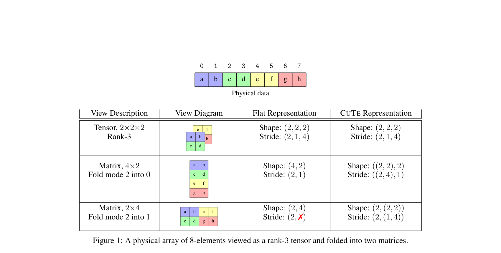
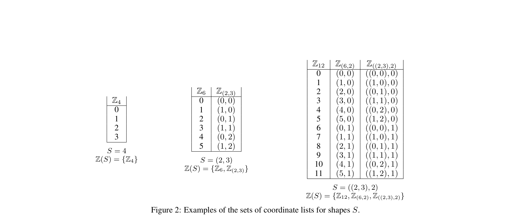
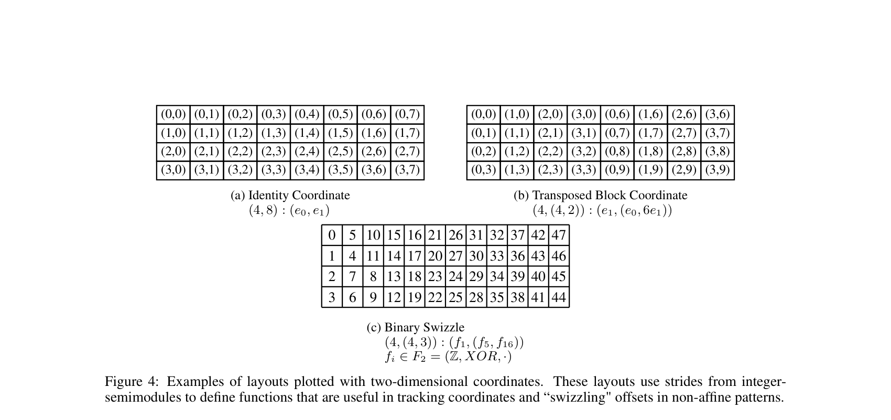
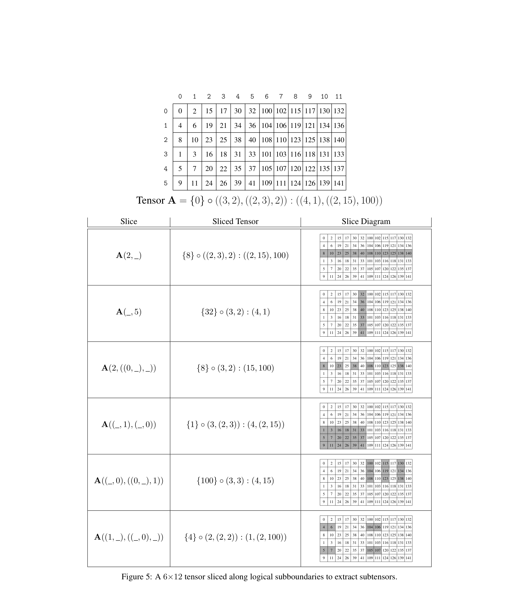
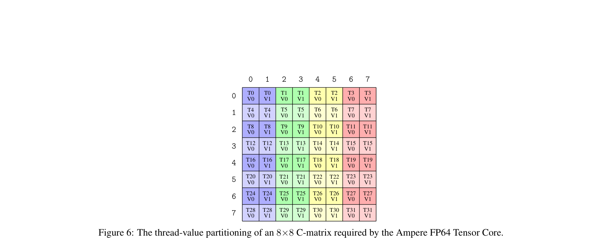
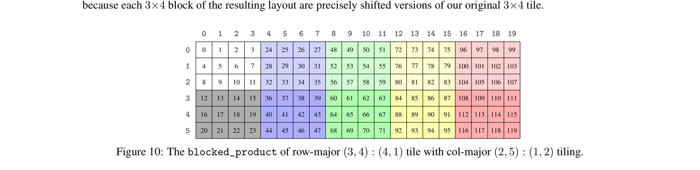
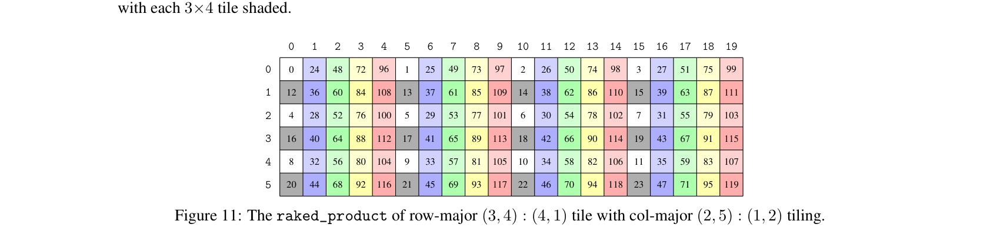

# CUTE LAYOUT REPRESENTATION AND ALGEBRA / CUTE 布局表示与代数

#### A PREPRINT / 预印本

### Cris Cecka NVIDIA Research <ccecka@nvidia.com>

# ABSTRACT / 摘要

> Modern architectures for high-performance computing and deep learning increasingly incorporate specialized tensor instructions, including tensor cores for matrix multiplication and hardwareoptimized copy operations for multi-dimensional data. These instructions prescribe fixed, often complex data layouts that must be correctly propagated through the entire execution pipeline to ensure both correctness and optimal performance. We present CUTE, a novel mathematical specification for representing and manipulating tensors. CUTE introduces two key innovations: (1) a hierarchical layout representation that directly extends traditional flat-shape and flat-stride tensor representations, enabling the representation of complex mappings required by modern hardware instructions, and (2) a rich algebra of layout operations – including concatenation, coalescence, composition, complementation, division, tiling, and inversion – that enables sophisticated layout manipulation, derivation, verification, and static analysis. CUTE layouts provide a framework for managing both data layouts and thread arrangements in GPU kernels, while the layout algebra enables powerful compile-time reasoning about layout properties and the expression of generic tensor transformations.

面向高性能计算与深度学习的现代体系结构越来越多地集成专用张量指令，包括用于矩阵乘法的张量核心以及针对多维数据的硬件优化拷贝操作。这些指令规定了固定且往往复杂的数据布局（layout），必须在整条执行流水线中正确传播，才能保证正确性与最优性能。本文提出 CUTE（CUDA Tensors / Compute Unified Tensors 的规范），一种用于表示与操作张量的新数学描述。CUTE 有两项核心创新：（1）层次化布局表示，直接扩展传统的扁平形状（flat-shape）与扁平步长（flat-stride）张量表示，从而能够表达现代硬件指令所需的复杂映射；（2）丰富的布局运算代数——包括拼接（concatenation）、合并（coalescence）、复合（composition）、补（complementation）、除法（division）、分块（tiling）与求逆（inversion）——支持复杂的布局变换、推导、验证与静态分析。CUTE 布局为在 GPU 核函数中同时管理数据布局与线程排布提供了框架；布局代数则支持在编译期对布局性质进行强推理，并表达通用的张量变换。

> In this work, we demonstrate that CUTE's abstractions significantly aid software development compared to traditional approaches, promote compile-time verification of architecturally prescribed layouts, facilitate the implementation of algorithmic primitives that generalize to a wide range of applications, and enable the concise expression of tiling and partitioning patterns required by modern specialized tensor instructions.

本文表明，与传统方法相比，CUTE 的抽象能显著改善软件开发；促进对体系结构规定布局的编译期验证；便于实现可推广到广泛应用的算法原语；并能简洁表达现代专用张量指令所需的分块与划分模式。

> CUTE has been successfully deployed in production systems, forming the foundation of NVIDIA's CUTLASS library and a number of related efforts including CuTe DSL.

CUTE 已在生产系统中成功部署，构成 NVIDIA CUTLASS 库及包括 CuTe DSL 在内的多项相关工作的基础。

# Contents / 目录

（下表保留原英文目录结构；末列为原稿页码。）

| 1 |     |        | Introduction and Motivation              | 3  |
|---|-----|--------|------------------------------------------|----|
|   | 1.1 |        | Related Work<br>                         | 3  |
|   | 1.2 |        | Canonical Loops and Loop Transformations | 4  |
|   | 1.3 |        | Tensors and Folding                      | 6  |
| 2 |     |        | Layout Representation                    | 7  |
|   | 2.1 |        | Tuples and HTuples                       | 8  |
|   | 2.2 | Shape  |                                          | 8  |
|   |     | 2.2.1  | Coordinate Sets and Compatibility        | 9  |
|   |     | 2.2.2  | Coordinates                              | 10 |
|   | 2.3 | Stride |                                          | 11 |
|   |     | 2.3.1  | Integer-Semimodules                      | 11 |

|   | 2.4 |                | Layout                             | 12 |
|---|-----|----------------|------------------------------------|----|
|   |     | 2.4.1          | Notations and Operations           | 12 |
|   |     | 2.4.2          | Layout Examples                    | 13 |
|   |     | 2.4.3          | Completeness                       | 13 |
|   |     | 2.4.4          | Semi-Linearity<br>                 | 14 |
|   | 2.5 |                | Tensor                             | 15 |
|   |     | 2.5.1          | Slicing<br>                        | 16 |
|   | 2.6 |                | Applications                       | 18 |
|   |     | 2.6.1          | COPY                               | 18 |
|   |     | 2.6.2          | GEMM<br>                           | 19 |
|   |     |                |                                    |    |
| 3 |     | Layout Algebra |                                    | 20 |
|   | 3.1 |                | Concatenate                        | 20 |
|   | 3.2 |                | Coalesce                           | 20 |
|   | 3.3 |                | Composition                        | 21 |
|   |     | 3.3.1          | Composition Properties             | 21 |
|   |     | 3.3.2          | Evaluation and Restrictions<br>    | 21 |
|   |     | 3.3.3          | Intuition and Divisibility         | 23 |
|   |     | 3.3.4          | Application: Partitioning Example  | 25 |
|   |     | 3.3.5          | By-mode Composition and Tilers<br> | 26 |
|   | 3.4 |                | Inverse                            | 26 |
|   |     | 3.4.1          | Right-Inverse                      | 26 |
|   |     | 3.4.2          | Application: Vectorization Example | 27 |
|   |     | 3.4.3          | Left-Inverse                       | 28 |
|   |     | 3.4.4          | Application: Admissibility Example | 29 |
|   | 3.5 |                | Complement                         | 30 |
|   |     | 3.5.1          | Application: Logical Product       | 30 |
|   |     | 3.5.2          | Application: Logical Divide<br>    | 31 |
|   |     |                |                                    |    |
|   |     |                |                                    |    |

# Acknowledgments / 致谢

> The authors thank Vijay Thakkar for being an early adopter of CUTE, for his pivotal role in its popularization and integration into CUTLASS, and for substantial contributions to its foundational design and deployment. They also thank Andrew Kerr, Pradeep Ramani, and Manish Gupta for their insights into using CUTE within CUTLASS and for driving its early adoption in the development of high-performance kernels. They thank Muhammad Osama and Duane Merrill for early experimental work with CUTE prototypes and low-level performance optimizations in initial CUTE examples. Finally, the authors thank Michael Garland, Bastian Hagedorn, Jay Shah, and Amanda Liu for insightful feedback and for repeatedly challenging the CUTE specifications.

作者感谢 Vijay Thakkar 作为 CUTE 的早期采用者，在其推广与融入 CUTLASS 以及基础设计与落地方面的关键贡献。亦感谢 Andrew Kerr、Pradeep Ramani 与 Manish Gupta 在 CUTLASS 内使用 CUTE 的见解，以及推动其在高性能核开发中早期采纳。感谢 Muhammad Osama 与 Duane Merrill 在 CUTE 原型实验与早期示例中的底层性能优化工作。最后感谢 Michael Garland、Bastian Hagedorn、Jay Shah 与 Amanda Liu 的深刻反馈与对 CUTE 规范的一再质疑。

[4 Conclusion](#page-32-0) 33

# <span id="page-2-0"></span>1 Introduction and Motivation / 引言与动机

> Modern GPUs are increasingly optimized for tensor-centric computations, driven by the demands of deep learning and scientific computing. NVIDIA's Volta architecture [\[1\]](#page-33-0) introduced Tensor Cores, enabling efficient small-matrix multiplications directly in hardware. This capability expanded in Turing [\[2\]](#page-33-1) and Ampere [\[3\]](#page-33-2) with specialized instructions for structured matrix movement within the GPU memory hierarchy. The Hopper [\[4\]](#page-33-3) and Blackwell [\[5\]](#page-33-4) architectures further advance this paradigm, introducing copy instructions for efficiently transferring rank-5 tensors between global and shared memory and further expanding tensor core capabilities. Fully harnessing these tensor-oriented hardware features is critical for peak GPU performance, motivating high-performance programming models that can represent and manipulate these tensors efficiently.

现代 GPU 日益针对以张量为中心的计算进行优化，这由深度学习与科学计算的需求驱动。NVIDIA Volta 架构 [\[1\]](#page-33-0) 引入张量核心（Tensor Cores），可在硬件中直接高效完成小矩阵乘。Turing [\[2\]](#page-33-1) 与 Ampere [\[3\]](#page-33-2) 进一步扩展了 GPU 存储层次内结构化矩阵搬运的专用指令。Hopper [\[4\]](#page-33-3) 与 Blackwell [\[5\]](#page-33-4) 继续推进这一范式，引入在全局与共享内存之间高效搬运 5 阶张量的拷贝指令，并进一步扩展张量核心能力。充分挖掘这些面向张量的硬件特性对达到 GPU 峰值性能至关重要，因而需要能够高效表示与操作张量的高性能编程模型。

> The existing and emerging hardware depends critically on how multidimensional data is stored and accessed in multiple hierarchical memory spaces and in multiple hierarchical levels of parallelism. Data storage layouts have always affected performance by dictating how and when memory accesses occur, but as hardware instructions become larger and prescribe fixed layouts for inputs and outputs the effect on correctness also becomes vital. These layouts must be propagated through the entire execution pipeline to ensure correct invocation of hardware instructions and ensure optimized memory access patterns.

现有及新兴硬件高度依赖多维数据如何在多级存储空间以及多级并行层次中被存储与访问。数据存储布局一直通过决定访存方式与时机而影响性能；但随着硬件指令规模变大并为输入输出规定固定布局，其对正确性的影响也变得关键。这些布局必须在整条执行流水线中传播，以保证硬件指令被正确调用并获得优化的访存模式。

> In this work, we present the foundational concepts of CUTE, a specification for CUDA Tensors, or Compute Unified Tensors, designed to provide building blocks for writing peak-performance linear algebra libraries. At its core, CUTE introduces two key innovations:

本文阐述 CUTE（CUDA Tensors / Compute Unified Tensors）的基础概念，旨在为编写峰值性能线性代数库提供构件。其核心有两项创新：

> - A *novel representation for tensor layouts*: CUTE shapes, layouts, and tensors are inherently hierarchical, constructed from smaller nested instances. This hierarchy provides the means to represent complex mappings required by modern tensor instructions, but remains a strict extension of existing flat-shape and flat-stride representations found in libraries like BLAS, torch.tensor, numpy.ndarray, and MATLAB.
> - A *novel algebra of operations defined over layouts*: CUTE layouts support a rich set of operations, including concatenation, coalescence, composition, complementation, division, tiling, and inversion, which all result in new CUTE layouts. These operations enable sophisticated partitioning, manipulation, verification, and derivation of tensor layouts demanded by modern tensor instructions.

- **新颖的张量布局表示**：CUTE 的形状（shape）、布局与张量本质上是层次化的，由更小的嵌套实例构成。该层次结构能够表达现代张量指令所需的复杂映射，同时仍是 BLAS、`torch.tensor`、`numpy.ndarray`、MATLAB 等库中既有扁平形状与扁平步长表示的严格扩展。
- **定义在布局上的新颖运算代数**：CUTE 布局支持丰富的运算，包括拼接、合并、复合、补、除法、分块与求逆，其结果仍是 CUTE 布局。这些运算支持现代张量指令所要求的复杂划分、变换、验证与推导。

> CUTE's layout representation provides an intuitive framework for managing threads and data in writing generic algorithms. CUTE's layout algebra provides an expressive approach for manipulating layouts and generating new layouts in the development of high-performance linear algebra kernels. These approaches enable:

CUTE 的布局表示为编写通用算法时管理线程与数据提供了直观框架；布局代数为高性能线性代数核开发中操作布局与生成新布局提供了富有表现力的途径。由此可以：

> - Support for complex layouts and partitioning: CUTE facilitates the representation of intricate layouts required by application-specific data patterns and complex partitioning patterns required by specialized tensor instructions.
> - Separation of concerns: Data layouts are declared independently of algorithmic logic, promoting clarity and modularity.
> - Static analysis and optimization: Sophisticated algebraic techniques empower the inspection, reordering, and partitioning of tensor arguments according to architectural constraints.

- **支持复杂布局与划分**：便于表示应用特定数据模式所需的精细布局，以及专用张量指令所需的复杂划分模式。
- **关注点分离**：数据布局与算法逻辑独立声明，提高清晰度与模块化。
- **静态分析与优化**：借助代数方法，可按体系结构约束检查、重排与划分张量实参。

### <span id="page-2-1"></span>1.1 Related Work / 相关工作

> CUTE is motivated by the need to support development of efficient tensor contractions, which are at the core of many scientific computing and machine learning applications. Conventional approaches for computing general tensor contractions rely on matricization, which involves logically or explicitly restructuring tensor data to perform computations using a sequence of calls to a Basic Linear Algebra Subprograms (BLAS) library.

CUTE 的动机来自支持高效张量缩并（tensor contraction）开发的需求，而张量缩并是许多科学计算与机器学习应用的核心。计算一般张量缩并的常规方法依赖矩阵化（matricization），即逻辑上或显式地重组张量数据，以便通过一系列对基本线性代数子程序（BLAS）库的调用来完成计算。

> BLAS provides efficient and portable implementations of core linear algebra operations, with highly optimized versions available for a wide range of architectures [\[6\]](#page-33-5). Among BLAS primitives, the GEneral Matrix Multiply (GEMM) routine is easily the most optimized and widely used operation in all of scientific computing and machine learning.

BLAS 为核心线性代数运算提供高效可移植实现，并在广泛架构上有高度优化版本 [\[6\]](#page-33-5)。在 BLAS 原语中，通用矩阵乘（GEMM）无疑是在科学计算与机器学习中使用最广、优化最充分的一类运算。

> The BLAS-like Library Instantiation Software (BLIS) framework [\[7\]](#page-33-6) extends GEMM by supporting non-unit strides in both row and column modes simultaneously, which addresses some challenges in handling irregular memory layouts without resorting to explicit memory copies. The strided-batched GEMM extension to BLAS further generalizes the primitive and allows its application to even more tensor contractions [\[8\]](#page-33-7). Abstracting matrix layouts even further, a key insight motivating CUTE is the use of multi-indices in tensor notation to enable the transformation of arbitrary tensor contractions into a canonical batched-GEMM primitive.

类 BLAS 库实例化软件（BLIS）框架 [\[7\]](#page-33-6) 通过同时支持行、列模式下的非单位步长扩展了 GEMM，有助于在不显式拷贝内存的情况下处理不规则内存布局。BLAS 的跨步批处理 GEMM 扩展进一步推广该原语，使其适用于更多张量缩并 [\[8\]](#page-33-7)。在矩阵布局抽象上再进一步，推动 CUTE 的一个关键洞见是：在张量记号中使用多重指标，可将任意张量缩并变换为规范的批处理 GEMM 原语。

> Many existing libraries rely on tensors and nearly all of them are based on the flat-shape and flat-stride representation. In Python, these include numpy.ndarray and torch.tensor

许多现有库依赖张量，且几乎都以扁平形状与扁平步长表示为基础。在 Python 中包括 `numpy.ndarray` 与 `torch.tensor`：

```python
>>> import numpy
>>> a = numpy.ndarray([3,7,5])
>>> a.dtype
dtype('float64')
>>> a.shape
(3, 7, 5)
>>> a.strides
(280, 40, 8)
```

```python
>>> import torch
>>> a = torch.empty(3,7,5)
>>> a.dtype
torch.float32
>>> a.shape
torch.Size([3, 7, 5])
>>> a.stride()
(35, 5, 1)
```

> and in C++, std::mdspan

在 C++ 中为 `std::mdspan`：

```cpp
std::mdspan a = std::mdspan(data, 3, 7, 5);
a.extent(0);
```

> CUTE supports these representations and strictly expands on them with generalizations to hierarchical shapes and strides to represent more complex layouts, non-integral strides, and non-integral layout codomains.

CUTE 支持上述表示，并严格扩展为层次化形状与步长，以表示更复杂的布局、非整数步长以及非整数布局陪域（codomain）。

> Independent generalizations of dense tensor representations include HeLayers [9], ThunderKittens [10], and the Linear Layouts [11] approach used in OpenAI's Triton compiler [12]. Thunderkittens implements a wide variety of bespoke types for register memory, shared memory, row/column-major tiles, row/column-major tiles of row/column-major subtiles, and prescribed access patterns for warps and threads. These types are written with the architectural layout requirements and memory hierarchy in mind, but the representational span is limited to the existing types and patterns. Linear Layouts are based on  $\mathbb{F}_2$  linear algebra and provide a more general representation of tensor layouts as well as an avenue for layout analysis and generation. Linear Layouts' strict reliance on  $\mathbb{F}_2$  makes some of the operators difficult for humans to inspect and limits the work to power-of-two shapes and strides, which is unacceptable to many applications.

对稠密张量表示的独立推广包括 HeLayers [9]、ThunderKittens [10]，以及 OpenAI Triton 编译器 [12] 采用的 Linear Layouts [11]。Thunderkittens 为寄存器内存、共享内存、行/列主序分块、行/列主序子分块的行/列主序分块，以及 warp 与线程的规定访问模式等实现了大量专用类型；这些类型针对体系结构布局需求与存储层次编写，但表示范围受限于已有类型与模式。Linear Layouts 基于  $\mathbb{F}_2$  线性代数，提供更一般的张量布局表示以及布局分析与生成途径；但其严格依赖  $\mathbb{F}_2$  使部分算子难以人工检视，并将工作限制在 2 的幂形状与步长，对许多应用不可接受。

> Other approaches to layout analysis which inspired portions of this work also rely on  $\mathbb{F}_2$  linear algebra, such as the work of Edelman et al. [13], Cormen et al. [14], and Bouverot et al. [15]. These works provide a foundation for analysis and algorithm generation, but are limited due to the application contexts in which they were written.

本文部分工作所借鉴的其他布局分析方法同样依赖  $\mathbb{F}_2$  线性代数，如 Edelman 等 [13]、Cormen 等 [14]、Bouverot 等 [15]。这些工作为分析与算法生成奠定基础，但受写作时的应用场景所限。

> As the C++ implementation of CuTe within CUTLASS v3 [16] is open-source with some documentation, it has already been referenced and used in independent works analyzing the CuTe layouts and CuTe algebraic operations. Bhaskaracharya et al. [17] analyzes CuTe and Linear Layouts [11] in the context of integer set relations (ISL), but omit stride abstractions that allow the representation of Linear Layouts as CuTe layouts. LEGO [18] uses a restricted form of CuTe layouts and a primitive form of CuTe composition to generate complex indexing within a code generator. Colfax Research [19] analyzes CuTe layouts and some operations on them in the context of category theory. In this paper, we intend to provide a more definitive and formal treatment of CuTe concepts and their applications.

CUTLASS v3 [16] 中的 CuTe C++ 实现已开源并附有部分文档，已被独立工作引用以分析 CuTe 布局与代数运算。Bhaskaracharya 等 [17] 在整数集关系（ISL）语境下分析 CuTe 与 Linear Layouts [11]，但省略了允许将 Linear Layouts 表示为 CuTe 布局的步长抽象。LEGO [18] 在代码生成器中使用受限形式的 CuTe 布局与初等的 CuTe 复合以生成复杂索引。Colfax Research [19] 在范畴论语境下分析 CuTe 布局及其部分运算。本文旨在对 CuTe 概念及其应用给出更确定、更形式化的处理。

> The design and concepts of CuTE have already demonstrated utility in several applications. For instance, CuTE has been used within the Graphene tensor compiler [20], where it plays a critical role in representing tensor operations. Additionally, the C++ implementation of CuTE has been used in implementations of the Stream-K algorithm [21] and is core to the development of NVIDIA's CUTLASS v3 library [22]. CuTE has also been a core component in state-of-the-art implementations for large language models, including FlashAttention and each of its evolving generations [23, 24, 25], highlighting its relevance to cutting-edge research and applications in deep learning. Additionally, CuTE is the basis for a number of related compiler projects including CuTE DSL [26], a Python-based DSL for dynamic compilation of CUDA software for linear algebra applications.

CuTE 的设计与概念已在多种应用中展现价值。例如 CuTE 用于 Graphene 张量编译器 [20]，在表示张量运算中起关键作用；CuTE 的 C++ 实现已用于 Stream-K 算法 [21] 的实现，并是 NVIDIA CUTLASS v3 [22] 开发的核心。CuTE 也是大语言模型前沿实现（含 FlashAttention 及其演进版本 [23, 24, 25]）的核心组件，体现其在深度学习前沿研究与工程中的相关性。此外，CuTE 还是多项相关编译项目的基础，包括用于线性代数应用中 CUDA 软件动态编译的 Python DSL——CuTE DSL [26]。

#### <span id="page-3-0"></span>1.2 Canonical Loops and Loop Transformations / 规范循环与循环变换

> The explicit calculation of loop indices is a common challenge in the development of high-performance linear algebra kernels. These calculations are difficult for programmers to get right and even more challenging to maintain. Rather than coupling information about data access with algorithmic logic, we prefer to write algorithmic logic clearly in terms of matrix/vector coordinates and abstract the data access patterns to the data layouts.

显式计算循环索引是开发高性能线性代数核时的常见难题：既难写对，更难维护。我们倾向于将数据访问信息与算法逻辑解耦，用矩阵/向量坐标清晰书写算法逻辑，并把数据访问模式抽象到数据布局中。

> To illustrate, we first define the class of loop nests that can be addressed by the techniques developed in this work. Specifically, we consider a *standard loop form* to be a loop with a single index, starting at zero, bounded by a constant, and incremented by 1 each iteration.

为说明这一点，首先定义本文技术所能处理的循环嵌套类。具体地，将**标准循环形式**定义为：单一索引、从零开始、上界为常数、每步增量为 1 的循环。

> For instance, consider the following loop:

例如考虑如下循环：

```cpp
for ( int m = 2; m <= 50; m += 3)
  A [ m ] = e ( m );
```

> This loop sets A[2], A[5], A[8], . . . to the result of a pure expression e(m). It can be transformed into a canonical loop as follows:

该循环将 `A[2], A[5], A[8], ...` 设为纯表达式 `e(m)` 的结果，可变换为如下规范循环：

```cpp
for ( int i = 0; i < 17; ++ i )
  ( A + 2)[3* i ] = g ( i );
```

> Here, the pointer is offset by a loop-invariant constant, the loop stride is normalized to 1, the lower bound is transformed to zero, the upper bound is tight and non-inclusive, and the pure expression is transformed g(i) = e(3\*i+2). It is now intuitive to interpret the above example as iterating through a logically 17-element vector, where the logical coordinate is strided by 3 to index the data at base address A + 2. This program can be represented with the following data:

此处指针对循环不变常数偏移，循环步长规范为 1，下界变为零，上界为紧且不包含端点，纯表达式变为 `g(i) = e(3*i+2)`。于是可直观地把该例看作在逻辑上的 17 元向量上迭代，逻辑坐标以步长 3 跨步，在基地址 `A+2` 处索引数据。该程序可用下列数据表示：

Accessor: A + 2 Shape: 17 Stride: 3

> Nested loops can be treated similarly. Consider the following two-dimensional loop nest:

嵌套循环可类似处理。考虑如下二维循环嵌套：

```cpp
for ( int n = 3; n < 43; n += 2)
  for ( int m = 4; m <= 22; m += 5)
    A [ p * m + q * n ] = e (m , n );
```

> which can be transformed into canonical loop form:

可变换为规范形式：

```cpp
for ( int j = 0; j < 20; ++ j )
  for ( int i = 0; i < 4; ++ i )
     ( A + 4* p + 3* q )[5* p * i + 2* q * j ] = g (i , j );
```

> With the canonical loop nest, it is natural to interpret the transformed loop as iterating through a logically 4×20 matrix, where the logical row coordinate i is strided by 5p, and the logical column coordinate j is strided by 2q to index the data at base address A + 4\*p + 3\*q. This can be represented with the following data

在规范嵌套下，自然可将变换后的循环理解为在逻辑上的  $4\times20$  矩阵上迭代：逻辑行坐标  $i$  以  $5p$  为步长，逻辑列坐标  $j$  以  $2q$  为步长，在基地址  $A+4p+3q$  处索引数据。可用下列数据表示：

```text
Accessor: A + 4p + 3q
   Shape: ( 4, 20)
  Stride: (5p, 2q)
```

> A key observation is that the 4×20 matrix can also be interpreted as an 80-element vector with non-uniform, semiaffine striding, expressed with an equivalent canonical loop form:

关键观察是：该  $4\times20$  矩阵也可解释为具有非均匀半仿射步长的 80 元向量，并用等价的规范循环表示：

```cpp
for ( int k = 0; k < 80; ++ k )
  ( A + 4* p + 3* q )[5* p *( k %4) + 2* q *( k /4)] = f ( k );
```

> where % is modulo and / is integer floor-division. This transformation is the colexicographical bijection, (i,j) = (k%4,k/4), between 2D coordinates (i,j) and 1D coordinates k. This bijection is equivalent to, and can be derived directly from, the shape represented previously. Thus, the shape representation can accept both 2D coordinates and 1D coordinates, providing a flexible and rank-agnostic framework for indexing data.

其中 `%` 为取模，`/` 为整数向下除。该变换是 2D 坐标  $(i,j)$  与 1D 坐标  $k$  之间的逆字典序双射  $(i,j)=(k\bmod 4,\lfloor k/4\rfloor)$ 。该双射与先前表示的形状等价，且可直接由形状导出。因此形状表示可同时接受 2D 与 1D 坐标，为数据索引提供灵活、与秩无关的框架。

> Furthermore, the canonical loop form also provides guidance for provably correct loop transformations that often appear in optimizing compilers for tensor computations. Consider the most general canonical loop nest:

此外，规范循环形式还为张量计算优化编译器中常见的、可证明正确的循环变换提供指引。考虑最一般的规范嵌套：

```cpp
for ( int i0 = 0; i0 < N0 ; ++ i0 )
  for ( int i1 = 0; i1 < N1 ; ++ i1 )
     for ( int i2 = 0; i2 < N2 ; ++ i2 )
       ...
          A [ d0 * i0 + d1 * i1 + d2 * i2 + ...] = e (i0 , i1 , i2 ,...);
```

> where  $(N_0, N_1, N_2, ...)$  is the "shape" of the computation and  $(d_0, d_1, d_2, ...)$  are the "strides" of the access pattern,

其中  $(N_0, N_1, N_2, \ldots)$  为计算的「形状」， $(d_0, d_1, d_2, \ldots)$  为访问模式的「步长」：

Accessor: A

Shape: (N0,N1,N2,...) Stride: (d0,d1,d2,...)

> Because there is a one-to-one correspondence between the Shape: Stride information and the loop nest itself, rather than asking how to perform transformations on the loops – splitting, transposition, concatenation, permutation, truncation, vectorization, etc – we can instead ask "What are valid ways to transform the Shape: Stride representation and what operators provide those transformations?" Indeed, if  $\mathbf{L} = \text{Shape}$ : Stride represents the data access and the loop nest, what functions P exist such that

由于「形状 : 步长」信息与循环嵌套本身一一对应，我们不必问如何对循环做分裂、转置、拼接、置换、截断、向量化等变换，而可以问：「形状 : 步长」表示有哪些合法变换方式，哪些算子实现这些变换？事实上，若  $\mathbf{L}=\mathrm{Shape}:\mathrm{Stride}$  表示数据访问与循环嵌套，则存在何种函数  $P$  使得

$$\mathbf{L}' = P(\mathbf{L}) = \mathbf{L} \circ P$$

> is a meaningful transformation of  $\mathbf{L} = \mathrm{Shape}$ : Stride, with a certain shape and stride, to a new loop nest  $\mathbf{L}' = \mathrm{Shape}'$ : Stride' with a potentially new shape and stride. These transformations, P, essentially rewrite the loop nest and, if defined properly, may themselves be composable, invertible, and provide functional-programming-like control of imperative loops. With considerations of the bijection between the 1D coordinates and the ND coordinates discussed above, this paper demonstrates a very effective representation of these transformation operators is  $P = \mathbf{P} = \mathrm{Shape}^*$ : Stride\*, the same objects that we use to represent the data access and loop nests themselves.

成为从具有某形状与步长的  $\mathbf{L}=\mathrm{Shape}:\mathrm{Stride}$  到有新形状与步长的新循环嵌套  $\mathbf{L}'=\mathrm{Shape}':\mathrm{Stride}'$  的有意义变换？这些变换  $P$  本质上重写循环嵌套；若定义得当，可复合、可逆，并带来类似函数式编程对命令式循环的控制。结合上文 1D 与多维坐标之间的双射，本文表明：这些变换算子的一种非常有效的表示是  $P=\mathbf{P}=\mathrm{Shape}^{\ast}:\mathrm{Stride}^{\ast}$ ，即与表示数据访问和循环嵌套所用的同一类对象。

#### <span id="page-5-0"></span>1.3 Tensors and Folding / 张量与折叠（Folding）

> To further motivate shapes that can be indexed by ND coordinates in addition to 1D coordinates, we generalize observations made in [8] mapping tensor contractions to canonical BLAS-like primitives.

为进一步说明形状除 1D 坐标外还可由多维坐标索引，本文推广文献 [8] 中将张量缩并映射到类 BLAS 规范原语的观察。

> In this work, tensors are denoted by bold letters, indices by lowercase letters, and the bounds of those indices by their corresponding uppercase letters. The rank of a tensor refers to the number of dimensions, also known as modes, it possesses. For example:

本文中张量用粗体字母，指标用小写，其上界用对应大写。张量的**秩（rank）**即其维度个数，亦称**模（mode）**。例如：

> - A scalar,  $\alpha$ , is a rank-0 tensor.
> - A vector,  $\mathbf{a}_i$ , is a rank-1 tensor with  $0 \le i < I$ .
> - A matrix,  $\mathbf{A}_{mn}$  is a rank-2 tensor with  $0 \le m < M$  and  $0 \le n < N$ .
> - A three-way array,  $\mathbf{A}_{mnp}$ , is a rank-3 tensor with  $0 \le m < M$ ,  $0 \le n < N$ , and  $0 \le p < P$ .

- 标量  $\alpha$  为 0 阶张量。
- 向量  $\mathbf{a}_i$  为 1 阶张量， $0\le i<I$ 。
- 矩阵  $\mathbf{A}_{mn}$  为 2 阶张量， $0\le m<M$  且  $0\le n<N$ 。
- 三维数组  $\mathbf{A}_{mnp}$  为 3 阶张量， $0\le m<M$ ， $0\le n<N$ ， $0\le p<P$ 。

> Summation is implied over repeated indices that appear only on a single side of an equation (Einstein notation), so an instance of a tensor contraction is

在等式单侧重复出现的指标隐含求和（爱因斯坦求和约定），故张量缩并一例为

$$\mathbf{C}_{stap} = \mathbf{A}_{stupr} \, \mathbf{B}_{atru},\tag{1}$$

> which represents the contraction of a rank-5 tensor with a rank-4 tensor to produce a rank-4 tensor. Contractions of this form are expressed compactly in the numpy.einsum and torch.einsum interfaces, for instance.

表示 5 阶与 4 阶张量缩并得到 4 阶张量。此类缩并可在 `numpy.einsum`、`torch.einsum` 等接口中紧凑写出。

> The above tensor contraction can be rewritten as

上式可改写为

$$\mathbf{C}_{(sp)(q)(t)} = \mathbf{A}_{(sp)(ur)(t)} \, \mathbf{B}_{(q)(ur)(t)},$$

> where the modes of the original tensor contraction have been grouped into four types:

其中原缩并的模被归为四类：

> - Row modes,  $\widehat{m}$ : Appear in A and C, and not in B.
> - Column modes,  $\hat{n}$ : Appear in B and C, and not in A.
> - Reduction modes, k: Appear in A and B, and not in C.
> - Batch modes, ℓ: Appear in A, B, and C.

- **行模**  $\widehat{m}$ ：出现在 A、C，不在 B。
- **列模**  $\hat{n}$ ：出现在 B、C，不在 A。
- **约化模**  $k$ ：出现在 A、B，不在 C。
- **批模**  $\ell$ ：出现在 A、B、C。

> This is referred to as tensor *folding*. Folding a tensor need not require any explicit copy, but can instead simply be a change of view of the data.

这称为张量**折叠（folding）**。折叠未必需要显式拷贝，而可以只是数据的视图变换。

> As an explicit example of tensor folding, consider the  $2\times2\times2$  tensor of 8 elements shown in the first row of Figure 1. The flat representation holds a shape and a stride for each mode of the tensor to index into the physical data. The flat representation is identical to the representation that is adopted by std::mdspan in C++, torch.tensor in PyTorch, numpy.ndarray in NumPy, among many other similar libraries. The  $2\times2\times2$  tensor can be folded into a  $4\times2$  matrix by folding the third mode into the first, as shown in the second row. The result admits the flat representation with a shape of (4,2) and a stride of (2,1). In principle, the  $2\times2\times2$  tensor can also be folded into a  $2\times4$  matrix by folding the third mode into the second mode. However, the result no longer admits a flat representation – there is no integer that can represent the stride of the second mode.

作为显式例子，考虑图 1 第一行所示含 8 个元素的  $2\times2\times2$  张量。扁平表示为张量的每个模持有形状与步长以索引物理数据，与 C++ `std::mdspan`、PyTorch `torch.tensor`、NumPy `numpy.ndarray` 等库的表示一致。该  $2\times2\times2$  张量可将第三模折入第一模而折叠为  $4\times2$  矩阵（第二行）。结果允许扁平表示：形状  $(4,2)$ 、步长  $(2,1)$ 。原则上也可将第三模折入第二模得到  $2\times4$  矩阵，但结果不再允许扁平表示——不存在整数能表示第二模的步长。



> Figure 1: A physical array of 8-elements viewed as a rank-3 tensor and folded into two matrices.
>
> 图 1：将含 8 个元素的物理数组视为 3 阶张量并折叠为两个矩阵。

<span id="page-6-1"></span>

| View Description                  | View Diagram             | Flat Representation                   | CUTE Representation                       |
|-----------------------------------|--------------------------|---------------------------------------|-------------------------------------------|
| Tensor, 2×2×2<br>Rank-3           | e f<br>a b<br>g h<br>c d | Shape: (2, 2, 2)<br>Stride: (2, 1, 4) | Shape: (2, 2, 2)<br>Stride: (2, 1, 4)     |
| Matrix, 4×2<br>Fold mode 2 into 0 | a b<br>c d<br>e f<br>g h | Shape: (4, 2)<br>Stride: (2, 1)       | Shape: ((2, 2), 2)<br>Stride: ((2, 4), 1) |
| Matrix, 2×4<br>Fold mode 2 into 1 | a b<br>e f<br>c d<br>g h | Shape: (2, 4)<br>Stride: (2, ✗)       | Shape: (2,(2, 2))<br>Stride: (2,(1, 4))   |

**[翻译]**

| 视图说明 | 视图示意图 | 扁平表示 | CUTE 表示 |
|----------|------------|----------|-----------|
| 张量 2×2×2，秩 3 | （同左） | Shape: (2, 2, 2)<br>Stride: (2, 1, 4) | Shape: (2, 2, 2)<br>Stride: (2, 1, 4) |
| 矩阵 4×2，将模 2 折入 0 | （同左） | Shape: (4, 2)<br>Stride: (2, 1) | Shape: ((2, 2), 2)<br>Stride: ((2, 4), 1) |
| 矩阵 2×4，将模 2 折入 1 | （同左） | Shape: (2, 4)<br>Stride: (2, ✗) | Shape: (2,(2, 2))<br>Stride: (2,(1, 4)) |

> The CUTE representation of the folded matrices is shown in the last column and emphasizes that the tensor folding really is just grouping modes together. In the case of the 4×2 matrix, the flat representation is called the *coalesced* version of the CUTE representation, while in the case of the 2×4 matrix no such flat representation exists.

折叠矩阵的 CUTE 表示见最右列，强调张量折叠实质是把模成组。对  $4\times2$  矩阵，扁平表示称为 CUTE 表示的**合并（coalesced）**形式；对  $2\times4$  矩阵则不存在此类扁平表示。

> This generalized form of tensor folding allows all tensor contractions to be written in a single canonical contraction form,

这种推广的张量折叠形式使所有张量缩并可写为单一规范缩并形式：

$$\mathbf{C}_{\widehat{m}\widehat{n}\widehat{\ell}} = \mathbf{A}_{\widehat{m}\widehat{k}\widehat{\ell}} \mathbf{B}_{\widehat{n}\widehat{k}\widehat{\ell}}.$$
 (2)

> where each mode may be a single mode or a group of modes, which we call a *multi-mode*. Appealing to the canonical loops in Section [1.2,](#page-3-0) regardless of whether the shape of <sup>m</sup><sup>b</sup> is <sup>M</sup> or (M0, M1), we can loop over it with 1D coordinates, m. Thus, any tensor contraction can be folded into a canonical batched-GEMM and evaluated with a trivial reference implementation composed of four nested loops:

其中每个模可为单模或模组（称**多模 multi-mode**）。据 [1.2](#page-3-0) 的规范循环，无论  $\widehat{m}$  的形状是  $M$  还是  $(M_0,M_1)$ ，都可用 1D 坐标  $m$  遍历。因此任意张量缩并可折叠为规范批处理 GEMM，并用四层嵌套循环的平凡参考实现求值：

```cpp
for ( int l = 0; l < L ; ++ l )
  for ( int m = 0; m < M ; ++ m )
     for ( int n = 0; n < N ; ++ n )
        for ( int k = 0; k < K ; ++ k )
          C (m ,n , l ) += A (m ,k , l ) * B (n ,k , l );
```

> This simple implementation of batched-GEMM can be used to evaluate a wide range of compatible tensor contractions, including any matrix-multiplication (GEMM), tensor contraction (GETT), and convolution (CONV), with intelligent construction of folded layouts. See Section [2.6.2](#page-18-0) for details on generic GEMM and its applications.

该简单批处理 GEMM 实现可在巧妙构造折叠布局下求值大量相容张量缩并，包括任意矩阵乘（GEMM）、张量缩并（GETT）与卷积（CONV）。通用 GEMM 及其应用详见 [2.6.2](#page-18-0)。

> Optimizations can then focus on loop reordering, tiling, vectorization, and other common optimizations by transforming the order and rank of the loop nests. These transformations, it turns out, can very often be represented by layouts as permutations on the coordinates spaces of the algorithm. These transform layouts functionally compose with the data layouts to generate new loop nests that are guaranteed to be consistent with the original problem. See Section [3.3](#page-20-0) for details on layout composition and application to generic partitioning.

随后可通过改变循环嵌套的顺序与秩，专注于循环重排、分块、向量化等常见优化。这些变换往往可用布局表示为算法坐标空间上的置换；变换布局与数据布局在函数意义上复合，生成与原始问题一致的新循环嵌套。布局复合及在通用划分中的应用见 [3.3](#page-20-0)。

# <span id="page-6-0"></span>2 Layout Representation / 布局表示

> CUTE layouts are versatile objects that are capable of representing a wide range of data and thread arrangements and have great utility in abstracting physical addresses and separating iteration order from storage order. In this section, we define the CUTE representation of shapes, layouts, and tensors and construct their interaction with coordinates. CUTE layouts enable generic algorithms that, with a single implementation, can be applied to any complex layout of data that may be folded into that algorithms' canonical form. Examples of such algorithms and their breadth of applications are provided in Section [2.6.](#page-17-0)

CUTE 布局是用途广泛的对象，可表示多样的数据与线程排布，在抽象物理地址、分离迭代顺序与存储顺序方面很有用。本节定义形状、布局与张量的 CUTE 表示及其与坐标的交互。CUTE 布局使通用算法能以单一实现作用于可折叠为该算法规范形式的任意复杂数据布局。此类算法及其应用广度见 [2.6](#page-17-0)。

#### <span id="page-7-0"></span>2.1 Tuples and HTuples / 元组与 HTuple

> The Tuple and HTuple concepts serve as foundational data structures throughout this work.

Tuple 与 HTuple 概念贯穿全文，为基础数据结构。

Definition 2.1. A Tuple(T ) is a finite, ordered list of elements selected from a set T . For an X = (X0, X1, . . . , Xn−1) ∈ Tuple(X ), we define the operations:

**定义 2.1.** Tuple$(T)$ 是从集合 $T$ 中选取的元素的有限有序列表。对 $X=(X_0,X_1,\ldots,X_{n-1})\in\mathrm{Tuple}(X)$，定义运算：

> - Rank: rank(X). The tuple length n.
> - Access: X<sup>i</sup> . The ith element of the Tuple X for 0 ≤ i < rank(X).

- **秩** $\mathrm{rank}(X)$：元组长度 $n$。
- **访问** $X_i$：Tuple $X$ 的第 $i$ 个元素， $0\le i<\mathrm{rank}(X)$。

> Where a Tuple(T ) is a flat collection of elements, an HTuple(T ) is a "hierarchical tuple of T s".

Tuple$(T)$ 是扁平元素集合；HTuple$(T)$ 则是「$T$ 的层次化元组」。

Definition 2.2. An HTuple(T ) is either an element of set T or a Tuple(HTuple(T )). For an X ∈ HTuple(X ) we define the operations:

**定义 2.2.** HTuple$(T)$ 要么是集合 $T$ 的一个元素，要么是 Tuple(HTuple$(T)$)。对 $X\in\mathrm{HTuple}(X)$ 定义：

> - Rank: rank(X). If X ∈ Tuple, then the tuple length, else 1.
> - Access: X<sup>i</sup> . The ith element of an HTuple X for 0 ≤ i < rank(X).
> - Depth: depth(X). If X ∈ Tuple, then 1 + max(depth(X0), depth(X1), . . .), else 0.

- **秩** $\mathrm{rank}(X)$：若 $X\in\mathrm{Tuple}$ 则为元组长度，否则为 1。
- **访问** $X_i$：HTuple $X$ 的第 $i$ 个元素， $0\le i<\mathrm{rank}(X)$。
- **深度** $\mathrm{depth}(X)$：若 $X\in\mathrm{Tuple}$ 则为 $1+\max(\mathrm{depth}(X_0),\ldots)$，否则为 0。

> For instance,

例如

$$(3, -8, 7)$$
  $(2, (4, 1), -1)$   $((4, 6), (3, (2, 2), 8))$ 

> are all instances of HTuple(Z).

均为 HTuple$(\mathbb{Z})$ 的实例。

> When reasoning with HTuples, it is useful to define a notion of *congruence* and *weak congruence*.

对 HTuple 推理时，引入**全等（congruence）**与**弱全等（weak congruence）**较方便。

Definition 2.3. *Congruence*, ∼, is an equivalence relation on HTuples. For P ∈ HTuple(P) and S ∈ HTuple(S),

**定义 2.3.** **全等** $\sim$ 为 HTuple 上的等价关系。对 $P\in\mathrm{HTuple}(P)$、$S\in\mathrm{HTuple}(S)$，

$$P \sim S \quad \text{ iff } \quad \begin{cases} P \in \mathcal{P} \text{ and } S \in \mathcal{S}, \text{ or } \\ P, S \in \text{Tuple and } \text{rank}(P) = \text{rank}(S) \text{ and } \forall_i \ P_i \sim S_i \end{cases}$$

> and we say that P and S are *congruent* and have the same *profile*.

则称 $P$ 与 $S$ **全等**，并具有相同**轮廓（profile）**。

> For instance,

例如

$$(4,8) \sim (5,7)$$
 and  $(4,(2,4)) \sim (7,(3,2))$  and  $(\mathbf{v},((\mathbf{p},3))) \sim (0,((0,0)))$ 

> but (4, 8) and (4,(2, 4)) are not congruent and (4,(2, 4)) and (0,((0, 0))) are not congruent.

但 $(4,8)$ 与 $(4,(2,4))$ 不全等；$(4,(2,4))$ 与 $(0,((0,0)))$ 也不全等。

> Similarly, weak congruence tests that the profile of one HTuple is at least as *refined* as another.

类似地，**弱全等**检验一 HTuple 的轮廓是否至少与另一者同样**精细（refined）**。

Definition 2.4. *Weak Congruence*, ≲, is a partial order on HTuples. For P ∈ HTuple(P) and S ∈ HTuple(S),

**定义 2.4.** **弱全等** $\lesssim$ 为 HTuple 上的偏序。对 $P\in\mathrm{HTuple}(P)$、$S\in\mathrm{HTuple}(S)$，

$$P \lesssim S$$
 iff  $\begin{cases} P \in \mathcal{P}, \text{ or } \\ P, S \in \text{Tuple and } \text{rank}(P) = \text{rank}(S) \text{ and } \forall_i P_i \lesssim S_i \end{cases}$ 

> and we say that P and S are *weakly congruent*, P *coarsens* the profile of S, and S *refines* the profile of P.

则称 $P$ 与 $S$ **弱全等**，$P$ **粗化** $S$ 的轮廓，$S$ **细化** $P$ 的轮廓。

> For instance,

例如

$$30 \lesssim (a, b) \lesssim (\mathbf{v}, (0, \alpha))$$
 and  $30 \lesssim (a, b, c) \lesssim ((0, 0), 0, 0)$ 

> but (a, b) and (a, b, c) are not weakly congruent and (v,(0, α)) and ((0, 0), 0) are not weakly congruent.

但 $(a,b)$ 与 $(a,b,c)$ 不弱全等；$(\mathbf{v},(0,\alpha))$ 与 $((0,0),0)$ 也不弱全等。

#### <span id="page-7-1"></span>2.2 Shape / 形状

> Multidimensional arrays are often characterized by their *shape*, a sequence of positive integers describing the extent of each mode. The 2D shape of an M×N matrix is represented as (M, N) and is naturally indexed by coordinates (m, n) with 0 ≤ m < M and 0 ≤ n < N. A natural extension of this is to represent a shape as a hierarchical tuple of positive integers.

多维数组常由其**形状**刻画：描述各模(extent)的正整数序列。$M\times N$ 矩阵的 2D 形状记为 $(M,N)$，自然由坐标 $(m,n)$ 索引， $0\le m<M$ ， $0\le n<N$ 。自然推广是将形状表示为正整数的层次化元组。

Definition 2.5. A *shape* is an HTuple(Z <sup>+</sup>), where Z <sup>+</sup> = {1, 2, 3, . . .} is the set of positive integers. The rank of a shape S is the rank of the HTuple. The size of a shape S is the product of its elements, denoted |S| = Q k |Sk|.

**定义 2.5.** **形状**为 HTuple$(\mathbb{Z}^+)$，其中 $\mathbb{Z}^+=\{1,2,3,\ldots\}$。形状 $S$ 的**秩**即该 HTuple 的秩；**大小**为其元素之积，记为 $\lvert S\rvert=\prod_k \lvert S_k\rvert$。

> What makes hierarchical shapes particularly useful is that they can be indexed by multiple coordinate systems. Consider the set of integers up to N,

层次化形状特别有用之处在于可用多种坐标系索引。考虑不超过 $N$ 的整数集，

$$\mathbb{Z}_N = \{0, 1, 2, \dots, N - 1\}.$$

> CUTE makes the observation that a 2D shape (M, N) can also be interpreted to describe 1D MN elements indexed by an integral coordinate i with 0 ≤ i < MN provided a bijection

CUTE 指出：2D 形状 $(M,N)$ 也可解释为描述 $MN$ 个 1D 元素，由整数坐标 $i$（ $0\le i<MN$ ）索引，只要存在双射

$$S: \mathbb{Z}_{MN} \longleftrightarrow \mathbb{Z}_M \times \mathbb{Z}_N$$

> maps between the 1D integral coordinates i ∈ ZMN and the 2D natural coordinates (m, n) ∈ Z<sup>M</sup> × Z<sup>N</sup> .

在 1D 积分坐标 $i\in\mathbb{Z}_{MN}$ 与 2D 自然坐标 $(m,n)\in\mathbb{Z}_M\times\mathbb{Z}_N$ 之间映射。

> Similarly, the 2D shape (M, NP) can be interpreted as a hierarchical shape (M,(N, P)) indexed by natural coordinates (m,(n, p)) with 0 ≤ m < M, 0 ≤ n < N, 0 ≤ p < P. A similar bijection can be made

类似地，2D 形状 $(M,NP)$ 可解释为层次形状 $(M,(N,P))$，由自然坐标 $(m,(n,p))$ 索引， $0\le m<M$ ， $0\le n<N$ ， $0\le p<P$ 。亦可建立双射

$$S: \mathbb{Z}_M \times \mathbb{Z}_{NP} \longleftrightarrow \mathbb{Z}_M \times (\mathbb{Z}_N \times \mathbb{Z}_P)$$

> to map between the 2D coordinates (m, q) ∈ Z<sup>M</sup> ×ZNP and the natural coordinates (m,(n, p)) ∈ Z<sup>M</sup> ×(Z<sup>N</sup> ×Z<sup>P</sup> ).

在 $(m,q)\in\mathbb{Z}_M\times\mathbb{Z}_{NP}$ 与 $(m,(n,p))\in\mathbb{Z}_M\times(\mathbb{Z}_N\times\mathbb{Z}_P)$ 之间。

> A direct consequence of hierarchical shapes and coordinates is that tensor algorithms can be written for the shapes that are most natural to them (Section [2.6\)](#page-17-0) – 1D shapes for vectors in COPY, 2D shapes for matrices in GEMM, 3D shapes for tensors in batched-GEMM, etc – while still accepting hierarchically shaped tensors that are folded to be weakly congruent with the algorithm's specification (Section [2.2.1\)](#page-8-0). Tensors of data, whose shape is often represented as a flat sequence of integers, can be arbitrarily folded into shapes accepted by generic tensor algorithms. Furthermore, because each mode of a tensor is associated with a stride (Section [2.3\)](#page-10-0) to index data, this folding of modes allows the representation of much more complex layouts of data beyond simple contiguous arrays in COPY or row-major and col-major matrices in BLAS GEMM (Section [2.4\)](#page-11-0).

层次形状与坐标的直接后果是：张量算法可针对对其最自然的形状书写（[2.6](#page-17-0)）——COPY 中向量为 1D，GEMM 中矩阵为 2D，批处理 GEMM 中张量为 3D 等——同时仍可接受经折叠后与算法规范弱全等的层次形状张量（[2.2.1](#page-8-0)）。数据的张量形状常表为扁平整数序列，可任意折叠为通用张量算法可接受的形状。又因张量每模关联用于索引数据的步长（[2.3](#page-10-0)），模的折叠可表示远比 COPY 中简单连续数组或 BLAS GEMM 中行主/列主矩阵更复杂的数据布局（[2.4](#page-11-0)）。

> In the following sections, we define this notion of compatibility and these relations between coordinate sets within a shape.

以下各节定义**相容性**及形状内坐标集之间的关系。

#### <span id="page-8-0"></span>2.2.1 Coordinate Sets and Compatibility / 坐标集与相容性

> As previously suggested, hierarchical shapes provide for indexing by multiple coordinate systems. Here, we define the coordinate set for a specific shape and a notion of compatibility between shapes to share coordinate sets between shapes.

如前所述，层次形状允许多种坐标系索引。此处定义给定形状的坐标集，以及形状间**相容**以共享坐标集的概念。

Definition 2.6. A *coordinate set* is a set Z<sup>N</sup> = {0, 1, 2, . . . , N − 1} of non-negative integers or a Cartesian product of coordinate sets, Z<sup>N</sup> × Z<sup>M</sup> = Z(N,M) .

**定义 2.6.** **坐标集**为非负整数集 $\mathbb{Z}_N=\{0,1,\ldots,N-1\}$，或坐标集的笛卡尔积 $\mathbb{Z}_N\times\mathbb{Z}_M=\mathbb{Z}_{(N,M)}$。

> For instance, the following are examples of coordinate sets:

例如：

$$\begin{split} \mathbb{Z}_6 &= \{0,1,2,3,4,5\} \\ \mathbb{Z}_3 \times \mathbb{Z}_4 &= \mathbb{Z}_{(3,4)} = \{(0,0),(1,0),(2,0),(0,1),(1,1),(2,1),(0,2),(1,2),(2,2),(0,3),(1,3),(2,3)\} \\ (\mathbb{Z}_2 \times \mathbb{Z}_1) \times \mathbb{Z}_3 &= \mathbb{Z}_{((2,1),3)} = \{((0,0),0),((1,0),0),((0,0),1),((1,0),1),((0,0),2),((1,0),2)\} \end{split}$$

> A coordinate set Z<sup>S</sup> is precisely the set of natural coordinates for a shape S. Other coordinate sets for a shape S are any coordinate set for a shape that is *compatible* with S and *coarsens* S.

坐标集 $\mathbb{Z}_S$ 恰为形状 $S$ 的自然坐标集。形状 $S$ 的其他坐标集是任一与 $S$ **相容**且**粗化** $S$ 的形状的坐标集。

Definition 2.7. *Compatibility*, ⪯, is a partial order on the set of shapes. For shapes P and S,

**定义 2.7.** **相容性** $\preceq$ 为形状集上的偏序。对形状 $P,S$，

$$P \preceq S \quad \text{ iff } \quad \begin{cases} P \in \mathbb{Z}^+ \text{ and } P = \lvert S\rvert \,, \text{ or } \\ P, S \in \text{Tuple and } \text{rank}(P) = \text{rank}(S) \text{ and } \forall_i \ P_i \preceq S_i \end{cases}$$

> and we say that P and S are *compatible*, P *coarsens* S, and S *refines* P.

则称 $P$ 与 $S$ **相容**，$P$ **粗化** $S$，$S$ **细化** $P$。

> Compatibility requires that the two shapes be the same size, so the integral values of the HTuples matter. For example,

相容要求两形状大小相同，故 HTuple 的整数值重要。例如

$$30 \le (2,15) \le (2,(3,5))$$
 and  $30 \le (6,5) \le ((3,2),5)$ 

> but (2,(3, 5)) and ((3, 2), 5) are not compatible despite having the same size. They do, however, share a common compatible shape of 30.

但 $(2,(3,5))$ 与 $((3,2),5)$ 虽大小相同却**不相容**；二者共享公共相容形状 $30$。

> With the definition of a coordinate set and shape compatibility, we can define the set of all compatible coordinates for any given shape.

有了坐标集与形状相容，可定义任意给定形状的所有相容坐标集。

Definition 2.8. A shape S defines a *set of compatible coordinate* sets, Z(S), as the coordinate sets of all shapes that coarsen S.

**定义 2.8.** 形状 $S$ 定义**相容坐标集族** $\mathbb{Z}(S)$ 为所有粗化 $S$ 的形状的坐标集之族。

$$\mathbb{Z}(S) = \{ \mathbb{Z}_{S'} \mid S' \leq S \}. \tag{3}$$

> Every shape has an integral coordinate set,

每个形状都有积分坐标集

$$\{0, 1, 2, \dots, \lvert S\rvert - 1\} = \mathbb{Z}_{\lvert S\rvert} \in \mathbb{Z}(S),$$

> and every rank-r shape has a rank-r coordinate set,

每个秩为 $r$ 的形状有秩 $r$ 坐标集

$$\{(a_0,\ldots,a_{r-1}) \mid a_i \in \mathbb{Z}_{\lvert S_i\rvert}\} = \mathbb{Z}_{(\lvert S_0\rvert,\lvert S_1\rvert,\ldots,\lvert S_{r-1}\rvert)} \in \mathbb{Z}(S).$$

> Note that if shape P coarsens shape S, then  $\mathbb{Z}(P) \subseteq \mathbb{Z}(S)$ . This means that any coordinate within shape P is also a coordinate within shape S.

注意若 $P$ 粗化 $S$，则 $\mathbb{Z}(P)\subseteq\mathbb{Z}(S)$，即 $P$ 内任一坐标也是 $S$ 内坐标。

#### <span id="page-9-0"></span>2.2.2 Coordinates / 坐标

> In this section, we define classes of coordinates, define a bijection between the compatible coordinate sets of a shape, and provide examples of these coordinate mappings.

本节定义坐标类、形状相容坐标集之间的双射，并给出坐标映射示例。

**Definition 2.9.** An *in-bounds coordinate*, or simply *coordinate*, into a shape S is an element of one of its coordinate sets,  $c \in \mathbb{Z}_{S'} \in \mathbb{Z}(S)$ . Note that a coordinate is always an  $\mathsf{HTuple}(\mathbb{N})$ . When intention is clear, we will simply write  $c \in \mathbb{Z}(S)$ .

**定义 2.9.** 进入形状 $S$ 的**界内坐标**（简称**坐标**）是其某坐标集的元素 $c\in\mathbb{Z}_{S'}\in\mathbb{Z}(S)$。坐标恒为 $\mathsf{HTuple}(\mathbb{N})$。意图明确时可写 $c\in\mathbb{Z}(S)$。

**Definition 2.10.** An integral coordinate into a shape S is a coordinate  $\overline{c} \in \mathbb{Z}_{|S|} \in \mathbb{Z}(S)$ . Note that an integral coordinate is always an integer,  $\overline{c} \in \mathbb{N}$ .

**定义 2.10.** 进入 $S$ 的**积分坐标**是 $\overline{c}\in\mathbb{Z}_{\lvert S\rvert}\in\mathbb{Z}(S)$，恒为整数 $\overline{c}\in\mathbb{N}$。

**Definition 2.11.** A *natural coordinate* into a shape S is a coordinate  $\widetilde{c} \in \mathbb{Z}_S \in \mathbb{Z}(S)$ . Note that a natural coordinate is always an  $\operatorname{HTuple}(\mathbb{N})$  that is congruent to the shape,  $\widetilde{c} \sim S$ .

**定义 2.11.** 进入 $S$ 的**自然坐标**是 $\widetilde{c}\in\mathbb{Z}_S\in\mathbb{Z}(S)$，恒为与形状全等的 $\operatorname{HTuple}(\mathbb{N})$，$\widetilde{c}\sim S$。

> To transform between in-bound coordinates, we construct an enumeration over the coordinate sets of a shape S to define *coordinate lists*. In this work, we choose the colexicographical ordering, <, of coordinates defined by:

为在界内坐标间变换，对形状 $S$ 的坐标集构造枚举以定义**坐标列表**。本文选取坐标的**逆字典序** $<$：

$$(a_0,\dots,a_n) < (b_0,\dots,b_n) \quad \text{iff} \quad \begin{cases} a_n < b_n, \text{ or } \\ a_n = b_n \text{ and } (a_0,\dots,a_{n-1}) < (b_0,\dots,b_{n-1}) \end{cases}$$

> and applied recursively as needed. The colexicographical enumeration defines a bijection on coordinate lists. The function

按需递归应用。逆字典序枚举在坐标列表上定义双射。函数

$$idx2crd: \ \mathbb{Z}_{\lvert S\rvert} \to \mathbb{Z}_{(\lvert S_0\rvert,\lvert S_1\rvert,\dots,\lvert S_{r-1}\rvert)},$$

$$i \mapsto \left(i \bmod \lvert S_0\rvert, \left\lfloor \frac{i}{\lvert S_0\rvert} \right\rfloor \bmod \lvert S_1\rvert, \dots, \left\lfloor \frac{i}{\prod_{k=0}^{r-3} \lvert S_k\rvert} \right\rfloor \bmod \lvert S_{r-2}\rvert, \left\lfloor \frac{i}{\prod_{k=0}^{r-2} \lvert S_k\rvert} \right\rfloor \right)$$
 (4)

> maps the *i*th coordinate of  $\mathbb{Z}_{|S|}$  (the *i*th integral coordinate of shape S) to the *i*th coordinate of  $\mathbb{Z}_{(|S_0|,|S_1|,\ldots,|S_{r-1}|)}$  (the *i*th natural coordinate of shape  $(|S_0|,|S_1|,\ldots,|S_{r-1}|)$ ). Other bijections such as the reverse and/or reflected lexicographical or colexicographical orderings can be used as well.

将 $\mathbb{Z}_{\lvert S\rvert}$ 的第 $i$ 个坐标（$S$ 的第 $i$ 个积分坐标）映到 $\mathbb{Z}_{(\lvert S_0\rvert,\ldots)}$ 的第 $i$ 个坐标（形状 $(\lvert S_0\rvert,\ldots)$ 的第 $i$ 个自然坐标）。亦可采用反序或反射的字典序/逆字典序等其他双射。

> The inverse of idx2crd is given by

$idx2crd$ 的逆为

<span id="page-9-2"></span><span id="page-9-1"></span>crd2idx: 
$$\mathbb{Z}_{(\lvert S_0\rvert,\lvert S_1\rvert,...,\lvert S_{r-1}\rvert)} \to \mathbb{Z}_{\lvert S\rvert},$$

$$(c_0,c_1,...,c_{r-1}) \mapsto c_0 + c_1 \cdot \lvert S_0\rvert + ... + c_{r-1} \cdot \prod_{l=0}^{r-2} \lvert S_k\rvert$$
(5)

> which maps the *i*th coordinate of  $\mathbb{Z}_{(|S_0|,|S_1|,...,|S_{r-1}|)}$  to the *i*th coordinate of  $\mathbb{Z}_{|S|}$ .

将 $\mathbb{Z}_{(\lvert S_0\rvert,\ldots)}$ 的第 $i$ 个坐标映到 $\mathbb{Z}_{\lvert S\rvert}$ 的第 $i$ 个坐标。

> If two shapes are compatible,  $P \leq S$ , then coordinates in  $\mathbb{Z}_P$  can be mapped to  $\mathbb{Z}_S$  via repeated application of idx2crd, and coordinates in  $\mathbb{Z}_S$  can be mapped to  $\mathbb{Z}_P$  via repeated application of crd2idx. Following the colexicographical ordering of coordinates, Figure 2 tabulates the mappings from integral coordinates to natural coordinates for each shape.

若两形状相容 $P\le S$，则 $\mathbb{Z}_P$ 中坐标可反复用 $idx2crd$ 映到 $\mathbb{Z}_S$，$\mathbb{Z}_S$ 中坐标可反复用 $crd2idx$ 映到 $\mathbb{Z}_P$。按逆字典序，图 2 列出各形状下积分坐标到自然坐标的映射。

**Out-of-bounds Coordinates** In addition to the coordinate sets we have already defined, it is useful to define coordinates of specific profiles that may not be in the coordinate sets of a shape.

**界外坐标** 除已定义坐标集外，还需定义具特定轮廓、但可能不在某形状坐标集中的坐标。

**Definition 2.12.** An admissible coordinate into a shape S is any coordinate  $c \in HTuple(\mathbb{Z})$  that is weakly congruent to the shape,  $c \lesssim S$ .

**定义 2.12.** 进入 $S$ 的**可容许坐标**为任意 $c\in\mathrm{HTuple}(\mathbb{Z})$ 且 $c\lesssim S$。

**Definition 2.13.** An *out-of-bounds coordinate* into a shape S is any admissible coordinate  $c \in HTuple(\mathbb{Z})$  that is not in-bounds,  $c \notin \mathbb{Z}(S)$ .

**定义 2.13.** 进入 $S$ 的**界外坐标**为可容许但非界内：$c\notin\mathbb{Z}(S)$。

<span id="page-10-2"></span>

| $ \begin{bmatrix} \mathbb{Z}_4 \\ 0 \\ 1 \\ 2 \\ 3 \end{bmatrix} $ $S = 4$ $\mathbb{Z}(S) = {\mathbb{Z}_4}$ | $ \begin{array}{c cc}  & \mathbb{Z}_6 & \mathbb{Z}_{(2,3)} \\ \hline 0 & (0,0) \\ 1 & (1,0) \\ 2 & (0,1) \\ 3 & (1,1) \\ 4 & (0,2) \\ 5 & (1,2) \end{array} $ $ S = (2,3) \\ \mathbb{Z}(S) = {\mathbb{Z}_6, \mathbb{Z}_{(2,3)}} $ | $ \begin{array}{c c} \mathbb{Z}_{12} \\ \hline 0 \\ 1 \\ 2 \\ 3 \\ 4 \\ 5 \\ 6 \\ 7 \\ 8 \\ 9 \\ 10 \\ 11 \end{array} $ | $\begin{array}{c} \mathbb{Z}_{(6,2)} \\ (0,0) \\ (1,0) \\ (2,0) \\ (3,0) \\ (4,0) \\ (5,0) \\ (0,1) \\ (1,1) \\ (2,1) \\ (3,1) \\ (4,1) \\ (5,1) \\ \end{array}$ | $\begin{array}{ c c c }\hline \mathbb{Z}_{((2,3),2)}\\\hline ((0,0),0)\\ ((1,0),0)\\ ((0,1),0)\\ ((1,1),0)\\ ((0,2),0)\\ ((1,2),0)\\ ((0,0),1)\\ ((1,0),1)\\ ((0,1),1)\\ ((0,1),1)\\ ((1,1),1)\\ ((0,2),1)\\ ((1,2),1)\\\hline \end{array}$ |
|-------------------------------------------------------------------------------------------------------------|-----------------------------------------------------------------------------------------------------------------------------------------------------------------------------------------------------------------------------------|-------------------------------------------------------------------------------------------------------------------------|------------------------------------------------------------------------------------------------------------------------------------------------------------------|---------------------------------------------------------------------------------------------------------------------------------------------------------------------------------------------------------------------------------------------|
|                                                                                                             |                                                                                                                                                                                                                                   |                                                                                                                         | S = ((2,                                                                                                                                                         | (( , ,, ,                                                                                                                                                                                                                                   |



> Figure 2: Examples of the sets of coordinate lists for shapes S.
>
> 图 2：形状 $S$ 的坐标列表示例。

**Definition 2.14.** A congruent coordinate into a shape S is any coordinate  $c \in \mathrm{HTuple}(\mathbb{Z})$  that is congruent to the shape,  $c \sim S$ . This is denoted as  $\mathbb{Z}^S = \{c \in \mathrm{HTuple}(\mathbb{Z}) \,\vert\, c \sim S\}$ .

**定义 2.14.** 与 $S$ **全等的坐标**为任意 $c\in\mathrm{HTuple}(\mathbb{Z})$ 且 $c\sim S$，记 $\mathbb{Z}^S=\{c\in\mathrm{HTuple}(\mathbb{Z}) \,\vert\, c\sim S\}$。

> That is,  $\mathbb{Z}_S$  is the finite set of coordinates bounded by shape S, and  $\mathbb{Z}^S$  is the infinite set of all coordinates congruent to S. Because the values within the shape S for  $\mathbb{Z}^S$  don't matter, we will sometimes use (\*,\*) as a placeholder profile. For instance.

即 $\mathbb{Z}_S$ 为 $S$ 界内的有限坐标集；$\mathbb{Z}^S$ 为与 $S$ 全等的无限坐标集。对 $\mathbb{Z}^S$，$S$ 内具体数值无关紧要，有时用 $(*,*)$ 作占位轮廓。例如

$$\mathbb{Z}^{(*,*)} = \{(a,b) \,\vert\, a,b \in \mathbb{Z}\} \text{ and } \mathbb{Z}^{(*,(*,*))} = \{(a,(b,c)) \,\vert\, a,b,c \in \mathbb{Z}\}$$

> Note that idx2crd is well-defined for all integers, equivalently coordinates in  $\mathbb{Z}^{|S|}$ , rather than simply the integers in  $\mathbb{Z}_{|S|}$ . When it is evaluated on an integer  $i \geq |S|$ , it will always return a coordinate  $(c_0, c_1, \ldots, c_{r-1})$  that is out-of-bounds with respect to shape  $(|S_0|, |S_1|, \ldots, |S_{r-1}|)$ . In contrast, crd2idx cannot guarantee an out-of-bounds result for an out-of-bounds coordinate input. Therefore, crd2idx and idx2crd are only inverses of each other when evaluated on in-bounds coordinates.

注意 $idx2crd$ 对所有整数（即 $\mathbb{Z}^{\lvert S\rvert}$ 中坐标）有定义，不仅 $\mathbb{Z}_{\lvert S\rvert}$。当 $i\ge\lvert S\rvert$ 时，输出相对形状 $(\lvert S_0\rvert,\ldots)$ 恒为界外。反之 $crd2idx$ 对界外坐标输入不能保证界外结果。故二者仅在界内坐标上互为逆。

### <span id="page-10-0"></span>2.3 Stride / 步长

> The previous section described shapes, their hierarchies, and coordinates for those shapes. To construct **layouts** of data, threads, or other objects, we define a mapping from coordinates within a shape to offsets.

上节描述形状、层次及其坐标。为构造数据、线程或其他对象的**布局**，定义从形状内坐标到偏移的映射。

**Definition 2.15.** A *stride* D for a shape S is an  $\mathrm{HTuple}(\mathcal{D})$  that is congruent with the shape,  $S \sim D$ . This stride defines a mapping from a natural coordinate  $\widetilde{c} \in \mathbb{Z}_S$  to the codomain  $\mathcal{D}$ , given by

**定义 2.15.** 形状 $S$ 的**步长** $D$ 为与 $S$ 全等的 $\mathrm{HTuple}(\mathcal{D})$，$S\sim D$。步长将自然坐标 $\widetilde{c}\in\mathbb{Z}_S$ 映到陪域 $\mathcal{D}$，由下式给出：

<span id="page-10-3"></span>
$$\begin{array}{c} \texttt{inner\_product:} \ \ \mathbb{Z} \cdot \mathcal{D} \to \mathcal{D}, \\ c \cdot d \mapsto cd \\ \texttt{inner\_product:} \ \ \texttt{HTuple}(\mathbb{Z}) \cdot \texttt{HTuple}(\mathcal{D}) \to \mathcal{D}, \\ c \cdot d \mapsto \sum_{i} \texttt{inner\_product}(c_{i}, d_{i}) \end{array} \tag{6}$$

> In most cases, strides are also  $\operatorname{HTuple}(\mathbb{Z})$ s, meaning  $\mathcal{D}=\mathbb{Z}$ . The resulting integer produced by inner\_product is typically interpreted as an offset within a data array. However, the concept of a stride element generalizes to any element of an integer-semimodule, which provides significant flexibility in the span of functions that layouts can represent.

多数情况下步长亦为 $\operatorname{HTuple}(\mathbb{Z})$，即 $\mathcal{D}=\mathbb{Z}$，`inner_product` 所得整数常解释为数组内偏移。但步长元素可推广为任意**整数半模（integer-semimodule）**元素，使布局可表示的函数类大为扩展。

#### <span id="page-10-1"></span>2.3.1 Integer-Semimodules / 整数半模

**Definition 2.16.** An *integer-semimodule* is a set M equipped with an associative addition,  $M+M\to M$ , and a scalar multiplication,  $\mathbb{Z}\cdot M\to M$ . For  $a,b\in\mathbb{Z}$  and  $m,n,p\in M$ , the addition and scalar multiplication satisfy

**定义 2.16.** **整数半模**为集合 $M$，配备结合加法 $M+M\to M$ 与标量乘 $\mathbb{Z}\cdot M\to M$。对 $a,b\in\mathbb{Z}$，$m,n,p\in M$ 满足：

- Multiplicative Identity:  $1 \cdot m = m$ ,
- Additive Associativity: m + (n + p) = (m + n) + p,

• Multiplicative Associativity:  $a \cdot (b \cdot m) = (ab) \cdot m$ .

> Additive identities and inverses are not required, so (M, +) is a semigroup. We write an integer-semimodule as  $(M, +, \cdot)$  to denote the set M, the additive operation +, and the scalar multiplication  $\cdot$ .

不要求加法单位元与逆元，故 $(M,+)$ 为半群。整数半模记为 $(M,+,\cdot)$。

> The integers,  $\mathbb{Z}$ , are an integer-semimodule. The rationals,  $\mathbb{Q}$ , are an integer-semimodule. The field  $\mathbb{F}_2 = (\{0,1\}, XOR, AND)$  of arithmetic operations modulo 2 is an integer-semimodule. Any Cartesian product or HTuple of integer-semimodules is an integer-semimodule given elementwise addition and scalar multiplication.

$\mathbb{Z}$、$\mathbb{Q}$ 均为整数半模；$\mathbb{F}_2=(\{0,1\},\mathrm{XOR},\mathrm{AND})$ 亦是。整数半模的笛卡尔积或 HTuple 按分量加与标量乘仍为整数半模。

> A uniquely useful integer-semimodule is  $(\mathbb{Z}^S, +, \cdot)$  with  $\mathbb{Z}^S$  the set of all  $\mathrm{HTuple}(\mathbb{Z})$  congruent to S. For instance, the basis elements of rank-2 arithmetic tuples form an integer-semimodule:

特别有用的是 $(\mathbb{Z}^S,+,\cdot)$，其中 $\mathbb{Z}^S$ 为与 $S$ 全等的全体 $\mathrm{HTuple}(\mathbb{Z})$。例如秩 2 算术元组的基向量构成整数半模：

$$e_0 = (1,0), \quad e_1 = (0,1), \quad \mathbb{Z}^{(*,*)} = \{a \cdot e_0 + b \cdot e_1 \,\vert\, a, b \in \mathbb{Z}\}$$

> with integer scaling and addition defined element-wise:

整数倍与加法按分量定义：

$$a \cdot e_0 + b \cdot e_1 = (a, b)$$

> Thus,  $e_0$ ,  $e_1$ , and any linear combination can be used as strides within a layout. By selecting stride elements from  $\mathbb{Z}^S$ , layouts can generate natural coordinates of a shape S through the inner\_product operation.

故 $e_0$、$e_1$ 及其线性组合可用作布局中的步长；从 $\mathbb{Z}^S$ 选取步长元素可通过 `inner_product` 生成形状 $S$ 的自然坐标。

#### <span id="page-11-0"></span>2.4 Layout / 布局

> CUTE uses a shape S and a stride D to define a *layout function*, or just *layout*. The shape S defines the domain(s) of the layout function, while the stride D defines the codomain of the layout function.

CUTE 用形状 $S$ 与步长 $D$ 定义**布局函数**（简称**布局**）。$S$ 决定定义域（们），$D$ 与陪域相关。

> An alternate interpretation of the shape presented previously is that it is a map from the set of all coordinate lists to the natural coordinates. This map is bijective so that each coordinate is mapped to a unique and equivalent natural coordinate within the shape. Similarly, a stride is a map from the natural coordinates of a shape to some codomain.

形状的另一种解释是：从所有坐标列表到自然坐标的映射，且为双射。步长则是从形状的自然坐标到某陪域的映射。

$$S: Z \leftrightarrow \mathbb{Z}_S, \ \forall Z \in \mathbb{Z}(S)$$
  
 $D: \mathbb{Z}_S \to \mathcal{D}$ 

> The  $\leftrightarrow$  are the functions idx2crd (4) and crd2idx (5) that map between natural coordinates of compatible shapes, while the  $\rightarrow$  mapping is the inner\_product (6) between a natural coordinate and the stride.

$\leftrightarrow$ 为相容形状自然坐标间的 $idx2crd$（4）与 $crd2idx$（5）；$\to$ 为自然坐标与步长的 `inner_product`（6）。

> The composition of the shape and the stride defines the layout function, which is a map from the set of all coordinate lists to the codomain.

形状与步长的复合即布局函数，从所有坐标列表映到陪域。

**Definition 2.17.** A layout  $\mathbf{L} = D \circ S$  is the functional composition of a shape S and a stride D, where  $S \sim D$ , and defines a mapping  $Z \to \mathcal{D}$  for each  $Z \in \mathbb{Z}(S)$ .

**定义 2.17.** 布局 $\mathbf{L}=D\circ S$ 为形状 $S$ 与步长 $D$（$S\sim D$）的函数复合，对每个 $Z\in\mathbb{Z}(S)$ 定义 $Z\to\mathcal{D}$。

#### <span id="page-11-1"></span>2.4.1 Notations and Operations / 记号与运算

> We write layouts L in different notations depending on context. For instance:

依语境用不同记号书写布局，例如：

$$\begin{array}{lll} (4,\ (3,\ 2)) \\ (2,\ (8,\ 1)) \end{array} = \begin{array}{lll} S \\ D \end{array} \quad \text{ or } \quad (4,(3,2)) : (2,(8,1)) = S : D \qquad \text{ or } \quad (2,(8,1)) \circ (4,(3,2)) = D \circ S$$

> where the last style emphasizes that the shape and stride themselves can be interpreted as functions that compose to define the layout function.

最后一种强调形状与步长本身可视为函数，复合得布局函数。

> Since the domain(s) of a layout are determined by its shape, layout properties align closely with shape properties. For layouts L = S : D and U = X : Y, we define:

布局的定义域由形状决定，故布局性质与形状紧密对齐。对 $\mathbf{L}=S:D$、$\mathbf{U}=X:Y$ 定义：

- rank(L) = rank(S): The rank of a layout is the rank of its shape.
- depth( $\mathbf{L}$ ) = depth(S): The depth of a layout is the depth of its shape.
- $|\mathbf{L}| = |S|$ : The size of a layout is the size of its shape.
- $\mathbf{L}_i = S_i : D_i$ : The *i*th sublayout is constructed from the *i*th element of its shape and stride.
- $\mathbb{Z}(\mathbf{L}) = \mathbb{Z}(S)$ : The coordinate sets of a layout are the coordinate sets of its shape.
- L  $\sim$  U  $\Leftrightarrow$   $S \sim X$ : The congruence of two layouts is the congruence of their shapes.
- $\mathbf{L} \preceq \mathbf{U} \Leftrightarrow S \preceq X$ : The compatibility of two layouts is the compatibility of their shapes.

- $\mathrm{rank}(\mathbf{L})=\mathrm{rank}(S)$；$\mathrm{depth}(\mathbf{L})=\mathrm{depth}(S)$；$\lvert\mathbf{L}\rvert=\lvert S\rvert$；$\mathbf{L}_i=S_i:D_i$；$\mathbb{Z}(\mathbf{L})=\mathbb{Z}(S)$；$\mathbf{L}\sim\mathbf{U}\Leftrightarrow S\sim X$；$\mathbf{L}\preceq\mathbf{U}\Leftrightarrow S\preceq X$。

> As an example of layout evaluation, consider the layout  $\mathbf{L}=((2,2),(4,2)):((1,8),(2,16))$  from Figure 3e and the integral coordinate  $22\in Z_{32}\in Z(\mathbf{L})$ , then

布局求值示例：图 3e 中 $\mathbf{L}=((2,2),(4,2)):((1,8),(2,16))$，积分坐标 $22\in\mathbb{Z}_{32}\in\mathbb{Z}(\mathbf{L})$，则

$$\mathbf{L}(22) = \mathbf{L}(2,5) = \mathbf{L}((0,1),(1,1)) = 26$$

> where we have shown the integral coordinate, the equivalent 2D coordinate, the equivalent natural coordinate, and the computed offset.

依次给出积分坐标、等价 2D 坐标、等价自然坐标与算得偏移。

> The in-bounds domain of a layout is the set of all coordinates  $c \in \mathbb{Z}(\mathbf{L})$ . Layouts can also be evaluated on out-of-bounds coordinates, analogous to arrays that can be evaluated on out-of-bounds indices with undefined behavior. So while the domain of a layout is the finite set  $\mathbb{Z}(\mathbf{L})$ , the *extended domain* is the infinite set  $\mathbb{Z}^{\mathbf{L}}$  of all  $\mathrm{HTuple}(\mathbb{Z})$  that are weakly congruent with S.

布局的界内定义域为 $\mathbb{Z}(\mathbf{L})$。布局也可在界外坐标上求值，类似数组越界索引（未定义行为）。**定义域**为有限集 $\mathbb{Z}(\mathbf{L})$；**延拓定义域**为与 $S$ 弱全等的全体 $\mathrm{HTuple}(\mathbb{Z})$ 之无限集 $\mathbb{Z}^{\mathbf{L}}$。

> We also make the distinction between the codomain and the image of a layout. The codomain of a layout is  $\mathcal{D}$ , which is often infinite (for instance,  $\mathbb{Z}$  or  $\mathbb{Z}^D$ ). The image of a layout is finite and is the range of values the layout produces for all coordinates in the domain.

区分**陪域**与**像**：陪域为 $\mathcal{D}$（常无限，如 $\mathbb{Z}$ 或 $\mathbb{Z}^D$）；**像**有限，为定义域上布局取值的范围。

$$image(\mathbf{L}) = \mathbf{L}(\mathbb{Z}(\mathbf{L})) = \mathbf{L}(\mathbb{Z}_{\lvert\mathbf{L}\rvert}) \subseteq codomain(\mathbf{L})$$

#### <span id="page-12-0"></span>2.4.2 Layout Examples / 布局示例

> Having defined shapes, strides, and layouts, we now present examples that demonstrate CuTE layouts are a strict generalization of common flat N-dimensional layouts.

在定义形状、步长与布局后，下面示例表明 CuTe 布局是常见扁平 $N$ 维布局的严格推广。

<span id="page-12-2"></span>

> Figure 3: Examples of layouts compatible with shape (4,8) plotted as  $4\times8$  matrices. These layouts use integer strides and hierarchical shapes to define functions useful for data tensors. The light line follows the general order of the layout offsets.
>
> 图 3：与形状 $(4,8)$ 相容的布局示例，绘为 $4\times8$ 矩阵。这些布局用整数步长与层次形状定义对数据张量有用的函数；浅色线表示布局偏移的大致顺序。

> Figure 3 illustrates examples of data layouts commonly encountered in dense linear algebra libraries, such as CUT-LASS. Each layout is represented as a mapping from logical coordinates  $(m,n) \in \mathbb{Z}_{(4,8)}$  to an offset  $k \in \mathbb{Z}$ . These offsets can, for instance, be used to index elements within a data array. The common row-major, column-major, and padded layouts are trivially represented by CUTE layouts, while the interleaved and mixed layouts demonstrate that the representation set of layouts is strictly expanded by using nested shapes and strides. In particular, it is clear that grids-of-tiles-of-data are immediately representable with CUTE layouts.

图 3 展示稠密线性代数库（如 CUTLASS）中常见的数据布局。每个布局表示从逻辑坐标 $(m,n)\in\mathbb{Z}_{(4,8)}$ 到偏移 $k\in\mathbb{Z}$ 的映射，可用于索引数组元素。行主、列主与填充布局可由 CUTE 平凡表示；交错与混合布局表明嵌套形状与步长严格扩大了可表示布局集合；尤其「分块网格中的数据」可直接用 CUTE 布局表示。

> Figure 4 illustrates examples of layouts constructed with integer-semimodule strides rather than integer strides. Figures 4a and 4b demonstrate layouts that generate coordinates. In future sections, we will discover that these coordinate layouts transform symmetrically to their data layout counterparts and often serve as utilities for detecting and predicating out-of-bounds accesses into data tensors. Additionally, coordinate tensors have proven very useful for instructions like TMA in Hopper and Blackwell that consume coordinates as instruction arguments rather than addresses. Figure 4c uses an integer-semimodule where group addition is replaced with binary XOR. This can be used to generate so-called swizzle patterns of data which are useful to prevent bank conflicts in read and write access patterns to shared memory. These examples highlight the uniformity of CuTE's layout concept and the generality of functions it can be used to represent.

图 4 为采用整数半模步长（非纯整数步长）构造的布局。图 4a、4b 生成坐标；后文将看到这类坐标布局与其数据布局对应物对称变换，并常用于检测/断言数据张量的界外访问。坐标张量对 Hopper/Blackwell 中把坐标（而非地址）作为指令实参的 TMA 等指令也很有用。图 4c 用群加法换为二进制 XOR 的整数半模，可生成所谓 **swizzle** 数据模式，有助于避免共享内存读写中的 bank 冲突。这些例子体现 CuTE 布局概念的统一性及可表示函数的一般性。

#### <span id="page-12-1"></span>2.4.3 Completeness / 完备性（生成性）

> Every function f with f(0) = 0 and finite domain  $\mathbb{Z}_N$  can be represented as the functional composition of the finite sequence of CUTE layouts. This means that CUTE layouts are a generating set under functional composition. Such a

每个满足 $f(0)=0$ 且有限定义域 $\mathbb{Z}_N$ 的函数 $f$ 都可表为有限个 CUTE 布局的函数复合。即 CUTE 布局在函数复合下构成**生成集**。

<span id="page-13-1"></span>

| (0,0) | (0,1)                                                                                                  | (0,2) | (0,3) | (0,4) | (0, | 5) | (0,6) | ) (( | ),7) |    |    | (0, | 0) | (1,0) | (2 | ,0) | (3,0) | (0,6) | (1,6) | (2,6) | (3,6) |
|-------|--------------------------------------------------------------------------------------------------------|-------|-------|-------|-----|----|-------|------|------|----|----|-----|----|-------|----|-----|-------|-------|-------|-------|-------|
| (1,0) | (1,1)                                                                                                  | (1,2) | (1,3) | (1,4) | (1, | 5) | (1,6) | ) (1 | ,7)  |    |    | (0, | 1) | (1,1) | (2 | ,1) | (3,1) | (0,7) | (1,7) | (2,7) | (3,7) |
| (2,0) | (2,1)                                                                                                  | (2,2) | (2,3) | (2,4) | (2, | 5) | (2,6) | ) (2 | 2,7) |    |    | (0, | 2) | (1,2) | (2 | ,2) | (3,2) | (0,8) | (1,8) | (2,8) | (3,8) |
| (3,0) | (3,1)                                                                                                  | (3,2) | (3,3) | (3,4) | (3, | 5) | (3,6) | ) (3 | 3,7) |    |    | (0, | 3) | (1,3) | (2 | ,3) | (3,3) | (0,9) | (1,9) | (2,9) | (3,9) |
|       | (a) Identity Coordinate (b) Transposed Block Coordinate $(4,8):(e_0,e_1)$ $(4,(4,2)):(e_1,(e_0,6e_1))$ |       |       |       |     |    |       |      |      |    |    |     |    |       |    |     |       |       |       |       |       |
|       |                                                                                                        |       |       |       | 0   | 5  | 10    | 15   | 16   | 21 | 26 | 31  | 32 | 37    | 42 | 47  |       |       |       |       |       |
|       |                                                                                                        |       |       |       | 1   | 4  | 11    | 14   | 17   | 20 | 27 | 30  | 33 | 36    | 43 | 46  |       |       |       |       |       |
|       |                                                                                                        |       |       |       | 2   | 7  | 8     | 13   | 18   | 23 | 24 | 29  | 34 | 39    | 40 | 45  |       |       |       |       |       |
|       |                                                                                                        |       |       |       | 3   | 6  | 9     | 12   | 19   | 22 | 25 | 28  | 35 | 38    | 41 | 44  |       |       |       |       |       |
|       | (c) Binary Swizzle                                                                                     |       |       |       |     |    |       |      |      |    |    |     |    |       |    |     |       |       |       |       |       |

(c) Binary Swizzle  $(4, (4, 3)) : (f_1, (f_5, f_{16}))$  $f_i \in F_2 = (\mathbb{Z}, XOR, \cdot)$ 



> Figure 4: Examples of layouts plotted with two-dimensional coordinates. These layouts use strides from integer-semimodules to define functions that are useful in tracking coordinates and "swizzling" offsets in non-affine patterns.
>
> 图 4：用二维坐标绘制的布局示例；步长来自整数半模，用于跟踪坐标及非仿射模式下的 swizzle 偏移。

> function f can be represented as sequence of compositions

函数 $f$ 可表为复合序列

$$f \equiv (2, 2, 2, \dots) : (f(1), f(2), f(3), \dots) \circ (3, 1) : (1, 4) \circ (4, 1) : (1, 6) \circ \dots \circ (N - 1, 1) : (1, 2(N - 2)).$$

> For all  $i \in \mathbb{Z}_N/\{0\}$ , the rightmost N-3 layouts map  $i \to 2^{i-1}$  and the leftmost layout maps  $2^{i-1} \to f(i)$ . Note that we've used the extended domain,  $\mathbb{Z}$ , rather than the in-bounds domain,  $\mathbb{Z}_N$ , to evaluate the intermediate layouts above.

对所有 $i\in\mathbb{Z}_N\setminus\{0\}$，最右 $N-3$ 个布局将 $i\mapsto 2^{i-1}$，最左布局将 $2^{i-1}\mapsto f(i)$。注意中间布局在延拓定义域 $\mathbb{Z}$ 上求值，而非 $\mathbb{Z}_N$。

#### <span id="page-13-0"></span>2.4.4 Semi-Linearity / 半线性

> The shape-stride definition,  $L = D \circ S$ , along with generalized integer-module strides yield a particularly useful linear-algebraic view of layout functions,

形状–步长定义 $\mathbf{L}=D\circ S$ 与推广的整数模步长给出布局函数特别有用的线性代数视角：

$$\mathbf{L}(c) = (D \circ S)(c) = d \cdot S(c) = d \cdot \widetilde{c}. \tag{7}$$

> The shape function is a convenient semi-affine bijection into the natural coordinates,  $\widetilde{c} \in \mathbb{Z}^S$ , and the stride function is a linear function of the natural coordinates. Indeed, for two natural coordinates  $\widetilde{c}_0, \widetilde{c}_1 \in \mathbb{Z}^S$ , the layout function is linear,

形状函数是到自然坐标 $\widetilde{c}\in\mathbb{Z}^S$ 的方便半仿射双射；步长函数是自然坐标的线性函数。对 $\widetilde{c}_0,\widetilde{c}_1\in\mathbb{Z}^S$，布局函数线性：

$$\mathbf{L}(\alpha \widetilde{c}_0 + \beta \widetilde{c}_1) = d \cdot (\alpha \widetilde{c}_0 + \beta \widetilde{c}_1) = \alpha (d \cdot \widetilde{c}_0) + \beta (d \cdot \widetilde{c}_1) = \alpha \mathbf{L}(\widetilde{c}_0) + \beta \mathbf{L}(\widetilde{c}_1),$$

> because the shape function is the identity and the stride function is linear. Note that for arbitrary coordinates  $c_0, c_1 \in \mathbb{Z}(S)$ , the layout is not linear because the shape function is not linear,

因在自然坐标上形状为恒等、步长线性。对任意 $c_0,c_1\in\mathbb{Z}(S)$，布局非线性，因形状函数非线性：

$$\tilde{c} = S(c_0 + c_1) \neq S(c_0) + S(c_1) = \tilde{c}_0 + \tilde{c}_1.$$

> As a result, the layout function is linear in the natural coordinates,  $\tilde{c} \in \mathbb{Z}^S$ , but nonlinear in the arbitrary coordinates,  $c \in \mathbb{Z}(S)$ .

故布局在自然坐标 $\widetilde{c}\in\mathbb{Z}^S$ 上线性，在任意坐标 $c\in\mathbb{Z}(S)$ 上非线性。

> In the natural coordinates,  $d\cdot\widetilde{c}$  can be interpreted as a generalized matrix-vector product,

在自然坐标下 $d\cdot\widetilde{c}$ 可解释为广义矩阵–向量积：

$$\mathbf{L}(c) = d \cdot \widetilde{c} = \mathbf{D} \ \widetilde{c}$$

> where  $\mathbf{D}$  is a matrix with elements selected from an integer-semimodule  $\mathcal{D}$ . In the most common case with integer strides,  $\mathcal{D} = \mathbb{Z}$ , this is a matrix-vector product with  $\mathbf{D} \in \mathbb{Z}^{1 \times n}$ . When strides are selected from the coordinate integer-semimodule,  $\mathcal{D} = (\mathbb{Z}^S, +, \cdot)$ , this is a matrix-vector product with  $\mathbf{D} \in \mathbb{Z}^{m \times n}$ . When strides are binary sequences,  $\mathcal{D} = F_2^m = (\mathbb{Z}_{2^m}, XOR, \cdot)$ , this is a matrix-vector product with  $\mathbf{D} \in \mathbb{F}_2^{m \times n}$ .

其中 $\mathbf{D}$ 的元素来自整数半模 $\mathcal{D}$。常见 $\mathcal{D}=\mathbb{Z}$ 时为 $\mathbf{D}\in\mathbb{Z}^{1\times n}$ 的矩阵–向量积；步长取自坐标半模 $\mathcal{D}=(\mathbb{Z}^S,+,\cdot)$ 时为 $\mathbf{D}\in\mathbb{Z}^{m\times n}$；二进制序列 $\mathcal{D}=F_2^m$ 时为 $\mathbf{D}\in\mathbb{F}_2^{m\times n}$。

> For instance, Table 1 shows the linear forms of an integer layout, a coordinate layout, and a binary layout. Well-studied transformations of the  $\mathbb{F}_2$  linear forms include the Bit Permute Complement (BCP) and Bit Matrix Multiply Complement (BMMC) transforms [13, 14, 15], which have recently found significant application to SIMT GPU programming [11]. In those works, the transforms under consideration are

表 1 给出整数布局、坐标布局与二进制布局的线性形式。$\mathbb{F}_2$ 线性形式的 BCP、BMMC 变换 [13,14,15] 近来在 SIMT GPU 编程 [11] 中应用甚多。那些工作中的变换为

$$f(\mathbf{v}) = \mathbf{A}\mathbf{v} + \mathbf{b} \tag{8}$$

<span id="page-14-1"></span>

| $\boldsymbol{\mathrm{L}}$                       | Linear Form: $r = \mathbf{D} \widetilde{c}$                                                                                                                                                                                                                        | Comment                                                             |
|-------------------------------------------------|--------------------------------------------------------------------------------------------------------------------------------------------------------------------------------------------------------------------------------------------------------------------|---------------------------------------------------------------------|
| ((2,2),(4,2)):((1,8),(2,16))                    | $r = \begin{bmatrix} 1 & 8 & 2 & 16 \end{bmatrix} \begin{bmatrix} \widetilde{c}_0 \\ \widetilde{c}_1 \\ \widetilde{c}_2 \\ \widetilde{c}_3 \end{bmatrix}$                                                                                                          | Integer strides are columns of $1 \times n$ $\mathbb{Z}$ -matrix    |
| $(4,(4,2)):(e_1,(e_0,6e_1))$                    | $ \begin{bmatrix} r_0 \\ r_1 \end{bmatrix} = \begin{bmatrix} 0 & 1 & 0 \\ 1 & 0 & 6 \end{bmatrix} \begin{bmatrix} \widetilde{c}_0 \\ \widetilde{c}_1 \\ \widetilde{c}_2 \end{bmatrix} $                                                                            | Coordinate strides are columns of $m \times n$ $\mathbb{Z}$ -matrix |
| $\equiv ((2,2),(2,2)):((f_1,f_2),(f_5,f_{10}))$ | $ \begin{bmatrix} r_0 \\ r_1 \\ r_2 \\ r_3 \end{bmatrix} = \begin{bmatrix} 1 & 0 & 1 & 0 \\ 0 & 1 & 0 & 1 \\ 0 & 0 & 1 & 0 \\ 0 & 0 & 0 & 1 \end{bmatrix} \begin{bmatrix} \widetilde{c}_0 \\ \widetilde{c}_1 \\ \widetilde{c}_2 \\ \widetilde{c}_3 \end{bmatrix} $ | Binary strides are columns of $m \times n \mathbb{F}_2$ -matrix     |

Table 1: Layouts and their associated linear forms.

**[翻译]** 表 1：布局及其对应线性形式。（Comment 列：整数步长为 $1\times n$ 的 $\mathbb{Z}$ 矩阵列；坐标步长为 $m\times n$ 的 $\mathbb{Z}$ 矩阵列；二进制步长为 $m\times n$ 的 $\mathbb{F}_2$ 矩阵列。）

> where **A** is an  $m \times n$  matrix of binary elements, **v** is a binary vector of length n, **b** is a binary vector of length m, and all arithmetic is performed modulo 2 (in the finite field with two elements,  $\mathbb{F}_2$ ).

其中 $\mathbf{A}$ 为 $m\times n$ 二元矩阵，$\mathbf{v}$ 为长 $n$ 二元向量，$\mathbf{b}$ 为长 $m$ 二元向量，运算在 $\mathbb{F}_2$ 上进行。

> Subsequent sections of this paper define algebraic operations on CUTE layouts that are generalized from linear algebra. Group composition on CUTE layouts can be interpreted as a generalization of matrix-multiplication. Right-inverses and left-inverses of CUTE layouts can be interpreted as Moore-Penrose pseudo-inverses in linear algebra. Indeed, similar linear algebraic expressions can be found in BCP and BMMC analysis [13, 14, 15, 11], which all use factorizations, inverses, and matrix products in analysis of algorithms. The CUTE layout algebra can be interpreted as a generalization of the linear algebraic BCP and BMMC operations beyond the  $\mathbb{F}_2$  field. In particular, the CUTE layout algebra was principally motivated by the general integer strides found in exotic data layouts for tensors. In this work, we aim to demonstrate that more general functional definitions of these operations are often computable for CUTE layouts and useful for a broad range of analyses and applications.

后文将定义从线性代数推广的 CUTE 布局代数运算。群复合可视为矩阵乘的推广；左右逆可视为 Moore–Penrose 伪逆。BCP/BMMC 分析 [13,14,15,11] 中亦有类似线代表达式。CUTE 布局代数可视为 $\mathbb{F}_2$ 上 BCP/BMMC 的推广；其首要动机来自张量奇特布局中的一般整数步长。本文旨在表明：这些运算的更一般函数定义对 CUTE 布局常可计算，并对分析与广泛应用有用。

#### <span id="page-14-0"></span>2.5 Tensor / 张量

> Finally, we define tensors which are the central object of CUTE by binding a layout to an accessor. The accessor is effectively a random-access, pointer-like object for the layout.

最后通过将布局与**访问器（accessor）**绑定来定义 CUTE 的中心对象——张量。访问器实质上是面向布局的随机访问、类指针对象。

**Definition 2.18.** An *accessor* is an object that supports offset and dereference operations:

**定义 2.18.** **访问器**支持偏移与解引用：

$$e+d \rightarrow e',$$
 offset accessor  $e$  by  $d \in \mathcal{D}$  to produce another accessor  $e'$ ;  $*e \rightarrow v,$  dereference accessor  $e$  to produce value  $v$ ;  $e[d] \rightarrow *(e+d),$  subscript operator as a common convenience.

**Definition 2.19.** A *tensor* is defined by the composition of an accessor, e, with a layout,  $\mathbf{L}$ , expressed as  $T = e \circ \mathbf{L}$ . A tensor evaluates the layout by mapping a coordinate  $c \in \mathbb{Z}(\mathbf{L})$  to the codomain  $\mathcal{D}$ , offsets the accessor accordingly, and dereferences the result to obtain the tensor's value. Formally,

**定义 2.19.** **张量**为访问器 $e$ 与布局 $\mathbf{L}$ 的复合 $T=e\circ\mathbf{L}$：将坐标 $c\in\mathbb{Z}(\mathbf{L})$ 经布局映到 $\mathcal{D}$，再偏移访问器并解引用得张量值。形式地

$$T(c) = (e \circ \mathbf{L})(c) = *(e + \mathbf{L}(c)) = e[\mathbf{L}(c)], \tag{9}$$

> yields the value of the tensor at coordinate c.

给出坐标 $c$ 处张量值。

> Most tensors are data layouts that use a memory address as an accessor. For instance, a memory address p can be used as a pointer accessor  $\{p\}$  with normal offset and dereference operations to construct a data tensor,

多数张量以内存地址为访问器的数据布局。例如地址 $p$ 作指针访问器 $\{p\}$：

<span id="page-14-2"></span>
$$\begin{aligned} \{p\} + b &\to \{p+b\} \\ *\{p\} &\to *p \\ T &= \{p\} \circ \mathbf{L}. \end{aligned}$$

> In addition, all layouts illustrated in Figure 3 can be transformed into implicit tensors by composing them with a counting iterator  $\{a\}$  which dereferences to a stored offset  $a \in \mathbb{Z}$ ,

此外，图 3 中布局可与计数迭代器 $\{a\}$（解引用为存储偏移 $a\in\mathbb{Z}$）复合成隐式张量：

$$\{a\} + b \to \{a+b\}$$

$$*\{a\} \to a$$

$$T = \{a\} \circ \mathbf{L}.$$

> Similarly, the coordinate layouts illustrated in Figure [4a](#page-13-1) and [4b](#page-13-1) can be transformed into implicit tensors by composing them with an accessor {(a, b)} that offsets with coordinates and dereferences to a stored coordinate (a, b) ∈ Z (⋆,⋆) ,

类似地，图 4a、4b 的坐标布局可与访问器 $\{(a,b)\}$ 复合（用坐标偏移，解引用为存储坐标 $(a,b)\in\mathbb{Z}^{(*,*)}$）：

$$\{(a,b)\} + (c,d) \to \{(a+c,b+d)\}$$

$$*\{(a,b)\} \to (a,b)$$

$$T = \{(a,b)\} \circ \mathbf{L}.$$

#### <span id="page-15-0"></span>2.5.1 Slicing / 切片

> A tensor may be either *fully evaluated* or *partially evaluated* through *slicing*. As a CUTE Tensor can be thought of as a Layout with an offset, arbitrary slicing can be performed along any mode(s) of a natural coordinate.

张量可**完全求值**或通过**切片**做**部分求值**。CUTE 张量可视为带偏移的布局，故可沿自然坐标的任意模切片。

- Full evaluation: Applying Eq. [\(9\)](#page-14-2) with a complete coordinate c results in a value.
- Partial evaluation (Slicing): When slicing with an incomplete coordinate c = c ′ + c ∗ , where c ∗ represents the unspecified portion of c, the result is a new tensor. The operation is expressed as:

- **完全求值**：对完整坐标 $c$ 用式 (9) 得标量值。
- **部分求值（切片）**：不完整坐标 $c=c'+c^{\ast}$（$c^{\ast}$ 为未指定部分）得新张量：

$$T(c) = (e \circ \mathbf{L})(c' + c^{\ast}) = (e + \mathbf{L}(c')) \circ \mathbf{L}(c^{\ast}) = e' \circ \mathbf{L}(c^{\ast}) = T'(c^{\ast}), \tag{10}$$

> where L(c ′ ) can be fully evaluated and accumulated into e and L(c ∗ ) is the sublayout of L that remains unevaluated. Slicing creates a sub-tensor that can be further evaluated or manipulated.

其中 $\mathbf{L}(c')$ 可完全求值并入 $e$，$\mathbf{L}(c^{\ast})$ 为 $\mathbf{L}$ 的未求值子布局。切片产生可继续求值或操作的子张量。

> Figure [5](#page-16-0) illustrates examples of slicing into a 6×12 matrix to extract rows, columns, and submatrices. These use a counting-iterator accessor denoted by {a} to indicate an offset of a ∈ Z. Slicing involves accumulating into the tensor offset and determining the unevaluated portion of the layout.

图 5 展示对 $6\times12$ 矩阵切片以取行、列与子矩阵；用计数迭代器 $\{a\}$ 表示 $a\in\mathbb{Z}$ 的偏移。切片将偏移累入张量并确定布局的未求值部分。

> In many tensor libraries like numpy.ndarray, torch.tensor, and MATLAB, slicing is supported with notation similar to above: write my\_matrix[2,:] to extract the second row of a matrix and my\_matrix[:,4] to extract the fourth column of a matrix. These libraries also support ranged slicing, such as my\_matrix[2:4,1:3] to extract the submatrix from the second to the fourth row and the first to the third column. CUTE does not support ranged slicing as it finds ranged slicing to be problematic for several reasons:

许多库（`numpy.ndarray`、`torch.tensor`、MATLAB）支持类似切片记号。CUTE **不支持区间切片**，原因包括：

> - Ranged slicing can't express all of the slices demonstrated in Figure [5.](#page-16-0) The last slice example cannot be expressed with ranged slicing on only the rows and columns of a matrix.
> - Ranged slicing promotes patterns like

- 区间切片无法表达图 5 全部示例；最后一例无法仅用矩阵行列的区间切片表达。
- 区间切片易鼓励如下模式：

```python
# Extract a TILE_SIZE of data for each thr_id
thr_data = my_data [ thr_id * TILE_SIZE :( thr_id +1 )* TILE_SIZE ]
```

> to retrieve a "tile" of data local to each thread. This pattern conflates the TILE\_SIZE, which is very often a static constant that a program wants to optimize over, with a thr\_id, which is a fundamentally dynamic index local to each thread. Instead, CUTE prefers a two-stage permute-and-slice approach like

该模式把常为静态常数、供优化的 `TILE_SIZE` 与每线程动态的 `thr_id` 混在一起。CUTE 偏好两阶段「置换再切片」：

```python
# Permute and reshape my_data tensor into shape ( TILE_SIZE , NumTiles )
# This is a wrapper around the more general composition ( my_data ,
                                          Transform_Layout )
tiled_data = logical_divide ( my_data , TILE_SIZE ) # ( TILE_SIZE , NumTiles )
assert size [1]( tiled_data ) == NumThrs # Verify NumTiles ==
                                          NumThrs
# Slice tiled tensor to retrieve TILE_SIZE local to thr_id
thr_data = thr_tile_data [None , thr_id ] # TILE_SIZE
```

> which separates the distinct parameters TILE\_SIZE and thr\_id, is easier for a compiler to reason about and propagate static information for (e.g. thr\_data has size TILE\_SIZE), and is equally as flexible. See Section [3.3.4](#page-24-0) for details and examples on generic partitioning and Section [3.5.2](#page-30-0) for details and examples on logical divide.

从而分离 `TILE_SIZE` 与 `thr_id`，便于编译器推理与传播静态信息（如 `thr_data` 大小为 `TILE_SIZE`），且同样灵活。通用划分见 [3.3.4](#page-24-0)，逻辑除见 [3.5.2](#page-30-0)。

• Ranged slicing can express slices that are impossible to represent with a CUTE layout. For instance, with A as in Figure [5,](#page-16-0) the slice A(0,0:2:12) could result in {0} ◦ (3, 2) : (15, 100) while the slice A(0:2:6,0) cannot be represented due to the incompatibility of the requested slice with the layout of A. This is principally due to an incompatibility of the requested tile and the layout of the tensor and, therefore, we prefer this error to be detected and exposed at the permute-and-reshape stage (composition) rather than the slicing stage. See Section [3.3.2](#page-20-2) for details and examples on admissibility conditions for layout group composition.

- 区间切片可表达 CUTE 布局无法表示的切片。例如图 5 中 `A(0,0:2:12)` 可能得到 `{0}\circ(3,2):(15,100)`，而 `A(0:2:6,0)` 因与 `A` 的布局不相容而无法表示。我们更希望在置换/reshape（复合）阶段而非切片阶段暴露此类错误。群复合可容性见 [3.3.2](#page-20-2)。

<span id="page-16-0"></span>

|   | 0 | 1 | 2 | 3 | 4 | 5 | 6 | 7 | 8 | 9 | 10 11                                  |
|---|---|---|---|---|---|---|---|---|---|---|----------------------------------------|
| 0 | 0 | 2 |   |   |   |   |   |   |   |   | 15 17 30 32 100 102 115 117 130 132    |
| 1 | 4 | 6 |   |   |   |   |   |   |   |   | 19 21 34 36 104 106 119 121 134 136    |
| 2 | 8 |   |   |   |   |   |   |   |   |   | 10 23 25 38 40 108 110 123 125 138 140 |
| 3 | 1 | 3 |   |   |   |   |   |   |   |   | 16 18 31 33 101 103 116 118 131 133    |
| 4 | 5 | 7 |   |   |   |   |   |   |   |   | 20 22 35 37 105 107 120 122 135 137    |
| 5 | 9 |   |   |   |   |   |   |   |   |   | 11 24 26 39 41 109 111 124 126 139 141 |

Tensor <sup>A</sup> <sup>=</sup> {0} ◦ ((3, 2),((2, 3), 2)) : ((4, 1),((2, 15), 100))

| Slice                 | Sliced Tensor                      | Slice Diagram                                                                                                                                                                                                                                                    |
|-----------------------|------------------------------------|------------------------------------------------------------------------------------------------------------------------------------------------------------------------------------------------------------------------------------------------------------------|
| A(2, _)               | {8} ◦ ((2, 3), 2) : ((2, 15), 100) | 0 2 15 17 30 32 100 102 115 117 130 132<br>4 6 19 21 34 36 104 106 119 121 134 136<br>8 10 23 25 38 40 108 110 123 125 138 140<br>1 3 16 18 31 33 101 103 116 118 131 133<br>5 7 20 22 35 37 105 107 120 122 135 137<br>9 11 24 26 39 41 109 111 124 126 139 141 |
| A(_, 5)               | {32} ◦ (3, 2) : (4, 1)             | 0 2 15 17 30 32 100 102 115 117 130 132<br>4 6 19 21 34 36 104 106 119 121 134 136<br>8 10 23 25 38 40 108 110 123 125 138 140<br>1 3 16 18 31 33 101 103 116 118 131 133<br>5 7 20 22 35 37 105 107 120 122 135 137<br>9 11 24 26 39 41 109 111 124 126 139 141 |
| A(2,((0, _), _))      | {8} ◦ (3, 2) : (15, 100)           | 0 2 15 17 30 32 100 102 115 117 130 132<br>4 6 19 21 34 36 104 106 119 121 134 136<br>8 10 23 25 38 40 108 110 123 125 138 140<br>1 3 16 18 31 33 101 103 116 118 131 133<br>5 7 20 22 35 37 105 107 120 122 135 137<br>9 11 24 26 39 41 109 111 124 126 139 141 |
| A((_, 1),(_, 0))      | {1} ◦ (3,(2, 3)) : (4,(2, 15))     | 0 2 15 17 30 32 100 102 115 117 130 132<br>4 6 19 21 34 36 104 106 119 121 134 136<br>8 10 23 25 38 40 108 110 123 125 138 140<br>1 3 16 18 31 33 101 103 116 118 131 133<br>5 7 20 22 35 37 105 107 120 122 135 137<br>9 11 24 26 39 41 109 111 124 126 139 141 |
| A((_, 0),((0, _), 1)) | {100} ◦ (3, 3) : (4, 15)           | 0 2 15 17 30 32 100 102 115 117 130 132<br>4 6 19 21 34 36 104 106 119 121 134 136<br>8 10 23 25 38 40 108 110 123 125 138 140<br>1 3 16 18 31 33 101 103 116 118 131 133<br>5 7 20 22 35 37 105 107 120 122 135 137<br>9 11 24 26 39 41 109 111 124 126 139 141 |
| A((1, _),((_, 0), _)) | {4} ◦ (2,(2, 2)) : (1,(2, 100))    | 0 2 15 17 30 32 100 102 115 117 130 132<br>4 6 19 21 34 36 104 106 119 121 134 136<br>8 10 23 25 38 40 108 110 123 125 138 140<br>1 3 16 18 31 33 101 103 116 118 131 133<br>5 7 20 22 35 37 105 107 120 122 135 137<br>9 11 24 26 39 41 109 111 124 126 139 141 |

**[翻译]** 表头：切片 | 切片后张量 | 切片示意图。



> Figure 5: A 6×12 tensor sliced along logical subboundaries to extract subtensors.
>
> 图 5：沿逻辑子边界对 $6\times12$ 张量切片以提取子张量。

#### <span id="page-17-0"></span>2.6 Applications / 应用

> CUTE provides a compact representation for a set of layouts that is strictly larger than can be represented with traditional flat shapes and strides. In contrast, libraries like CUTLASS v2 [\[22\]](#page-34-2) and Thunderkittens [\[10\]](#page-33-9) implement each layout individually and manually. This approach is labor-intensive, error-prone, and requires significant development time. To illustrate the complexity, the CUTLASS v2 code base contains nearly 300 separately implemented layouts spread across 87 files, collectively amounting to approximately 55,000 lines of code. Furthermore, many algorithms in CUTLASS v2 are designed to operate with only a limited subset of these layouts, exacerbating maintenance and scalability challenges. By comparison, CUTE's core layout representation, along with the associated algebra for manipulating layouts, requires only 3,000 lines of code and is capable of representing all 300 layouts found in CUTLASS v2 and more. Algorithms implemented in CUTE can enforce constraints on the rank or shape of their input, but remain compatible with any layout that satisfies these preconditions. This decoupling of algorithm logic from specific data or thread layouts results in more flexible and composable code.

CUTE 用紧凑表示刻画严格大于传统扁平形状/步长所能表示的布局集。CUTLASS v2 [\[22\]](#page-34-2)、Thunderkittens [\[10\]](#page-33-9) 等则逐个手写布局，费力易错。CUTLASS v2 约 300 种布局分散在 87 个文件、约 55k 行代码；许多算法仅能处理其子集。相较之下，CUTE 核心表示与布局代数约 3k 行即可覆盖上述 300 种并更多。算法可约束输入秩/形状，但与满足前提的任意布局相容，算法与具体数据/线程布局解耦，代码更灵活可组合。

> The benefits above were recognized and CUTE now forms the basis of CUTLASS v3, CUTLASS v4, and CuTe DSL, which are all built on top of CUTE's core layout representation and algebra. The complex data layouts and partitioning patterns required by modern tensor instructions are represented and manipulated with CUTE's single, consistent, and composable representation that has been robust across multiple generations of NVIDIA's instruction set architecture.

CUTE 已成为 CUTLASS v3/v4 与 CuTe DSL 的基础；现代张量指令所需的复杂数据布局与划分模式由 CUTE 单一、一致、可组合的表示刻画，并在多代 NVIDIA ISA 上保持稳健。

> In this section, we detail the use of only the layout and tensor representation to provide powerful generic implementations of two of the most fundamental algorithms: COPY and GEMM. These algorithms are implemented with CUTE tensors and are used to illustrate logical implementations being applicable to a wide range of applications. These algorithms, though often optimal on their own, serve as excellent generic reference implementations for optimized versions. The layout algebra in Section [3](#page-19-0) provides methods for inspecting and manipulating layouts to perform these optimizations.

本节仅用布局与张量表示给出 COPY、GEMM 两种基础算法的强通用实现；它们用 CUTE 张量实现，说明逻辑实现可适用于广泛应用；亦可作优化版的参考。第 [3](#page-19-0) 节的布局代数提供检查与变换布局以优化的方法。

#### <span id="page-17-1"></span>2.6.1 COPY

> A generic COPY algorithm written with CUTE tensors is

通用 COPY：

```cpp
// @pre size (src ) == size (dst )
template < class TS , class SLayout ,
             class TD , class DLayout >
void
copy ( Tensor < TS , SLayout > const & src , // N
      Tensor < TD , DLayout > & dst ) // N
{
  for ( int i = 0; i < size ( dst ); ++ i ) {
     dst ( i ) = src ( i );
  }
}
```

```python
# @pre size (src) == size ( dst)
def copy ( src : Tensor , # N
          dst : Tensor ): # N
  for i in range ( size ( dst ) ):
    dst [i] = src[i]
```

> where the precondition specifies that the size of the tensors is equal. Equivalently written in the tensor argument comments, both tensors are compatible with a shape N.

前置条件：两张量大小相等；即均与形状 $N$ 相容。

<span id="page-17-2"></span>This simple implementation of COPY accommodates a wide range of applications by varying the layouts of the source and destination tensors. Table [2](#page-17-2) provides examples of common applications and their associated source and destination layouts.

通过改变源/目的布局，该简单 COPY 可覆盖广泛应用。表 2 给出常见应用及示例布局。

| Application      | Source Layout            | Destination Layout       |
|------------------|--------------------------|--------------------------|
| 1D Arrays        | 8 : 1                    | 8 : 1                    |
| ND Arrays        | (8, 2, 3) : (1, 16, 32)  | (8, 2, 3) : (1, 16, 32)  |
| Gather           | (2, 3, 2) : (42, 1, 128) | 12 : 1                   |
| Scatter          | 12 : 1                   | (2, 3, 2) : (42, 1, 128) |
| Broadcast        | 7 : 0                    | 7 : 1                    |
| Constant         | 7 : 0                    | 7 : 0                    |
| Transpose        | (8, 3) : (1, 8)          | (8, 3) : (3, 1)          |
| Tensor Transpose | (8,(3, 5)) : (1,(57, 8)) | (8, 15) : (1, 8)         |

Table 2: Applications of COPY with example source and destination layouts.

**[翻译]** 表 2：COPY 应用及示例源/目的布局。（Application：1D 数组、多维数组、Gather、Scatter、广播、常数、转置、张量转置。）

> Any tensor of any rank can be copied to any tensor of any other rank. In that sense, COPY is a rank-1 algorithm regardless of the arguments' ranks. This is a version of rank-agnostic programming.

任意秩张量可复制到任意其他秩；在此意义上 COPY 是**秩 1 算法**（与实参秩无关），即秩无关编程的一种体现。

> When the idx2crd function for the source and destination tensors is computationally inexpensive to evaluate (e.g., when the tensor shapes are statically known), the above implementation never actually generates dynamic coordinate transformations. In such cases, the loop can be unrolled, idx2crd can be statically applied to the loop index i, and the inner\_product computation incurs minimal overhead in computing offsets. This is a version of static analysis and optimization since the layout shape and/or strides are often known at compile-time and available to the compiler. If idx2crd does incur a runtime cost, the provided implementation still serves as a robust reference to validate optimized versions that may further inspect domains and transform layouts using operations detailed in Section [3.](#page-19-0)

当源/目的 `idx2crd` 求值代价低（如形状静态已知）时，上述实现可不产生动态坐标变换：循环可展开，`idx2crd` 可对 $i$ 静态施用，`inner_product` 开销极小，属静态分析与优化。若 `idx2crd` 有运行时代价，该实现仍可作为验证优化版的稳健参考；优化版可进一步用第 [3](#page-19-0) 节运算检查定义域与变换布局。

### <span id="page-18-0"></span>2.6.2 GEMM

> A generic GEMM algorithm written with CUTE tensors is

通用 GEMM：

```cpp
// @pre M: size <0 >(A) == size <0 >(C)
// @pre N: size <0 >(B) == size <1 >(C)
// @pre K: size <1 >(A) == size <1 >(B)
template < class TA , class ALayout ,
             class TB , class BLayout ,
             class TC , class CLayout >
void
gemm ( Tensor < TA , ALayout > const & A , // (M,K)
      Tensor < TB , BLayout > const & B , // (N,K)
      Tensor < TC , CLayout > & C ) // (M,N)
{
  for ( int k = 0; k < size <1 >( B ); ++ k ) {
     for ( int n = 0; n < size <0 >( B ); ++ n ) {
        for ( int m = 0; m < size <0 >( A ); ++ m ) {
          C (m , n ) += A (m , k ) * B (n ,k );
  } } }
}
```

```python
# @pre M: size [0](A) == size [0](C)
# @pre N: size [0](B) == size [1](C)
# @pre K: size [1](A) == size [1](B)
def gemm ( A : Tensor , # (M,K)
          B : Tensor , # (N,K)
          C : Tensor ): # (M,N)
  for k in range ( size [1]( B ) ):
    for n in range ( size [0]( B ) ):
      for m in range ( size [0]( A ) ):
         C[m , n] += A[m , k] * B[n ,k]
```

> where the precondition specifies the logical constraints of the GEMM algorithm. In the comments of each tensor parameter, we write the shape that each tensor must be compatible with.

前置条件给出 GEMM 的逻辑约束；各张量注释写出其须相容的形状。

> This simple implementation of GEMM (and a batched-GEMM extension) can encompass a variety of applications by varying the layouts of the tensors. In Table [3,](#page-18-1) some common applications and example layouts are shown. These include all of the N-T variants of the BLAS GEMM and the generically strided (dm\*, dn\*, dk\*) variants of the BLIS GEMM. This also functions as a fully generic tensor-tensor contraction (GETT) where the tensors are folded into the appropriate matrix shape by grouping logical row modes, column modes, reduction modes, and batched modes [\[8\]](#page-33-7). Creating a layout (as a functional composition of CUTE layouts) that implements the im2col transformation [\[27\]](#page-34-7) also allows GEMM to implement CONV, which is core to many modern machine learning applications.

改变张量布局，该简单 GEMM（及批处理扩展）可覆盖多种应用。表 [3](#page-18-1) 列出常见应用与示例布局，含 BLAS GEMM 的 N/T 变体与 BLIS 的一般跨步 $(d_m,d_n,d_k)$ 变体；亦可作完全通用的张量–张量缩并（GETT），通过分组行/列/约化/批模将张量折叠为矩阵形状 [\[8\]](#page-33-7)。用 CUTE 布局复合实现 im2col [\[27\]](#page-34-7) 还可令 GEMM 实现卷积（CONV）。

<span id="page-18-1"></span>

| Application | A-Layout                    | B-Layout                         | C-Layout                     |
|-------------|-----------------------------|----------------------------------|------------------------------|
| NT GEMM     | (M, K) : (1, lda)           | (N, K) : (1, ldb)                | (M, N) : (1, ldc)            |
| TN GEMM     | (M, K) : (lda, 1)           | (N, K) : (ldb, 1)                | (M, N) : (1, ldc)            |
| NTT GEMM    | (N, K) : (1, ldb)           | (M, K) : (1, lda)                | (N, M) : (1, ldc)            |
| BLIS GEMM   | (M, K) : (dma, dka)         | (N, K) : (dnb, dkb)              | (M, N) : (dmc, dnc)          |
| GETT        | ((M1, M2), K) : ((1, W), X) | (N, K) : (K, 1)                  | ((M1, M2), N) : ((1, Y ), Z) |
| GETT        | (M,(K1, K2)) : ((W, X), 1)  | (N,(K1, K2)) : ((Y, Z), 1)       | (M, N) : (1, M)              |
| CONV        | (K,(C, T, R, S)) : DA       | ((N, Z, P, Q),(C, T, R, S)) : DB | (K,(N, Z, P, Q)) : DC        |

Table 3: Applications of GEMM with example layouts.

**[翻译]** 表 3：GEMM 应用及示例布局。

> By abstracting the fused-multiply-add operation and providing sufficiently powerful tiling utilities, this algorithm can be adapted and applied recursively at each level of an architectural hierarchy.

抽象融合乘加并提供足够强的分块工具后，该算法可在体系结构层次的每一级递归适配应用。

# <span id="page-19-0"></span>3 Layout Algebra / 布局代数

> While CUTE layouts are only a subset of the space of all possible functions, they are capable of representing a strictly larger set of layout functions than the traditional flat-shape and flat-stride representations found in libraries like BLAS, torch.tensor, and numpy.ndarray.

CUTE 布局虽是全体可能函数的真子集，但能表示的布局函数集严格大于 BLAS、`torch.tensor`、`numpy.ndarray` 等库中的传统扁平形状/步长表示。

> Beyond their representational power, a key utility of CUTE layouts lies in their ability to be manipulated and combined to create new layouts. This is achieved through a core set of algebraic operations defined over layouts, which can be further used to construct higher-level operations.

除表示能力外，CUTE 布局的关键用途在于可组合、变换以产生新布局；这由定义在布局上的一组核心代数运算实现，并可进一步构造更高层运算。

> In this section, we define *layout homomorphisms* – operations that take CUTE layout(s) and produce a CUTE layout that satisfies some functional properties.

本节定义**布局同态**——输入 CUTE 布局（们）、输出满足某函数性质的 CUTE 布局的运算。

#### <span id="page-19-1"></span>3.1 Concatenate / 拼接

> A layout can be expressed as the *concatenation* of its sublayouts,

布局可表为其**子布局的拼接**：

<span id="page-19-3"></span>
$$\mathbf{L} = S : D$$
=  $(S_0, S_1, \dots, S_n) : (D_0, D_1, \dots, D_n)$   
=  $(S_0 : D_0, S_1 : D_1, \dots, S_n : D_n)$   
=  $(\mathbf{L}_0, \mathbf{L}_1, \dots, \mathbf{L}_n)$ 

> such that

使得

$$\forall c = (c_0, c_1, \dots, c_n) \in \mathbb{Z}(\mathbf{L}), \ \mathbf{L}(c) = \mathbf{L}_0(c_0) + \mathbf{L}_1(c_1) + \dots + \mathbf{L}_n(c_n).$$
(11)

> For concatenation admissibility, the functional property [\(11\)](#page-19-3) implies that the codomain of all sublayouts must be contained in the same integer-semimodule. For instance, any two layouts with integer strides may be concatenated, but the layouts 4 : 2 and 3 : e<sup>0</sup> cannot be concatenated.

可拼接性：式 (11) 要求各子布局陪域含于同一整数半模。例如两整数步长布局可拼接，但 `4:2` 与 `3:e_0` 不可拼接。

> Noting that every sublayout of a layout is also a layout, it is useful to observe that any algebraic operation that manipulates a layout can also be applied to any individual sublayout. We often call these "by-mode operations," and every operation that is defined in this section (coalesce, composition, complement, logical divide, etc) can also be applied by-mode. This approach is expressed with the combinator

任一子布局也是布局，故任何代数运算也可**按模（by-mode）**施于单个子布局。本节定义的运算（合并、复合、补、逻辑除等）均可按模应用。用组合子表示：

<span id="page-19-4"></span>
$$\mathbf{A} \star \langle \mathbf{B}, \mathbf{C} \rangle = (\mathbf{A}_0, \mathbf{A}_1) \star \langle \mathbf{B}, \mathbf{C} \rangle = (\mathbf{A}_0 \star \mathbf{B}, \mathbf{A}_1 \star \mathbf{C}), \tag{12}$$

> where the ⋆ is some operation on two layouts and the ⟨⟩ notation represents a tuple of layouts, distinguishing it from a concatenation of layouts.

其中 $\star$ 为两布局上的某运算；$\langle\cdot\rangle$ 表示布局元组，以区别于布局拼接。

# <span id="page-19-2"></span>3.2 Coalesce / 合并

> Given a layout A, a *coalesced* layout R is a layout that satisfies:

给定布局 $\mathbf{A}$，**合并**布局 $\mathbf{R}$ 满足：

Consistent integral domain: 
$$|\mathbf{R}| = |\mathbf{A}|,$$
 (13)

Flattened or integral shape: 
$$depth(\mathbf{R}) \leq 1$$
, (14)

Consistent integral evaluation: 
$$\forall \overline{c} \in \mathbb{Z}_{|\mathbf{A}|}, \ \mathbf{R}(\overline{c}) = \mathbf{A}(\overline{c}).$$
 (15)

> The coalesce operation "simplifies" the layout A by treating it as a function over integers and potentially collapsing its shape to a shallower representation. While this process may remove rank and hierarchical information, modify coordinate sets, and merge multiple modes of A, it guarantees that the layout remains functionally equivalent as a mapping over its integral coordinates.

`coalesce` 将 $\mathbf{A}$ 视为整数上函数并可能压平形状；可能丢失秩与层次信息、改变坐标集、合并模，但保证在积分坐标上函数等价。

> In practice, when referencing a coalesced layout, we typically mean the coalesced layout that achieves minimal rank.

实践中通常指达到**最小秩**的合并布局。

> As an example, the coalesced layout of (2,(1, 6)) : (1,(6, 2)) is 12 : 1. Alternatively, this layout can be coalesced by-mode with Eq. [\(12\)](#page-19-4), where we apply coalesce to each mode independently:

例如 $(2,(1,6)):(1,(6,2))$ 合并为 `12:1`。亦可按式 (12) **按模**合并：

$$\begin{aligned} \mathsf{coalesce}((2,(1,6)):(1,(6,2)),\ \langle *,* \rangle) &= \mathsf{coalesce}((2:1,(1,6):(6,2)),\ \langle *,* \rangle) \\ &= (\mathsf{coalesce}(2:1,\ *),\ \mathsf{coalesce}((1,6):(6,2),\ *)) \\ &= (\mathsf{coalesce}(2:1),\ \mathsf{coalesce}((1,6):(6,2))) \\ &= (2:1,6:2) \\ &= (2,6):(1,2). \end{aligned}$$

> Similarly, the rank-2 layout ((4, 3), 5) : ((15, 1), 3) coalesces to (4, 15) : (15, 1) and the by-mode coalesced layout is ((4, 3), 5) : ((15, 1), 3) because the row and column layouts remain unchanged when individually coalesced. The rank-2 layout (4,(3, 5)),(15,(1, 3)) also coalesces to (4, 15) : (15, 1) and the by-mode coalesced layout is (4, 15) : (15, 1) because the second mode can be coalesced individually to 15 : 1.

类似地，$((4,3),5):((15,1),3)$ 合并为 $(4,15):(15,1)$，按模合并则不变；$(4,(3,5)),(15,(1,3))$ 全局合并亦为 $(4,15):(15,1)$，按模合并因第二模可单独合并为 `15:1` 亦为 $(4,15):(15,1)$。

#### <span id="page-20-0"></span>3.3 Composition / 复合

> Given layouts A and B, the *group composition* layout R = A ◦ B satisfies:

给定布局 $\mathbf{A}$、$\mathbf{B}$，**群复合**布局 $\mathbf{R}=\mathbf{A}\circ\mathbf{B}$ 满足：

Domain compatibility: 
$$\mathbf{B} \leq \mathbf{R}$$
, (16)

Functional composition: 
$$\forall c \in \mathbb{Z}(\mathbf{B}), \ \mathbf{R}(c) = \mathbf{A}(\mathbf{B}(c)).$$
 (17)

> In this formulation, B determines the shape and coordinate sets of the resulting layout by defining the domain of R, while A determines the codomain of R. The compatibility condition ensures that *all* coordinates of B can also be used as coordinates of R. For admissibility of both group and functional composition, the codomain of B must be compatible with the domain of A, which typically means that the codomain of B is a set of coordinates that are congruent to one of the coordinate sets in Z(A).

$\mathbf{B}$ 通过定义 $\mathbf{R}$ 的定义域决定结果形状与坐标集；$\mathbf{A}$ 决定陪域。相容条件保证 $\mathbf{B}$ 的**所有**坐标都可作为 $\mathbf{R}$ 的坐标。可容性还要求 $\mathbf{B}$ 的陪域与 $\mathbf{A}$ 的定义域相容，通常即 $\mathbf{B}$ 的陪域与 $\mathbb{Z}(\mathbf{A})$ 中某坐标集全等。

#### <span id="page-20-1"></span>3.3.1 Composition Properties / 复合性质

> Identity Layouts. For any shape S, an *identity layout* I<sup>S</sup> satisfies

**恒等布局**：对任意形状 $S$，**恒等布局** $\mathbf{I}_S$ 满足

<span id="page-20-4"></span>
$$\forall c \in \mathbb{Z}_S, \ \mathbf{I}_S(c) = c.$$

> Note that I<sup>S</sup> may actually take on any shape P so long as S ⪯ P. For example, the following are all identity layouts I<sup>24</sup> and satisfy L(i) = i for all i ∈ Z24:

注意 $\mathbf{I}_S$ 的形状可为任意 $P$ 只要 $S\preceq P$。以下为 $\mathbf{I}_{24}$，且 $\mathbf{L}(i)=i$ 对所有 $i\in\mathbb{Z}_{24}$：

$$24:1, \quad (4,6):(1,4), \quad (3,(4,2)):(1,(3,12)).$$

> Similarly, the following are both identity layouts I(4,6) and satisfy L(i, j) = (i, j) for all (i, j) ∈ Z(4,6):

以下为 $\mathbf{I}_{(4,6)}$，且 $\mathbf{L}(i,j)=(i,j)$ 对所有 $(i,j)\in\mathbb{Z}_{(4,6)}$：

$$(4,6):(e_0,e_1), (4,(3,2)):(e_0,(e_1,3e_1)).$$

> For a layout B with codomain ZD, any I<sup>D</sup> serves as a *group composition left identity*,

若 $\mathbf{B}$ 陪域为 $\mathbb{Z}_D$，任意 $\mathbf{I}_D$ 为**群复合左单位**：

$$\mathbf{I}_D \circ \mathbf{B} = \mathbf{B}.$$

> For a layout A with domain ZS, the layout I<sup>S</sup> with shape S serves as a *group composition right identity*,

若 $\mathbf{A}$ 定义域为 $\mathbb{Z}_S$，形状为 $S$ 的 $\mathbf{I}_S$ 为**群复合右单位**：

<span id="page-20-3"></span>
$$\mathbf{A} \circ \mathbf{I}_S = \mathbf{A}.$$

> Associative Property. Given layouts A, B, and C, and the condition

**结合性**：给定布局 $\mathbf{A},\mathbf{B},\mathbf{C}$，若

$$image(\mathbf{C}) \subseteq \mathbb{Z}(\mathbf{B}) \quad and \quad image(\mathbf{B}) \subseteq \mathbb{Z}(\mathbf{A}),$$
 (18)

> then

则

$$\mathbf{A} \circ (\mathbf{B} \circ \mathbf{C}) = (\mathbf{A} \circ \mathbf{B}) \circ \mathbf{C}.$$

> Note that composition is still often possible when Eq. [\(18\)](#page-20-3) is not satisfied, but associativity may be lost. For instance,

式 (18) 不成立时仍可复合，但结合性可能丢失，例如：

$$(5,3): (1,7) \circ [4:1 \circ 2:5]$$
  $= (5,3): (1,7) \circ 2:5$   $= 2:7$   $[(5,3): (1,7) \circ 4:1] \circ 2:5$   $= 4:1 \circ 2:5$   $= 2:5$ 

> yield different results because the range of 2 : 5 is not contained in the domain of 4 : 1. However, both expressions do evaluate properly given the out-of-bounds behavior of idx2crd and inner\_product.

因 `2:5` 的值域不含于 `4:1` 的定义域。但在 `idx2crd` 与 `inner_product` 的界外行为下两式仍可求值。

#### <span id="page-20-2"></span>3.3.2 Evaluation and Restrictions / 求值与限制

> The evaluation of group composition can be constructively derived from the layout evaluation operations in Eq. [\(4\)](#page-9-1) and Eq. [\(6\)](#page-10-3). In this section, we determine a set of admissibility conditions on layouts A and B that are required to successfully compute group composition.

群复合求值可由式 (4)(6) 构造导出。本节给出成功计算群复合对 $\mathbf{A},\mathbf{B}$ 的**可容性条件**。

> First, we require functional compatibility between A and B: the codomain of B must be weakly congruent with the shape of A. Most commonly, B's codomain is the integers and because all layouts A accept integral coordinates the layouts are functionally compatible. More generally, when B produces coordinates, those coordinates must be congruent to some coordinate in Z(A).

首先要求**函数相容**：$\mathbf{B}$ 的陪域与 $\mathbf{A}$ 的形状弱全等。常见情形为 $\mathbf{B}$ 陪域为整数，$\mathbf{A}$ 均接受积分坐标。更一般地，$\mathbf{B}$ 若产生坐标，须与 $\mathbb{Z}(\mathbf{A})$ 中某坐标全等。

> A general approach would equate the evaluations of (A ◦ B)(i) and R(i). In practice, we have found it sufficient to analyze a base case with the simplest possible B = s : d and reduce other evaluations to that case.

一般方法令 $(\mathbf{A}\circ\mathbf{B})(i)$ 与 $\mathbf{R}(i)$ 相等。实践中只需分析基情形 $\mathbf{B}=s:d$ 并归约其他求值。

**Base Case.** Let  $\mathbf{B} = s : d$  with  $s \in \mathbb{Z}^+$  and  $d \in \mathbb{N}$ . Let  $\mathbf{A} = S : D = (S_0, S_1, \dots, S_R) : (D_0, D_1, \dots, D_R)$  be a layout with  $S_r \in \mathbb{Z}^+$  and  $D_r \in \mathcal{D}$ . Define the exclusive prefix-product of  $S = (S_0, S_1, \dots, S_R)$  as

**基情形.** 设 $\mathbf{B}=s:d$，$s\in\mathbb{Z}^+$，$d\in\mathbb{N}$；$\mathbf{A}=S:D=(S_0,\ldots,S_R):(D_0,\ldots,D_R)$，$S_r\in\mathbb{Z}^+$，$D_r\in\mathcal{D}$。定义 $S$ 的**独占前缀积**

<span id="page-21-0"></span>
$$\overline{S}_r = \prod_{k=0}^{r-1} S_k.$$

> Then, the composition  $\mathbf{R} = \mathbf{A} \circ \mathbf{B}$  for each  $i = 0, 1, \dots, s-1$  is evaluated as follows:

则对每个 $i=0,\ldots,s-1$，

$$\mathbf{R}(i) = (\mathbf{A} \circ \mathbf{B})(i) = (D \circ S \circ d \circ s)(i)$$

$$= D(S(d(s(i))))$$

$$= inner_product(idx2crd_S(inner_product(idx2crd_s(i), d)), D)$$

$$= inner_product(idx2crd_S(inner_product(i, d)), D)$$

$$= inner_product(idx2crd_S(i \cdot d), D)$$

$$= \sum_{r=0}^{R-1} \left( \left\lfloor \frac{i \cdot d}{\overline{S}_r} \right\rfloor \mod S_r \right) \cdot D_r + \left\lfloor \frac{i \cdot d}{\overline{S}_R} \right\rfloor \cdot D_R$$

$$= \sum_{r=0}^{R-1} \left( \left\lfloor \frac{i}{\overline{S}_r'} \right\rfloor \mod S_r' \right) \cdot D_r' + \left\lfloor \frac{i}{\overline{S}_R'} \right\rfloor \cdot D_R'.$$
(19)

> The result  $\mathbf{R}$ , if it exists, is defined as the layout  $\mathbf{R} = S' : D' = (S'_0, S'_1, \dots, S'_R) : (D'_0, D'_1, \dots, D'_R)$ . We aim to determine S', D', and the conditions under which they exist.

若存在，$\mathbf{R}=S':D'$，需确定 $S',D'$ 及存在条件。

> First, because the codomain of  $\mathbf{B}$  is the integers, we can assume that the layout  $\mathbf{A}$  has been coalesced. By definition, this cannot change the evaluation of the composition.

因 $\mathbf{B}$ 陪域为整数，可设 $\mathbf{A}$ 已合并，不改变复合求值。

> Next, observe that if  $(s-1) \cdot d < \overline{S}_r$ , then  $\lfloor i \cdot d/\overline{S}_q \rfloor = 0$  for all i < s and q > r. That is, all of the modes q > r of  $\mathbf{A}$  have no contribution to the result. Without loss of generality, we proceed under the assumption that  $(s-1) \cdot d \geq \overline{S}_R$ , which can always be achieved through truncation or extension of the shape of  $\mathbf{A}$ . This assumption does not alter Eq. (19) but simplifies the analysis by removing redundant cases.

若 $(s-1)d<\overline{S}_r$，则对 $i<s$、$q>r$ 有 $\lfloor id/\overline{S}_q\rfloor=0$，即 $\mathbf{A}$ 的模 $q>r$ 无贡献。不妨设 $(s-1)d\ge\overline{S}_R$（可通过截断/扩展 $\mathbf{A}$ 的形状达到），不改动式 (19) 但简化分析。

> We impose the stride divisibility condition

施加**步长整除条件**

$$\overline{S}_r \,\vert\, d \text{ or } d \,\vert\, \overline{S}_r \text{ for each } r = 0, \dots, R,$$
 (20)

> and define

并定义

<span id="page-21-1"></span>
$$\delta_r = \left\lceil \frac{d}{\overline{S}_r} \right\rceil, \quad \rho_r = \left\lceil \frac{\overline{S}_r}{d} \right\rceil.$$

（原文用 $\mid$ 表整除；此处写作 $\,\vert\,$ 以避免与表格竖线混淆。）

> Then,

则经恒等式 $(ab)\bmod(nb)=(a\bmod n)\cdot b$ 及 $\delta_r \,\vert\, S_r$ 等推导可得形状与步长 $S_r',D_r'$ 如原文；并需**形状整除条件**

$$\left\lceil \frac{\overline{S}_r}{d} \right\rceil \,\vert\, s \text{ for each } r = 0, \dots, R, \tag{21}$$

> and modify the shape to

并调整形状为（见原文式）

<span id="page-22-2"></span><span id="page-22-1"></span>
$$S'_r = \frac{S_r}{\delta_r}, \quad S'_R = \frac{s}{\rho_R},$$
 
$$D'_r = D_r \cdot \delta_r,$$

> where the term  $s/\rho_R$  is imposed to truncate or extend the resulting shape to size s.

$s/\rho_R$ 项用于将结果形状截断/扩展到大小 $s$。

> Thus, we have computed the shape and strides of the result,  $\mathbf{R} = S' : D'$ , provided that the stride divisibility condition (20) and shape divisibility condition (21) are satisfied by  $\mathbf{A}$  and  $\mathbf{B}$ .

故在步长整除 (20) 与形状整除 (21) 满足时，$\mathbf{R}=S':D'$ 可计算。

> **Reductive Case: Distributive.** To express more general compositions in terms of the base case, we use a distributive property of the composition operation over concatenation of sublayouts of **B**,

**归约：分配.** 对 $\mathbf{B}$ 子布局拼接，复合满足分配律

$$\mathbf{A} \circ \mathbf{B} = \mathbf{A} \circ (\mathbf{B}_0, \mathbf{B}_1, \dots) = (\mathbf{A} \circ \mathbf{B}_0, \mathbf{A} \circ \mathbf{B}_1, \dots). \tag{22}$$

（原文继续给出式 (23) 及 $\mathbf{B}$ 陪域与形状 $S$ 全等或模隔离等充分条件；**坐标情形**下 $\mathbf{B}$ 产生坐标须与 $\mathbb{Z}(\mathbf{A})$ 中某坐标全等，步长为坐标半模的缩放基向量等。）

#### <span id="page-22-0"></span>3.3.3 Intuition and Divisibility / 直观与整除

> Compositions with rank-1 left-hand layouts **A** are trivial because  $S_R$  does not appear in Eq. (19):

左端 $\mathbf{A}$ 秩为 1 时式 (19) 中无 $S_R$，平凡：

$$(S_0):(D_0)\circ s:d=s:D_0\cdot d.$$

> In this case, there are no non-trivial divisibility checks because R = 0, S<sup>0</sup> = 1, δ<sup>0</sup> = d, and ρ<sup>0</sup> = 1. Note that this means group composition is still possible even when image(B) ̸⊆ Z(A),

此时无实质整除检查。注意即使 $\mathrm{image}(\mathbf{B})\not\subseteq\mathbb{Z}(\mathbf{A})$，群复合仍可能，如 `7:11 ∘ 3:4 = 3:44`；$\mathbf{B}$ 亦不必互不相交即可分配，如 `7:11 ∘ (3,5):(6,3) = (3,5):(66,33)`。

> For compositions with layouts A of greater rank, the intuitive strategy involves two steps:

更高秩 $\mathbf{A}$ 的直观两步：**(1)** 用「除以」前 $d$ 个元素得到每第 $d$ 个元素的中间布局；**(2)** 将中间跨步布局的大小固定为 $s$ 以「保留」前 $s$ 个元素。

> Violations of Divisibility Conditions. Certain compositions violate the stride or shape divisibility conditions.

违反整除条件时，不存在表示「每第三个元素」或「前 6 个元素」等的布局；即 CUTE 布局在群复合下**不严格封闭**，但实践中多源于概念误用、布局/硬件不相容或程序错误，常可在编译期捕获。

### Apparent Violations. Consider the composition

**表面违反**：$(4,2,8):(3,12,97)\circ 3:3$ 看似违反步长整除，但合并 $\mathbf{A}$ 并截断后可等价得到 `3:9`。而 $(4,2,8):(3,12,97)\circ 4:3$ 与 $(4,2,8):(3,15,97)\circ 3:3$ 等仍可能失败。

<span id="page-24-1"></span>

（图 6 前表格与原文一致，描述 Ampere FP64 张量核对 $8\times8$ C 矩阵的线程–值划分。）



> Figure 6: The thread-value partitioning of an 8×8 C-matrix required by the Ampere FP64 Tensor Core.
>
> 图 6：Ampere FP64 张量核所要求的 $8\times8$ C 矩阵的线程–值（thread–value）划分。

### <span id="page-24-0"></span>3.3.4 Application: Partitioning Example / 应用：划分示例

> Composition lies at the heart of the CUTE layout algebra, enabling operations such as reshaping, restriding, permuting, partitioning, tiling, and extracting sublayouts. This section demonstrates the application of composition for partitioning a data tensor using an arbitrary thread-value pattern.

复合是 CUTE 布局代数的核心，支持 reshape、重步长、置换、划分、分块与子布局提取。本节用任意线程–值模式划分数据张量。

> Consider a layout of data that refines shape (8, 8). We aim to partition this data using the thread-value pattern shown in Figure [6,](#page-24-1) which is the logical partitioning pattern of a specific Ampere Tensor Core. The thread-value partitioning pattern for this instruction can be represented by the layout

设数据布局细化形状 $(8,8)$，按图 [6](#page-24-1)（某 Ampere 张量核的逻辑划分）划分。该指令的线程–值模式可表示为

```text
ThrValLayoutC: ((4, 8), 2) : ((16, 1), 8),
```

> which acts as a map from (thread\_idx, value\_idx) to the 1D coordinate within the 8×8 matrix. As illustrated, Figure [6](#page-24-1) actually plots the inverse for human interperability as it displays the mapping from 2D coordinates within the 8×8 matrix to the (thread\_idx, value\_idx) pair. This ThrValLayoutC is considered static metadata of the Ampere Tensor Core instruction – it is intrinsic to the instruction and hardware's function and, prior to CUTE, was only described in the instruction set architecture (ISA) with images similar to Figure [6.](#page-24-1)

即从 `(thread_idx, value_idx)` 到 $8\times8$ 矩阵内 1D 坐标。图 6 实际绘制的是**逆映射**（便于阅读）。`ThrValLayoutC` 视为指令的静态元数据；CUTE 之前 ISA 仅用类似图示描述。

> Any 8×8 data layout can be permuted by composing it with the thread-value ThrValLayoutC. Each composition produces a layout compatible with shape (32, 2) and defines the mapping between (thread\_idx, value\_idx) and data offsets. For example, Table [4](#page-24-2) shows examples of data layouts being transformed via composition by the above ThrValLayoutC.

任意 $8\times8$ 数据布局可与 `ThrValLayoutC` 复合；结果与形状 $(32,2)$ 相容。表 [4](#page-24-2) 给出示例。

<span id="page-24-2"></span>

| Data Name      | Data Layout 8×8 (A)                | TV Layout 32×2 (B)         | Result 32×2 (R)                    |
|----------------|------------------------------------|----------------------------|------------------------------------|
| ColMajor       | (8, 8) : (1, 8)                    | ((4, 8), 2) : ((16, 1), 8) | ((4, 8), 2) : ((16, 1), 8)         |
| RowMajor       | (8, 8) : (8, 1)                    | ((4, 8), 2) : ((16, 1), 8) | ((4, 8), 2) : ((2, 8), 1)          |
| Padded         | (8, 8) : (1, 9)                    | ((4, 8), 2) : ((16, 1), 8) | ((4, 8), 2) : ((18, 1), 9)         |
| ColInterleaved | ((4, 2),(2, 4)) : ((2, 16),(1, 8)) | ((4, 8), 2) : ((16, 1), 8) | ((4,(4, 2)), 2) : ((8,(2, 16)), 1) |
| Swizzled       | (8, 8) : (f1, f9)                  | ((4, 8), 2) : ((16, 1), 8) | ((4, 8), 2) : ((f18, f1), f9)      |
| Coordinate     | (8, 8) : (e0, e1)                  | ((4, 8), 2) : ((16, 1), 8) | ((4, 8), 2) : ((2e1, e0), e1)      |

Table 4: Examples of data layouts being transformed via composition by a TV Layout.

**[翻译]** 表 4：数据布局经 TV 布局复合变换的示例。

> The following code demonstrates a common pattern that uses thread-value partitioning:

常见代码模式：

```python
smem_data = Tensor ( MyAccessor , MyLayout8x8 ) # Tensor : Coord -> Offset
tv_layout = Layout ((( 4 , 8 ) ,2 ) , (( 16 , 1 ) ,8 )) # TV Layout : (Thr ,Val) -> Coord
smem_tv = composition ( smem_data , tv_layout ) # Compose : (Thr ,Val) -> Offset
smem_v = smem_tv [thr_id , None ] # Slice by thread to get subtensor
copy ( smem_v , rmem_data ) # Copy to register tensor / array
```

> This pattern occurs extremely often in SIMD programming, where each processing element receives a symmetric partition of some parent data. In general, CUTE recognizes that arbitrary partitioning can be defined as composition (permutation and/or reshaping) followed by slicing. As mentioned in Section [2.5.1,](#page-15-0) this compose-and-slice pattern separates out the partitioning pattern (the ThrValLayoutC) from the realized slice of data (the slice with thr\_id). Since the partitioning pattern is very often compile-time metadata related to instructions or optimization parameters and the slice is very often a runtime program identifier index, this pattern is much more capable of propagating static information and reducing runtime overhead.

该模式在 SIMD 编程中极常见。CUTE 将任意划分视为复合（置换/reshape）再切片；划分模式（`ThrValLayoutC`）与按 `thr_id` 的切片分离，前者多为编译期元数据，后者多为运行期索引，利于静态信息传播与降低运行时开销。

#### <span id="page-25-0"></span>3.3.5 By-mode Composition and Tilers / 按模复合与 Tiler

> Group composition can be applied by-mode, enabling operations on subdomains of layouts. For instance, it is often desirable to apply composition on the rows of a matrix and the columns of a matrix independently. We use the combinator in Eq [\(12\)](#page-19-4) with the ⋆ operator identified as group composition ◦ to apply individual compositions to independent sublayouts of a layout.

群复合可按模应用。用式 (12) 且 $\star=\circ$，对独立子布局分别复合。

> We call the tuples of layouts in Eq [\(12\)](#page-19-4) a *Tiler*.

式 (12) 中的布局元组称为 **Tiler（分块器）**。

Definition 3.1. A *Tiler* is an HTuple(Tile), where each Tile is

**定义 3.1.** Tiler 为 HTuple(Tile)，每个 Tile 为

- a *Layout* S : D, or
- a *Integer* S, treated equivalently to the layout S : 1.

- 布局 $S:D$，或
- 整数 $S$，等价于布局 $S:1$。

> This definition means that all layouts are tilers, all integers are tilers, and it provides for shapes like (4, 8) to be used as tilers. This common case is exemplified in Figure [7a,](#page-25-3) where a shape serves as a convenient tiler for extracting and working with sublayouts.

故所有布局与整数都是 Tiler；形状如 $(4,8)$ 可作 Tiler（图 7a）。

<span id="page-25-3"></span>

> Figure 7: Examples of tilers T that extract a 4×8 sublayout from an arbitrary 8×16 layout L via L ◦ T.
>
> 图 7：Tiler $T$ 经 $\mathbf{L}\circ T$ 从任意 $8\times16$ 布局 $\mathbf{L}$ 提取 $4\times8$ 子布局的示例。

> Figure [7](#page-25-3) illustrates how tilers can be applied via composition to any layout. The figure demonstrates taking an arbitrary layout compatible with shape (8, 16) and applying various tilers to extract elements from the columns and rows individually to produce a sublayout compatible with shape (4, 8). For instance, the tiler ⟨4 : 1, 8 : 1⟩ extracts the first 4 elements from each column and the first 8 elements from each row, producing a sublayout compatible with shape (4, 8).

图 7 说明对任意与 $(8,16)$ 相容的布局施加各种 Tiler，分别从列、行提取元素得到与 $(4,8)$ 相容的子布局；例如 $\langle 4:1, 8:1\rangle$ 每列取前 4、每行取前 8。

> Additionally, there is an equivalence between composition of tilers and composition of coordinate layouts. For a layout L = (M, N) : (X, Y ) and a tiler T = ⟨T0, T1⟩, we note that

此外，Tiler 复合与坐标布局复合等价：对 $\mathbf{L}=(M,N):(X,Y)$、$\mathbf{T}=\langle T_0,T_1\rangle$，

$$\mathbf{L} \, \circ \, \mathbf{T} \, \equiv \, \mathbf{L} \, \circ \, (M,N) : (e_0,e_1) \, \circ \, \mathbf{T}$$

> meaning that (M, N) : (e0, e1) ◦ T has the same action on L that T does. Here, (M, N) : (e0, e1) is an identity layout, mapping it's 2D natural coordinates to 2D coordinates. This formulation of tilers cements the notion that shapes can be considered maps from coordinates to natural coordinates as used in the definition of Layout in Section [2.4.](#page-11-0) Specifically, all of the following objects should be considered equivalent when used in composition:

即 $(M,N):(e_0,e_1)\circ\mathbf{T}$ 与 $\mathbf{T}$ 对 $\mathbf{L}$ 作用相同；$(M,N):(e_0,e_1)$ 为恒等布局。以下在复合中应视为等价：

$$(4,8) \equiv \langle 4,8 \rangle \equiv (4:1,8:1) \equiv (4,8):(e_0,e_1)$$

# <span id="page-25-1"></span>3.4 Inverse / 逆

> Layouts may be injective, surjective, or bijective and admit right-, left-, full-, and quasi-inverses. When layouts are interpreted as functions from coordinates to offsets, inverse layouts may be interpreted as functions from offsets to coordinates. Layout inverses are very useful in determining where within a layout certain offsets exist, extracting groups of specific offsets, or determining the common sublayout of two individual layouts.

布局可为单射、满射或双射，并可有右逆、左逆、完全逆与拟逆。将布局视为坐标到偏移的函数时，逆布局可视为偏移到坐标。逆用于定位偏移、提取特定偏移组或求两布局的公共子布局。

> In this section, we define the generalized left- and right-inverses of a layout and provide application examples for their use.

本节定义广义左、右逆并给出应用示例。

#### <span id="page-25-2"></span>3.4.1 Right-Inverse / 右逆

> A *right-(psuedo)inverse* of a layout L : Z<sup>|</sup>L<sup>|</sup> → D is an injective layout L : DL‡ → Z<sup>|</sup>L<sup>|</sup> that satisfies

布局 $\mathbf{L}:\mathbb{Z}_{\lvert\mathbf{L}\rvert}\to\mathcal{D}$ 的**右（伪）逆**为单射布局 $\mathbf{L}^{\ddagger}:\mathcal{D}_{\mathbf{L}^{\ddagger}}\to\mathbb{Z}_{\lvert\mathbf{L}\rvert}$，满足

<span id="page-25-4"></span>
$$\forall k \in \mathcal{D}_{\mathbf{L}^{\ddagger}}, \ \mathbf{L}^{\ddagger}(\mathbf{L}(\mathbf{L}^{\ddagger}(k))) = \mathbf{L}^{\ddagger}(k)$$
(24)

> The above general definition is useful in determining properties of  $L^{\ddagger}$  in the case that L has a general integer-semimodule codomain  $\mathcal{D}$ . In the common case  $\mathcal{D} = \mathbb{Z}$ , the canonical right-inverse definition is recovered.

一般陪域 $\mathcal{D}$ 时用式 (24)；常见 $\mathcal{D}=\mathbb{Z}$ 时退化为标准右逆：

$$\forall k \in \mathbb{Z}_{|\mathbf{L}^{\ddagger}|}, \ \mathbf{L}(\mathbf{L}^{\ddagger}(k)) = k,$$

> but with more general codomains like  $\mathcal{D}=\mathbb{Z}^{(*,*)}$ , we can conclude from (24) that  $\mathcal{D}\lesssim \mathbf{L}^{\ddagger}$ , the right-inverse's domain coarsens the profile of the codomain of  $\mathbf{L}$  so it can accept offsets from  $\mathbf{L}$ .

更一般如 $\mathcal{D}=\mathbb{Z}^{(*,*)}$ 时，由 (24) 得 $\mathcal{D}\lesssim\mathbf{L}^{\ddagger}$。

> If a layout  ${\bf L}$  has a right-inverse layout  ${\bf L}^{\ddagger}$ , then  $\left|{\bf L}^{\ddagger}\right| \leq |{\bf L}|$ . In practice, when referencing the right-inverse of a layout, we typically mean the right-inverse with the maximum size. For instance, the right-inverses of the largest size of the layouts in Figure 3 and 4 are shown in Table 5.

若存在右逆，则 $\lvert\mathbf{L}^{\ddagger}\rvert\le\lvert\mathbf{L}\rvert$；实践中常指**最大尺寸**右逆。表 5 给出图 3、4 中布局的示例。

<span id="page-26-1"></span>

（表 5、表 6 与原文相同；**[翻译]** 表 5/6 注释列：非 2 的幂尺寸/步长可行；非连续像时结果更小；步长为 0 的模无贡献；平凡右逆；陪域与 $\mathbb{Z}$ 或 $\mathbb{Z}^{(*,*)}$ 全等；整数模步长下可定义等。）

| $\boldsymbol{\mathrm{L}}$      | $\mathbf{L}^{\ddagger}$    | Comments                                                     |
|--------------------------------|----------------------------|--------------------------------------------------------------|
| (4,8):(1,4)                    | 32:1                       |                                                              |
| (4,8):(8,1)                    | (8,4):(4,1)                |                                                              |
| (3,7,5):(5,15,1)               | (5,21):(21,1)              | Non-power-of-two sizes/strides are fine.                     |
| (4,8):(1,5)                    | 4:1                        | Smaller result for non-contiguous images.                    |
| (4,(4,2)):(4,(1,16))           | (4,4,2):(4,1,16)           | Result domain congruent with codomain $\mathbb{Z}$ .         |
| ((2,2),(4,2)):((1,8),(2,16))   | (2,4,2,2):(1,4,2,16)       |                                                              |
| ((2,2),(2,4)):((0,1),(0,2))    | (2,2):(4,8))               | Stride-0 modes do not contribute.                            |
| ((2,2),(2,4)):((0,2),(0,4))    | 1:0                        | Trivial right-inverse.                                       |
| $(4,8):(e_0,e_1)$              | (4,8):(1,4)                | Result domain congruent with codomain $\mathbb{Z}^{(*,*)}$ . |
| $(4,(4,2)):(e_1,(e_0,6e_1))$   | (4,4):(4,1)                | Smaller result and domain compatible.                        |
| $(4,(4,3)):(f_1,(f_5,f_{16}))$ | $(4,4,3):(f_1,f_5,f_{16})$ | Possible to define for integer-module strides.               |

Table 5: Examples of layout right-inverses.

> When the layout L is a bijection on  $\mathbb{Z}_{|L|}$ , then the right-inverse is also the *inverse*,  $L^{-1}$ , of the layout L and satisfies

若 $\mathbf{L}$ 在 $\mathbb{Z}_{\lvert\mathbf{L}\rvert}$ 上为双射，则右逆即**逆** $\mathbf{L}^{-1}$，且

$$\forall k \in \mathbb{Z}_{|\mathbf{L}|}, \ \mathbf{L}(\mathbf{L}^{-1}(k)) = k = \mathbf{L}^{-1}(\mathbf{L}(k))$$

> If a layout L has a full-inverse  $L^{-1}$  we call that layout *compact*.

有完全逆的布局称为**紧（compact）**。

#### <span id="page-26-0"></span>3.4.2 Application: Vectorization Example / 应用：向量化示例

<span id="page-26-2"></span>

> Figure 8: Examples of common subvectors between layouts.
>
> 图 8：布局间公共子向量的示例。

> Right inverses are extremely useful in inspecting data layouts and determining if and where contiguous elements exist. As an immediate example, the right-inverse of the layouts (4,8):(1,4) and (4,8):(8,1) are 32:1 and (8,4):(4,1) respectively. This means that both layouts, because their right-inverses have size-32, index into 32 contiguous physical elements.

右逆极利于检查布局及判断连续元素是否存在。例如 `(4,8):(1,4)` 与 `(4,8):(8,1)` 的右逆分别为 `32:1` 与 `(8,4):(4,1)`，右逆大小 32 表示两布局索引 32 个连续物理元素。

> As a more involved example, a common pattern for copy, called a vectorizing-copy in CuTe, attempts to find the maximum number of elements that can be copied at once between two tensors. The right-inverse allows CuTe to determine the *maximum common sublayout* between two layouts and, with additional information regarding hardware capabilities and physical alignment of pointers and strides, can algebraically determine the number and location of elements that can be safely vectorized to perform the copy.

CuTe 中**向量化拷贝**尝试求两张量间一次可拷贝的最大元素数；右逆用于求**最大公共子布局**，结合硬件能力与指针对齐等可代数确定可安全向量化的元素个数与位置。

> Two examples of vectorization are shown in Figure 8. In the first image 8a, the coordinates of the source and destination layouts match for element offsets  $k \in \{0, 1\}$  with coordinates  $\bar{c} \in \{0, 1\}$ . Provided the accessor, data types,

图 8 两例：8a 中源/目的在 $k\in\{0,1\}$ 与 $\bar{c}\in\{0,1\}$ 处匹配，若访问器、数据类型

> and alignments allow for it, the copy width could be expanded to accommodate two elements per instruction. In the second image [8b,](#page-26-2) the coordinates of the source and destination layouts match for element offsets k ∈ {0, 1, 2, 3} with coordinates c = {0, 2, 8, 10}. The copy width could be expanded to accommodate four elements per instruction.

与对齐允许，拷贝宽度可扩至每指令 2 个元素。8b 中在 $k\in\{0,1,2,3\}$ 与 $c\in\{0,2,8,10\}$ 匹配，可扩至每指令 4 个元素。

> In general, for layout A : Z(A) → Z<sup>α</sup> and B : Z(B) → Z<sup>β</sup> with |A| = |B|, we wish to find the largest integer K such that the coordinates match

一般地，对 $\lvert\mathbf{A}\rvert=\lvert\mathbf{B}\rvert$，求最大整数 $K$ 使得

<span id="page-27-1"></span>
$$\forall k \in \mathbb{Z}_K, \ \mathbf{A}^{\ddagger}(k) = \mathbf{B}^{\ddagger}(k)$$

> and this can be computed efficiently via finding K such that

可等价求 $K$ 使 $\forall k\in\mathbb{Z}_K,\ k=\mathbf{A}(\mathbf{B}^{\ddagger}(k))=(\mathbf{A}\circ\mathbf{B}^{\ddagger})(k)$ 或对称式；即 $\mathbf{A}\circ\mathbf{B}^{\ddagger}=(I_K,X)$ 等恒等部分的尺寸。

> Moreover, the integral coordinates of these mutually contiguous elements is given by

此外，这些相互连续元素的积分坐标由式 (25) 给出（见原文）。

> In practice, consider the reference function COPY in Section [2.6.1.](#page-17-1) The implementation may internally permute the iteration order without altering the observable behavior. Permuting the iteration order is equivalent to applying a consistent permutation to the layouts of the source and destination tensors. By selecting the permutation to match the layout defined in Eq. [\(25\)](#page-27-1), all contiguous elements can be permuted to the first mode, enabling special handling by vectorized instructions. Furthermore, this procedure can not only detect if and where the elements to be vectorized are located, but also the maximum number of elements that can be safely vectorized as well. This provides a framework for the AutoVectorization optimization opportunity.

COPY 实现可重排迭代顺序而不改变可观察行为；选取与式 (25) 一致的置换可将连续元素换到第一模以供向量化指令处理，并给出**自动向量化（AutoVectorization）**机会的分析框架。

### <span id="page-27-0"></span>3.4.3 Left-Inverse / 左逆

> A *left-(pseudo)inverse* of a layout L : Z<sup>|</sup>L<sup>|</sup> → D is a layout L † : DL† → Z<sup>|</sup>L<sup>|</sup> that satisfies

**左（伪）逆** $\mathbf{L}^{\dagger}$ 满足

$$\forall k \in \mathbb{Z}_{|\mathbf{L}|}, \ \mathbf{L}(\mathbf{L}^{\dagger}(\mathbf{L}(k))) = \mathbf{L}(k)$$
 (26)

> The left inverse may not be unique and may take any values for inputs that are not in the image of L. The above general definition is useful in determining properties of L † in the case that L has a general integer-semimodule codomain D. In the common case where L is injective, the canonical left-inverse definition is recovered,

左逆不唯一；在 $\mathbf{L}$ 单射时退化为 $\forall k,\ \mathbf{L}^{\dagger}(\mathbf{L}(k))=k$。

> The left-inverses of the layouts in Figure [3](#page-12-2) and [4](#page-13-1) are shown in Table [6.](#page-27-2)

表 [6](#page-27-2) 给出图 3、4 布局的左逆示例（表结构与原文同）。

<span id="page-27-2"></span>

| L                                  | †<br>L                       | Comment                                          |  |
|------------------------------------|------------------------------|--------------------------------------------------|--|
| (4, 8) : (1, 4)                    | 32 : 1                       |                                                  |  |
| (4, 8) : (8, 1)                    | (8, 4) : (4, 1)              | Same as right-inverse for contiguous images.     |  |
| (3, 7, 5) : (5, 15, 1)             | (5, 21) : (21, 1)            | Non-power-of-two sizes/strides are fine.         |  |
| (4, 8) : (1, 5)                    | (5, 8) : (1, 4)              | Larger result for non-contiguous images.         |  |
| (4,(4, 2)) : (4,(1, 16))           | (4, 4, 2) : (4, 1, 16)       | Result domain congruent with codomain Z.         |  |
| ((2, 2),(4, 2)) : ((1, 8),(2, 16)) | (2, 4, 2, 2) : (1, 4, 2, 16) |                                                  |  |
| ((2, 2),(2, 4)) : ((0, 2),(0, 4))  | (2, 2, 4) : (0, 2, 8)        | Result is not unique – any mode-0 stride.        |  |
| ((2, 2),(2, 4)) : ((0, 1),(0, 2))  | (2, 2) : (4, 8)              |                                                  |  |
| (4, 8) : (e0, e1)                  | (4, 8) : (1, 4)              | Result domain congruent with codomain Z<br>(∗,∗) |  |
| (4,(4, 2)) : (e1,(e0, 6e1))        | (4,(6, 2)) : (4,(1, 16))     | Larger result and domain compatible.             |  |
| (4,(4, 3)) : (f1,(f5, f16))        | (4, 4, 3) : (f1, f5, f16)    | Possible to define for integer-module strides.   |  |

Table 6: Examples of layout left-inverses.

<span id="page-28-1"></span>

> Figure 9: TMEM load/store instructions access specific offsets and assigns data to thread-local registers [\[28\]](#page-34-8).
>
> 图 9：TMEM 存取指令访问特定偏移并将数据分配到线程局部寄存器 [\[28\]](#page-34-8)。

### <span id="page-28-0"></span>3.4.4 Application: Admissibility Example / 应用：可容性示例

> Left-inverses are useful for determining the existence and location of specific offsets produced by a data layout.

左逆用于判断数据布局产生的特定偏移是否存在及位于何处。

> Loading and storing data to and from Blackwell "tensor memory" (TMEM) uses instructions that access TMEM at a predefined set of very specific offsets, as shown in Figure [9.](#page-28-1) The physical TMEM addressing is a 2D grid of up to 512 "cols" and 128 "lanes". The images show the access pattern for one warp of each instruction, but each instruction actually uses four warps and the patterns above repeat every 32 lanes four times. In addressing physical TMEM, striding across the 32-bit "cols" increments the TMEM address by 1 and striding down the "lanes" increments the TMEM address by 16384. With the physical addressing in mind, we define a layout that records all physical offsets that each instruction accesses:

Blackwell TMEM 的存取在预定偏移上进行（图 [9](#page-28-1)）。物理寻址为最多 512「列」×128「道」的 2D 网格；图示为每指令每 warp 模式，实际每指令用 4 个 warp。沿 32-bit 列跨步地址 $+1$，沿道向下 $+16384$。可定义记录各指令访问的物理偏移的布局：

| Instruction                 | (InstrCOL, InstrLANE) → TMEM Offset |
|-----------------------------|-------------------------------------|
| tcgen05{.ld,.st}.32x32b.x1  | (1, 128):(1, 16384)                 |
| tcgen05{.ld,.st}.32x32b.x2  | (2, 128):(1, 16384)                 |
| tcgen05{.ld,.st}.16x256b.x1 | (8,(16, 4)):(1,(16384, 32 · 16384)) |

> These layouts are instruction-specific and can be used to determine exactly which offsets within TMEM each instruction will access.

这些布局因指令而异，可精确判定各指令将访问 TMEM 中哪些偏移。

> Despite the 2D addressing and the use of TMEM as the accumulators of MMAs with shape (M, N), the TMEM "lanes" and "cols" do not always correspond to logical matrix rows and columns. Like any addressing, the physical offsets can be wrapped and folded into any shape via an arbitrary CUTE layout. Thus, given a data layout and a TMEM instruction, we wish to determine

尽管 TMEM 以 $(M,N)$ MMA 累加器使用，「道/列」未必对应逻辑行列。物理偏移可用任意 CUTE 布局折叠。给定数据布局与 TMEM 指令，需判定：

> - 1. whether the data layout contains all offsets that the instruction will access, and
> - 2. where, in logical coordinates, the offsets accessed by the instruction are located within the data layout.

1. 数据布局是否包含指令将访问的全部偏移；2. 这些偏移在数据布局的逻辑坐标中位于何处。

> In general, for a data layout A : Z(A) → Z<sup>α</sup> that maps logical coordinates to data offsets, and an instruction layout T : Z(T) → Z<sup>β</sup> that maps instruction coordinates to data offsets, we wish to determine the existence and location of all offsets T(i) in the image of A. This is stated as

一般：数据布局 $\mathbf{A}:\mathbb{Z}(\mathbf{A})\to\mathbb{Z}^{\alpha}$，指令布局 $\mathbf{T}:\mathbb{Z}(\mathbf{T})\to\mathbb{Z}^{\beta}$，需判定 $\mathbf{T}(i)$ 是否均在 $\mathbf{A}$ 的像中及位置：

$$\forall i \in \mathbb{Z}_{|\mathbf{T}|}, \exists c \in \mathbb{Z}(\mathbf{A}) \ s.t. \ \mathbf{T}(i) = \mathbf{A}(c)$$

> and can be computed efficiently by computing the left-inverse of A and checking

可高效计算 $\mathbf{A}$ 的左逆并检验 $\mathbf{A}(\mathbf{A}^{\dagger}(\mathbf{T}(i)))=\mathbf{T}(i)$。

> With these conditions, we can say that each offset T(i) appears in the image of A and is located at the coordinate A† (T(i)). The layout A† ◦ T is a layout that maps instruction coordinates to logical data coordinates and can be used via zipped\_divide, for example, to partition the data layout A into sublayouts that correspond to the offsets accessed by the instruction.

满足条件时，$\mathbf{T}(i)$ 在 $\mathbf{A}$ 的像中，位于 $\mathbf{A}^{\dagger}(\mathbf{T}(i))$；$\mathbf{A}^{\dagger}\circ\mathbf{T}$ 将指令坐标映到逻辑数据坐标，可配合 `zipped_divide` 等划分数据布局。

#### <span id="page-29-0"></span>3.5 Complement / 补布局

> The *complement* of a layout  $\mathbf{L}: \mathbb{Z}(\mathbf{L}) \to \mathcal{D}$  is a layout  $\mathbf{L}^{\ast}: \mathbb{Z}(\mathbf{L}^{\ast}) \to \mathcal{D}$  that satisfies the following conditions

布局 $\mathbf{L}:\mathbb{Z}(\mathbf{L})\to\mathcal{D}$ 的**补** $\mathbf{L}^{\ast}:\mathbb{Z}(\mathbf{L}^{\ast})\to\mathcal{D}$ 满足：

Weak congruence with codomain: 
$$\mathcal{D} \lesssim \mathbf{L}^{\ast}$$
, (27)

Disjoint images: 
$$\forall b \in \mathbb{Z}(\mathbf{L}), \ \forall a \in \mathbb{Z}^{\mathbf{L}^{\ast}}/\{0\}, \ \mathbf{L}(b) \neq \mathbf{L}^{\ast}(a),$$
 (28)

<span id="page-29-4"></span><span id="page-29-3"></span><span id="page-29-2"></span>Ordered image: 
$$\forall a \in \mathbb{Z}_{|\mathbf{L}^{\ast}|}/\{0\}, \mathbf{L}^{\ast}(a-1) < \mathbf{L}^{\ast}(a). \tag{29}$$

> The complement of a layout is a layout that generates elements in the codomain of the original layout but not in the image. In composition, a layout L is often used as an indirection into another layout, so the complement  $L^{\ast}$  is a layout that points to elements omitted by L. The complement operation enables the splitting of a layout via *logical divide* (Section 3.5.2) and enables repetition and extension of a layout via *logical product* (Section 3.5.1).

补布局生成陪域中不在原布局像内的元素。$\mathbf{L}^{\ast}$ 指向 $\mathbf{L}$ 未覆盖的元素；补运算支持**逻辑除**（3.5.2）分裂布局，及**逻辑积**（3.5.1）重复/扩展布局。

> In this section, we are only concerned with layouts that have a codomain  $\mathcal{D}$  that is an  $\mathtt{HTuple}(\mathbb{Z})$ : the integers or coordinates with  $\mathcal{D}=\mathbb{Z}^D$  for some profile D. This enables the weak congruence condition Eq. 27. The disjoint images condition, Eq. 28, ensures that the complement generates distinct values from the original layout. Note that the finite domain  $\mathbb{Z}(\mathbf{L})$  of the original layout is used, while the infinite extended domain  $\mathbb{Z}^{\mathbf{L}^{\ast}}$  of the complement is used. This provides that whether the complement shape is truncated or extended (e.g. through composition with a layout on the right), it will always generate distinct values. Finally, the ordered image condition, Eq. 29, establishes uniqueness of the complement layout.

本节仅考虑陪域为 $\mathtt{HTuple}(\mathbb{Z})$ 或 $\mathbb{Z}^D$ 的布局。(28) 保证与像不交；(29) 保证补唯一。原布局用有限 $\mathbb{Z}(\mathbf{L})$，补用无限延拓域 $\mathbb{Z}^{\mathbf{L}^{\ast}}$。

> Examples of complements in Table 7.

示例见表 7（与原文同）。

<span id="page-29-5"></span>

| L                             | $\mathbf{L}^{\ast}$                  | Comment                                                                                                      |
|-------------------------------|---------------------------------|--------------------------------------------------------------------------------------------------------------|
| (4,8):(1,4)                   | 1:32                            | Note that $\forall i \in \mathbb{Z}^+, \mathbf{L}(i) > \max_{j \in \mathbb{Z}_{\mathbf{L}}} \mathbf{L}(j)$ . |
| (4,8):(8,1)                   | 1:32                            | Order of input doesn't matter.                                                                               |
| (4,(4,2)):(4,(1,16))          | 1:32                            | Hierarchy of input doesn't matter.                                                                           |
| (4,8):(1,5)                   | 1:40                            |                                                                                                              |
| (4,8):(1,8)                   | (2,1):(4,64)                    | Still disjoint, but "filling holes" in the codomain.                                                         |
| ((2,2),(2,4)):((0,1),(0,2))   | 1:8                             | Stride-0 modes do not contribute.                                                                            |
| ((2,2),(2,4)):((0,2),(0,4))   | (2,1):(1,16)                    |                                                                                                              |
| $(4,8):(e_0,e_1)$             | $(1,1):(4e_0,4e_1)$             | Result domain congruent with codomain $\mathbb{Z}^{(*,*)}$ .                                                 |
| $(4,(4,2)):(e_1,(e_0,12e_1))$ | $(1,(3,1)):(4e_0,(4e_1,24e_1))$ | Weak congruence and disjoint and ordered.                                                                    |

Table 7: Examples of layout complements.

### <span id="page-29-1"></span>3.5.1 Application: Logical Product / 应用：逻辑积

> The logical product of two layouts A and B is a layout R where "each element of layout B has been replaced with a uniquely shifted version of the layout A."

两布局 $\mathbf{A},\mathbf{B}$ 的**逻辑积**：「$\mathbf{B}$ 的每个元素被换成 $\mathbf{A}$ 的唯一平移副本」。

> Concretely, we define the logical product as a function of two layouts to produce a rank-2 layout

定义为产生秩 2 布局：

$$\mathbf{A} \otimes \mathbf{B} = (\mathbf{A}, \mathbf{A}^{\ast} \circ \mathbf{B})$$

> where  $A^*$  is the complement of A. Note that the first mode of the result is exactly the input layout A and the second mode is compatible with the input layout B in shape and order of elements. The first mode, the A layout, is typically referred to as the "tile" which is repeated across the "grid" layout B.

其中 $\mathbf{A}^{\ast}$ 为 $\mathbf{A}$ 的补；第一模为瓦片（tile），第二模为网格（grid）$\mathbf{B}$。

> Consider the example of a row-major layout (3,4): (4,1) tile to be reproduced in a col-major layout (2,5): (1,2) grid:

以下保留 `extracted.md` 中与该例对应的 `array` 环境起始行（原提取稿中该环境未闭合）：

$$\begin{array}{cccccccccccccccccccccccccccccccccccc$$

> where the layout 1:12 is the complement of (3,4):(4,1). In the first mode of the result, the original tile is available and the second mode of the result repeats the original tile uniquely 10 times in a  $2 \times 5$  col-major order.

其中 `1:12` 是 `(3,4):(4,1)` 的补。结果的第一模保留原瓦片；第二模按 $2\times5$ 列主序将原瓦片不重复地铺砌 10 次。

> As another example, consider layout (4,8): (20,2) tile to be reproduced in a row-major layout (3,2): (2,1) grid:

另一例：将布局 `(4,8):(20,2)` 作为瓦片，在行主布局 `(3,2):(2,1)` 网格上重复：

> where the layout (2,1):(1,80) is the complement of (4,8):(20,2). Note that the grid is now interleaving the tiles to produce the smallest codomain of the result. The complement layout tells the result how to stride the layout **B** and layout **B** is telling the result how to order and shape the complement layout.

其中 `(2,1):(1,80)` 是 `(4,8):(20,2)` 的补。网格通过交错瓦片使结果的陪域最小；补布局决定如何对布局 **B** 跨步，而 **B** 决定如何对补布局排序与定形。

> Related Products The logical product produces a rank-2 layout, where the first mode is the original tile and the second mode is interpreted as the grid, or "tiling", of that tile.

**相关积**：逻辑积产生秩 2 布局，第一模为原瓦片，第二模解释为该瓦片的网格或「铺砌」。

> While the logical product has no restrictions on the rank or compatibility of A and B, the operation blocked\_product is often a more intuitive version which uses the rank of the inputs to construct the shape of the result. We might expect the product of a 3×4 layout with a 2×5 layout to produce a 6×20 layout. The blocked\_product requires the rank of A and B to be the same,

逻辑积对 $\mathbf{A}$、$\mathbf{B}$ 的秩与相容性无限制；`blocked_product` 更直观，用输入秩构造结果形状——例如 $3\times4$ 与 $2\times5$ 的积可期望为 $6\times20$。`blocked_product` 要求

$$rank(\mathbf{A}) = rank(\mathbf{B})$$

> so that it can apply a zip operation to combine logical row-modes with row-modes and logical col-modes with colmodes. For instance, rearranging the modes of the example above

以便对逻辑行模与行模、列模与列模做 zip。例如将上例的模重排为

$$\begin{array}{ccc} ((3,4), & (2,5)) \\ ((4,1), & (12,24)) \end{array} \implies \begin{array}{c} ((3,2), & (4,5)) \\ ((4,12), & (1,24)) \end{array}$$

<span id="page-30-1"></span>

> results in a 6×20 layout. Figure [10](#page-30-1) plots the resulting layout with each 3×4 tile shaded. This is considered "blocked" because each 3×4 block of the resulting layout are precisely shifted versions of our original 3×4 tile.

得到 $6\times20$ 布局。图 [10](#page-30-1) 绘制该结果，每个 $3\times4$ 瓦片着色显示。称为「blocked」是因为结果中每个 $3\times4$ 块都是原 $3\times4$ 瓦片的精确平移副本。

|   | 0 | 1 | 2 | 3 | 4 | 5 | 6 | 7 | 8 |  |  |  | 9 10 11 12 13 14 15 16 17 18 19                                 |  |  |
|---|---|---|---|---|---|---|---|---|---|--|--|--|-----------------------------------------------------------------|--|--|
| 0 | 0 | 1 | 2 | 3 |   |   |   |   |   |  |  |  | 24 25 26 27 48 49 50 51 72 73 74 75 96 97 98 99                 |  |  |
| 1 | 4 | 5 | 6 | 7 |   |   |   |   |   |  |  |  | 28 29 30 31 52 53 54 55 76 77 78 79 100 101 102 103             |  |  |
| 2 | 8 | 9 |   |   |   |   |   |   |   |  |  |  | 10 11 32 33 34 35 56 57 58 59 80 81 82 83 104 105 106 107       |  |  |
| 3 |   |   |   |   |   |   |   |   |   |  |  |  | 12 13 14 15 36 37 38 39 60 61 62 63 84 85 86 87 108 109 110 111 |  |  |
| 4 |   |   |   |   |   |   |   |   |   |  |  |  | 16 17 18 19 40 41 42 43 64 65 66 67 88 89 90 91 112 113 114 115 |  |  |
| 5 |   |   |   |   |   |   |   |   |   |  |  |  | 20 21 22 23 44 45 46 47 68 69 70 71 92 93 94 95 116 117 118 119 |  |  |



> Figure 10: The blocked\_product of row-major (3, 4) : (4, 1) tile with col-major (2, 5) : (1, 2) tiling.
>
> 图 10：行主 `(3,4):(4,1)` 瓦片与列主 `(2,5):(1,2)` 网格的 `blocked_product`。

> The operation raked\_product is similar to the blocked product except the modes are zipped in reverse:

`raked_product` 与 `blocked_product` 类似，但按相反顺序 zip 各模：

((3, 4), (2, 5)) ((4, 1), (12, 24)) <sup>=</sup><sup>⇒</sup> ((2, 3), (5, 4)) ((12, 4), (24, 1))

<span id="page-30-2"></span>

> which results in the 3×4 tile being "raked" over the 2×5 tile rather than "blocked". Figure [11](#page-30-2) plots the resulting layout with each 3×4 tile shaded.

结果是 $3\times4$ 瓦片在 $2\times5$ 瓦片上被「耙过（raked）」而非「分块（blocked）」。图 [11](#page-30-2) 绘制结果并对每个 $3\times4$ 瓦片着色。


|   | 0 | 1 | 2           | 3 | 4              | 5 | 6 | 7           | 8 |                |   |             |                |   |  |             | 9 10 11 12 13 14 15 16 17 18 19                                 |
|---|---|---|-------------|---|----------------|---|---|-------------|---|----------------|---|-------------|----------------|---|--|-------------|-----------------------------------------------------------------|
| 0 | 0 |   | 24 48 72 96 |   |                | 1 |   | 25 49 73 97 |   |                | 2 | 26 50 74 98 |                | 3 |  | 27 51 75 99 |                                                                 |
| 1 |   |   |             |   |                |   |   |             |   |                |   |             |                |   |  |             | 12 36 60 84 108 13 37 61 85 109 14 38 62 86 110 15 39 63 87 111 |
| 2 | 4 |   |             |   | 28 52 76 100 5 |   |   |             |   | 29 53 77 101 6 |   |             | 30 54 78 102 7 |   |  |             | 31 55 79 103                                                    |
| 3 |   |   |             |   |                |   |   |             |   |                |   |             |                |   |  |             | 16 40 64 88 112 17 41 65 89 113 18 42 66 90 114 19 43 67 91 115 |
| 4 | 8 |   |             |   | 32 56 80 104 9 |   |   |             |   |                |   |             |                |   |  |             | 33 57 81 105 10 34 58 82 106 11 35 59 83 107                    |
| 5 |   |   |             |   |                |   |   |             |   |                |   |             |                |   |  |             | 20 44 68 92 116 21 45 69 93 117 22 46 70 94 118 23 47 71 95 119 |



> Figure 11: The raked\_product of row-major (3, 4) : (4, 1) tile with col-major (2, 5) : (1, 2) tiling.
>
> 图 11：同上瓦片与网格的 `raked_product`。

> Many other versions of logical product can be produced that additionally group and rearrange modes to produce a convenient result.

还可对模做额外分组与重排，以得到便于使用的其他逻辑积变体。

#### <span id="page-30-0"></span>3.5.2 Application: Logical Divide / 应用：逻辑除

> The logical division of two layouts A and B is a layout R where "layout A is split into two: the elements that are pointed to by B and those elements that are not pointed to by B.".

**逻辑除** $\mathbf{A}\oslash\mathbf{B}$：将 $\mathbf{A}$ 分为「$\mathbf{B}$ 指向的元素」与「未被 $\mathbf{B}$ 指向的元素」。

$$\mathbf{A} \oslash \mathbf{B} = \mathbf{A} \circ (\mathbf{B}, \mathbf{B}^{\ast}_{|\mathbf{A}|}) = \mathbf{A} \circ \mathbf{B}^{\star}$$

> where  $\mathbf{B}^{\ast}_{|\mathbf{A}|}$  is the complement of  $\mathbf{B}$  taken with respect to the size of layout  $\mathbf{A}$ . Because this operation intends to preserve all elements of  $\mathbf{A}$  and simply split layout  $\mathbf{A}$  into two, we require that  $\mathbf{B}^{\bigstar} = (\mathbf{B}, \mathbf{B}^*_{|\mathbf{A}|})$  is surjective onto  $\mathbb{Z}_{|A|}$ . This often involves an extension of the size of  $\mathbf{B}^*$  so that  $|\mathbf{B}^{\bigstar}| \geq |\mathbf{A}|$ . Furthermore, we require the complement  $\mathbf{B}^*$  to "complete" the layout  $\mathbf{B}$  in the sense that  $\mathbf{B}^{\bigstar} = (\mathbf{B}, \mathbf{B}^*_{|A|})$  has a reflexive generalized inverse  $\mathbf{B}^+$  which satisfies:

其中 $\mathbf{B}^{\ast}_{\lvert\mathbf{A}\rvert}$ 是相对于布局 $\mathbf{A}$ 的大小对 $\mathbf{B}$ 取的补。该运算旨在保留 $\mathbf{A}$ 的全部元素并将 $\mathbf{A}$ 一分为二，故要求 $\mathbf{B}^{\bigstar}=(\mathbf{B},\mathbf{B}^{\ast}_{\lvert\mathbf{A}\rvert})$ 满射到 $\mathbb{Z}_{\lvert A\rvert}$。这常需扩展 $\mathbf{B}^{\ast}$ 的大小使 $\lvert\mathbf{B}^{\bigstar}\rvert\ge\lvert\mathbf{A}\rvert$。还要求补 $\mathbf{B}^{\ast}$ 在意义上「补全」布局 $\mathbf{B}$：$\mathbf{B}^{\bigstar}$ 具有自反广义逆 $\mathbf{B}^+$，满足：

$$\mathbf{B}^{\star}\mathbf{B}^{+}\mathbf{B}^{\star} = \mathbf{B}^{\star} \tag{30}$$

$$\mathbf{B}^{+}\mathbf{B}^{\star}\mathbf{B}^{+} = \mathbf{B}^{+} \tag{31}$$

> In analogy with the logical product operation, the first mode of the result layout  $\mathbf{A} \circ \mathbf{B}$  is typically referred to as the "tile" which is repeated across the "grid", or "tiling", layout  $\mathbf{A} \circ \mathbf{B}^*_{|\mathbf{A}|}$ . The  $\mathbf{B}$  argument is referred to as the "tiler", which can be extended beyond simply being a layout as in Section 3.3.5.

与逻辑积类似，结果布局 $\mathbf{A}\circ\mathbf{B}$ 的第一模常称为在「网格」布局 $\mathbf{A}\circ\mathbf{B}^{\ast}_{\lvert\mathbf{A}\rvert}$ 上重复的「瓦片」。$\mathbf{B}$ 称为「tiler（分块器）」，亦可推广为 3.3.5 节中不止于单纯布局的情形。

> As an immediate example, it is common to ask for some set of logical elements from another layout. For example, to extract every third element from a layout we can use composition:

一个直接例子：常需从另一布局中取一组逻辑元素；例如每三个取一个可用复合：

$$\begin{array}{cccccccccccccccccccccccccccccccccccc$$

> In both cases above, a layout of 24 elements is composed with the layout 8: 3, which yields a layout of every third element. But what about the "rest" of the elements from the left-hand side layout? Logical divide splits the left-hand side layout into two pieces: the part that gets "hit" by the right-hand side and the "rest":

上两例中，24 元布局与布局 `8:3` 复合，得到每第三个元素。左端布局的「其余」元素呢？逻辑除把左端布局拆成两块：被右端「击中」的部分与「其余」：

$$\begin{array}{cccccccccccccccccccccccccccccccccccc$$

> where 3:1 is the complement of 8:3 under the size of 24. The first mode of the result again contains every third element of the left-hand side layout as requested and the second mode of the result is the number of those "tiles" that are contained in the original layout (3 in this case) and the strides between those tiles. The complement is used to determine which elements are missing and in what order to keep them.

其中 `3:1` 是在大小 24 下 `8:3` 的补。结果第一模仍含左端所求的每第三个元素；第二模是原布局所含此类「瓦片」的个数（此例为 3）以及瓦片之间的步长。补用于确定缺失元素及其保留顺序。

> **Related Divides** Similar to composition, it is very common to want to apply logical divide by-mode. The same notation and strategy is used

与复合类似，常需**按模**做逻辑除；记号与策略为

$$\mathbf{A} \oslash \langle \mathbf{B}, \mathbf{C} \rangle = (\mathbf{A}_0, \mathbf{A}_1) \oslash \langle \mathbf{B}, \mathbf{C} \rangle = (\mathbf{A}_0 \oslash \mathbf{B}, \mathbf{A}_1 \oslash \mathbf{C}).$$

> The intuition for this is to be able to perform these operations across columns and rows independently and then potentially rearrange those modes to construct new layouts, similar to the layout products. For example, returning to the tilers in Section 3.3.5, using the same tilers with logical divide rather than composition yields the  $2\times2$  layout of the  $4\times8$  sublayouts that the tilers point to. This is shown in Figure 12 where one could imagine a  $2\times2$  layout which maps to each individually shaded tile of data.

直观上可独立对列、行做这些运算，再重排模以构造新布局，类似布局积。例如回到 3.3.5 的 Tiler，用逻辑除而非复合可得到指向各 $4\times8$ 子布局的 $2\times2$ 布局；图 12 中可想象一个 $2\times2$ 布局映到各着色数据瓦片。

> For instance, given a layout (8, 16): (20, 1), we would like to extract a "tile" where we want 4 consecutive elements down each column and every other element across each row. The by-mode logical divide produces:

例如对布局 `(8,16):(20,1)`，希望每列连续 4 个元素、每行隔一取一；按模逻辑除产生（图示见原稿）：

> where the "tile" modes are colored blue and the "rest" modes are colored black. Note that the resulting layout remains 8×16 and the elements pointed to by the tiler have been permuted to first 4×8block.

（插图中）「瓦片」模为蓝，「其余」模为黑。注意结果布局仍为 $8\times16$，Tiler 指向的元素被置换到前 $4\times8$ 块。

<span id="page-31-0"></span>

> Figure 12: Examples of tilers that split an  $8\times16$  layout into  $4\times8$  tiles with a  $2\times2$  tiling.
>
> 图 12：将 $8\times16$ 布局划分为 $4\times8$ 瓦片并形成 $2\times2$ 铺砌的 Tiler 示例。

> The operation zipped\_divide performs by-mode logical divide then zips together like-modes:

```text
((4, 8), (2, 2))
((20, 2), (80, 1))
```

> which creates a "tile" mode (blue) that is precisely the sublayout pointed to by the tiler and a "rest" mode (black) that is the sublayout that iterates over tiles. The operation zipped\_divide will always return a rank-2 layout result where the first mode is precisely the composition with the tiler and the second is the composition with the complement.

由此得到「瓦片」模（蓝），即 Tiler 指向的精确子布局；以及「其余」模（黑），即在瓦片间迭代的子布局。`zipped_divide` 恒返回秩 2 结果：第一模为与 Tiler 的复合，第二模为与补的复合。

> A very common pattern in software is tiling a data layout into a grid of tiles and then selecting a particular tile for each processing element. In the PyCuTe implementation, this looks like

```python
data = Tensor ( MyAccessor , MyLayoutMxN ) # Tensor : Coord ->
                                    Offset
tiler = (4 , 8 ) # Tiler : TileCoord ->
                                    Coord
tiled_data = zipped_divide ( data , tiler ) # Compose : ( TileCoord , GridCoord ) ->
                                    Offset
tile = tiled_data [None , blk_id ] # Slice for a 1D block id
tile = tiled_data [None , ( blk_x , blk_y )] # Slice for a 2D block id ,
                                   equivalently
```

> As is evident, this pattern is very similar to the thread-value partitioning of Section [3.3.4,](#page-24-0) but only the tile-mode is actually specified and the missing "Grid" mode is computed as the complement of the tiler. This "completed" tiler with shape (Tile, Grid) is then composed with the data to produce the grid of tiles, which can be sliced in the second mode by a block identifier to extract a particular tile for a processing element.

该模式与 [3.3.4](#page-24-0) 的线程–值划分相似，但只指定瓦片模，网格模由 Tiler 的补算出；完整 Tiler 与数据复合后可在第二模按块 ID 切片取每处理单元的瓦片。

> Many other versions of logical divide can be produced that additionally group and rearrange modes to produce a convenient result.

还可对模做额外分组与重排，以得到便于使用的其他逻辑除变体。

# <span id="page-32-0"></span>4 Conclusion / 结论

> This paper has presented CUTE, a mathematical framework for representing and manipulating tensor layouts that addresses the increasing complexity of modern GPU architectures. Through its hierarchical layout representation, CUTE provides a generic approach to writing and managing the intricate data layouts and partitioning patterns required by specialized tensor instructions on contemporary hardware. Through its rich algebraic operations, CUTE provides a principled approach to manipulating layouts and generating new layouts in the development of high-performance linear algebra kernels. Together, the representation and algebra enable support for complex layouts and partitioning, separation of concerns, and static analysis and optimization.

本文提出 CUTE：表示与操作张量布局的数学框架，应对现代 GPU 体系结构日益增长的复杂性。层次布局表示为编写与管理当代专用张量指令所需的精细数据布局与划分模式提供通用途径；丰富代数运算为高性能线性代数核开发中操作与生成新布局提供系统方法。二者共同支持复杂布局与划分、关注点分离以及静态分析与优化。

> The expressiveness of CUTE's layout representation has proven instrumental in several key applications. CUTE facilitates representing diverse algorithms such as general tensor-tensor contractions (GETT) and convolutions (CONV) as instances of general matrix multiplication (GEMM), promoting code reuse and algorithmic uniformity. For instance, CUTE provides for matrices to be indexed using (m, n) coordinates regardless of their concrete data layout and allows generic algorithms to remain orthogonal to specific layouts, while algorithms or instructions that require specific layouts can statically inspect, verify, and reason about their tensor arguments.

CUTE 布局表示的表达能力已在多项关键应用中验证：便于将 GETT、CONV 等表示为 GEMM 实例，促进代码复用与算法统一；矩阵可用 $(m,n)$ 索引而与具体存储布局无关，通用算法与特定布局正交；需要特定布局的算法或指令可静态检查、验证并推理张量实参。

> The CUTE layout algebra enables the static analysis and transformation of tensor layouts to implement and validate generic algorithms. For instance, it enables the derivation of maximal vectorization opportunities for COPY operations, validation of input and output layouts for matrix multiply-accumulate (MMA) and COPY instructions, and derivation of optimal shared memory layouts complete with bank conflict-avoiding swizzling patterns. These capabilities transform layout management from an error-prone manual process into a systematic, verifiable methodology.

CUTE 布局代数支持对张量布局的静态分析与变换以实现并验证通用算法：例如推导 COPY 的最大向量化机会、验证 MMA/COPY 的输入输出布局、推导含防 bank 冲突 swizzle 的最优共享内存布局等，使布局管理从易错手工流程变为可系统验证的方法论。

> The practical impact of CUTE is evidenced by its successful deployment in production systems, most notably as the foundation of NVIDIA's CUTLASS v3 and v4 libraries. Performance evaluations in CUTLASS and applications such as FlashAttention demonstrate that CUTE's abstractions introduce no performance overhead while significantly accelerating software development. The framework's adoption has validated its dual promise: maintaining the performance characteristics of hand-optimized code while substantially reducing development complexity and time.

CUTE 已在生产系统成功部署，尤以 NVIDIA CUTLASS v3/v4 为基础。CUTLASS 与 FlashAttention 等评估表明其抽象不引入性能开销且显著加速开发；采用验证了双重承诺：保持手写优化代码的性能特征，同时大幅降低开发复杂度与时间。

> Looking forward, CUTE's mathematical foundations and algebraic approach position it as a sustainable framework for adapting to future architectural innovations. By separating layout concerns from algorithmic logic and providing powerful compile-time reasoning capabilities, CUTE establishes a methodology for tensor-centric programming that can accommodate the demands of a wide range of computing systems and applications.

展望未来，CUTE 的数学基础与代数方法使其能适应未来体系结构创新；通过分离布局与算法逻辑并提供强编译期推理，为以张量为中心的编程建立可适应广泛系统与应用需求的方法论。

# References / 参考文献

以下为英文参考文献条目原文（书目信息未逐条翻译，以保持引文准确性）。

- <span id="page-33-0"></span>[1] NVIDIA. Volta Architecture Whitepaper, 2017. URL: [https://images.nvidia.com/content/](https://images.nvidia.com/content/volta-architecture/pdf/volta-architecture-whitepaper.pdf) [volta-architecture/pdf/volta-architecture-whitepaper.pdf](https://images.nvidia.com/content/volta-architecture/pdf/volta-architecture-whitepaper.pdf).
- <span id="page-33-1"></span>[2] NVIDIA. Turing Architecture Whitepaper, 2018. URL: [https://images.nvidia.com/](https://images.nvidia.com/aem-dam/en-zz/Solutions/design-visualization/technologies/turing-architecture/NVIDIA-Turing-Architecture-Whitepaper.pdf) [aem-dam/en-zz/Solutions/design-visualization/technologies/turing-architecture/](https://images.nvidia.com/aem-dam/en-zz/Solutions/design-visualization/technologies/turing-architecture/NVIDIA-Turing-Architecture-Whitepaper.pdf) [NVIDIA-Turing-Architecture-Whitepaper.pdf](https://images.nvidia.com/aem-dam/en-zz/Solutions/design-visualization/technologies/turing-architecture/NVIDIA-Turing-Architecture-Whitepaper.pdf).
- <span id="page-33-2"></span>[3] NVIDIA. Ampere Architecture Whitepaper, 2021. URL: [https://images.nvidia.com/aem-dam/en-zz/](https://images.nvidia.com/aem-dam/en-zz/Solutions/data-center/nvidia-ampere-architecture-whitepaper.pdf) [Solutions/data-center/nvidia-ampere-architecture-whitepaper.pdf](https://images.nvidia.com/aem-dam/en-zz/Solutions/data-center/nvidia-ampere-architecture-whitepaper.pdf).
- <span id="page-33-3"></span>[4] NVIDIA. Hopper Architecture Whitepaper, 2023. URL: [https://resources.nvidia.com/](https://resources.nvidia.com/en-us-hopper-architecture/nvidia-h100-tensor-c) [en-us-hopper-architecture/nvidia-h100-tensor-c](https://resources.nvidia.com/en-us-hopper-architecture/nvidia-h100-tensor-c).
- <span id="page-33-4"></span>[5] NVIDIA. Blackwell Architecture Whitepaper, 2025. URL: [https://images.nvidia.com/aem-dam/](https://images.nvidia.com/aem-dam/Solutions/geforce/blackwell/nvidia-rtx-blackwell-gpu-architecture.pdf) [Solutions/geforce/blackwell/nvidia-rtx-blackwell-gpu-architecture.pdf](https://images.nvidia.com/aem-dam/Solutions/geforce/blackwell/nvidia-rtx-blackwell-gpu-architecture.pdf).
- <span id="page-33-5"></span>[6] L Susan Blackford, Antoine Petitet, Roldan Pozo, Karin Remington, R Clint Whaley, James Demmel, Jack Dongarra, Iain Duff, Sven Hammarling, Greg Henry, et al. An updated set of basic linear algebra subprograms (blas). *ACM Transactions on Mathematical Software*, 28(2):135–151, 2002.
- <span id="page-33-6"></span>[7] Field G. Van Zee and Robert A. van de Geijn. Blis: A framework for rapidly instantiating blas functionality. *ACM Trans. Math. Softw.*, 41(3), June 2015. [doi:10.1145/2764454](https://doi.org/10.1145/2764454).
- <span id="page-33-7"></span>[8] Yang Shi, U. N. Niranjan, Animashree Anandkumar, and Cris Cecka. Tensor Contractions with Extended BLAS Kernels on CPU and GPU. In *2016 IEEE 23rd International Conference on High Performance Computing (HiPC)*, pages 193–202, 2016. [doi:10.1109/HiPC.2016.031](https://doi.org/10.1109/HiPC.2016.031).
- <span id="page-33-8"></span>[9] Ehud Aharoni, Allon Adir, Moran Baruch, Nir Drucker, Gilad Ezov, Ariel Farkash, Lev Greenberg, Ramy Masalha, Guy Moshkowich, Dov Murik, Hayim Shaul, and Omri Soceanu. Helayers: A tile tensors framework for large neural networks on encrypted data. *Proceedings on Privacy Enhancing Technologies*, 2023(1):325âA¸S342, January 2023. ˘ [doi:10.56553/popets-2023-0020](https://doi.org/10.56553/popets-2023-0020).
- <span id="page-33-9"></span>[10] Benjamin F. Spector, Simran Arora, Aaryan Singhal, Daniel Y. Fu, and Christopher RÃl'. Thunderkittens: Simple, fast, and adorable ai kernels, 2024. [arXiv:2410.20399](https://arxiv.org/abs/2410.20399).
- <span id="page-33-10"></span>[11] Keren Zhou, Mario Lezcano, Adam Goucher, Akhmed Rakhmati, Jeff Niu, Justin Lebar, Pawel Szczerbuk, Peter Bell, Phil Tillet, Thomas Raoux, and Zahi Moudallal. Linear layouts: Robust code generation of efficient tensor computation using F2, 2025. URL: <https://arxiv.org/abs/2505.23819>, [arXiv:2505.23819](https://arxiv.org/abs/2505.23819).
- <span id="page-33-11"></span>[12] Philippe Tillet, Hsiang-Tsung Kung, and David D. Cox. Triton: an intermediate language and compiler for tiled neural network computations. *Proceedings of the 3rd ACM SIGPLAN International Workshop on Machine Learning and Programming Languages*, 2019.
- <span id="page-33-12"></span>[13] A. Edelman, S. Heller, and S. Lennart Johnsson. Index transformation algorithms in a linear algebra framework. *IEEE Transactions on Parallel and Distributed Systems*, 5(12):1302–1309, 1994. [doi:10.1109/71.334903](https://doi.org/10.1109/71.334903).
- <span id="page-33-13"></span>[14] T.H. Cormen. Fast permuting on disk arrays. *Journal of Parallel and Distributed Computing*, 17(1):41–57, 1993. [doi:10.1006/jpdc.1993.1004](https://doi.org/10.1006/jpdc.1993.1004).
- <span id="page-33-14"></span>[15] Mathis Bouverot-Dupuis and Mary Sheeran. Efficient gpu implementation of affine index permutations on arrays. In *Proceedings of the 11th ACM SIGPLAN International Workshop on Functional High-Performance and Numerical Computing*, FHPNC 2023, page 15âA¸S28, New York, NY, USA, 2023. Association for Computing ˘ Machinery. [doi:10.1145/3609024.3609411](https://doi.org/10.1145/3609024.3609411).
- <span id="page-33-15"></span>[16] NVIDIA. CUTLASS: CUDA Templates for Linear Algebra Subroutines and Solvers, 2023. URL: [https:](https://github.com/NVIDIA/cutlass/tree/v3.0.0) [//github.com/NVIDIA/cutlass/tree/v3.0.0](https://github.com/NVIDIA/cutlass/tree/v3.0.0).
- <span id="page-33-16"></span>[17] Somashekaracharya G. Bhaskaracharya, Aravind Acharya, Bastian Hagedorn, and Vinod Grover. Modeling layout abstractions using integer set relations, 2025. [arXiv:2511.10374](https://arxiv.org/abs/2511.10374).
- <span id="page-33-17"></span>[18] Amir Mohammad Tavakkoli, Cosmin Oancea, and Mary Hall. Lego: Layout expression for generating one-toone mapping, 2025. [arXiv:2505.08091](https://arxiv.org/abs/2505.08091).
- <span id="page-33-18"></span>[19] Colfax Research. Categorical foundations for CuTe layouts, 2025. URL: [https://research.colfax-intl.](https://research.colfax-intl.com/download/categories-of-layouts/) [com/download/categories-of-layouts/](https://research.colfax-intl.com/download/categories-of-layouts/).

- <span id="page-34-0"></span>[20] Bastian Hagedorn, Bin Fan, Hanfeng Chen, Cris Cecka, Michael Garland, and Vinod Grover. Graphene: An ir for optimized tensor computations on gpus. In *Proceedings of the 28th ACM International Conference on Architectural Support for Programming Languages and Operating Systems, Volume 3*, ASPLOS 2023, page 302âA¸S313, New York, NY, USA, 2023. Association for Computing Machinery. ˘ [doi:10.1145/3582016.](https://doi.org/10.1145/3582016.3582018) [3582018](https://doi.org/10.1145/3582016.3582018).
- <span id="page-34-1"></span>[21] Muhammad Osama, Duane Merrill, Cris Cecka, Michael Garland, and John D. Owens. Stream-K: Work-Centric Parallel Decomposition for Dense Matrix-Matrix Multiplication on the GPU. In *Proceedings of the 28th ACM SIGPLAN Annual Symposium on Principles and Practice of Parallel Programming*, PPoPP '23, page 429âA¸S431, New York, NY, USA, 2023. Association for Computing Machinery. ˘ [doi:10.1145/3572848.](https://doi.org/10.1145/3572848.3577479) [3577479](https://doi.org/10.1145/3572848.3577479).
- <span id="page-34-2"></span>[22] Andrew Kerr, Duane Merrill, Julien Demouth, and John Tran. CUTLASS: Fast Linear Algebra in CUDA C++, 2017. URL: <https://developer.nvidia.com/blog/cutlass-linear-algebra-cuda>.
- <span id="page-34-3"></span>[23] Tri Dao, Dan Fu, Stefano Ermon, Atri Rudra, and Christopher Ré. FlashAttention: Fast and Memory-Efficient Exact Attention with IO-Awareness. In S. Koyejo, S. Mohamed, A. Agarwal, D. Belgrave, K. Cho, and A. Oh, editors, *Advances in Neural Information Processing Systems*, volume 35, pages 16344–16359. Curran Associates, Inc., 2022.
- <span id="page-34-4"></span>[24] Tri Dao. FlashAttention-2: Faster Attention with Better Parallelism and Work Partitioning, 2023. [arXiv:](https://arxiv.org/abs/2307.08691) [2307.08691](https://arxiv.org/abs/2307.08691).
- <span id="page-34-5"></span>[25] Jay Shah, Ganesh Bikshandi, Ying Zhang, Vijay Thakkar, Pradeep Ramani, and Tri Dao. Flashattention-3: Fast and accurate attention with asynchrony and low-precision. In A. Globerson, L. Mackey, D. Belgrave, A. Fan, U. Paquet, J. Tomczak, and C. Zhang, editors, *Advances in Neural Information Processing Systems*, volume 37, pages 68658–68685. Curran Associates, Inc., 2024. [doi:10.52202/079017-2193](https://doi.org/10.52202/079017-2193).
- <span id="page-34-6"></span>[26] NVIDIA. CuTe DSL: Python APIs for CUTLASS. [https://docs.nvidia.com/cutlass/latest/media/](https://docs.nvidia.com/cutlass/latest/media/docs/pythonDSL/cute_dsl.html) [docs/pythonDSL/cute\\_dsl.html](https://docs.nvidia.com/cutlass/latest/media/docs/pythonDSL/cute_dsl.html), 2025. Accessed: 2026-03-01.
- <span id="page-34-7"></span>[27] Sharan Chetlur, Cliff Woolley, Philippe Vandermersch, Jonathan Cohen, John Tran, Bryan Catanzaro, and Evan Shelhamer. cuDNN: Efficient primitives for deep learning, 2014. [arXiv:1410.0759](https://arxiv.org/abs/1410.0759).
- <span id="page-34-8"></span>[28] NVIDIA Corporation. PTX ISA 9.0 Documentation. Technical report, NVIDIA Corporation, 2025. URL: <https://docs.nvidia.com/cuda/parallel-thread-execution/index.html>.

