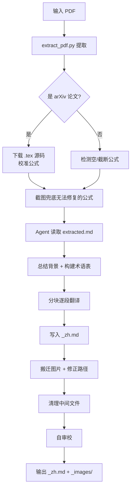

# translate_pdf — PDF 双语翻译工具

将英文技术 PDF（论文、规范、幻灯片）翻译为**中英双语对照的 Markdown 文档**。本工具采用"脚本提取 + Agent 翻译"的两阶段架构：Python 脚本负责从 PDF 中忠实提取文本、公式、代码、图片，AI Agent 按既定规则逐段翻译并生成双语稿。

---

## 功能特性

- **高保真提取**：基于 [Marker](https://github.com/VikParuchuri/marker) 将 PDF 转为 Markdown，保留标题层级、段落、列表、表格、数学公式。
- **代码块自动标注语言**：识别代码片段并自动加上 ` ```python`、` ```cpp ` 等语言标签，修正 PDF 提取造成的字符间空格。
- **图片无损导出**：统一输出 PNG 格式；当 PyMuPDF 能提取到比 Marker 更高分辨率的原始嵌入图片时自动替换。
- **矢量图兜底**：自动检测 Marker 遗漏的矢量插图，按页面区域渲染为 PNG 补全，避免图片缺失。
- **OCR 文字识别**：对文字密集型图片（架构图、流程图等）自动跑 OCR，输出 `ocr_report.json` 供 Agent 在译文中补充"图片文字翻译"。
- **公式质量三级策略**（由 Skill 流程驱动）：
  1. arXiv 论文优先下载 `.tex` 源码，全面校准并展开自定义宏；
  2. 非 arXiv 论文使用 Marker 提取结果并检测空/截断公式；
  3. 无法修复的公式用 PDF 截图兜底。
- **术语一致性**：翻译前自动构建术语表（20–50 条），全文保持同一译法。
- **GPU 加速**：自动检测 CUDA，用 GPU 跑 Marker 与 EasyOCR，CPU 兜底。

---

## 目录结构

```
translate_pdf/
├── __init__.py          # 包声明，版本号
├── extract_pdf.py       # 提取脚本（本包的唯一可执行入口）
├── requirements.txt     # Python 依赖清单
├── SKILL.md             # Agent 工作流程（Cursor Skill 规范）
└── README.md            # 本文件
```

---

## 安装

### 1. Python 依赖

```bash
pip install -r requirements.txt
```

依赖包说明：

| 包 | 用途 |
|----|------|
| `marker-pdf` | PDF → Markdown 主引擎 |
| `PyMuPDF` | 原始图片提取、矢量图渲染、公式截图 |
| `pytesseract` | OCR 识别（需系统安装 Tesseract） |
| `Pillow` | 图片处理 |
| `easyocr` | 备用 OCR 引擎，支持 GPU |

### 2. 系统依赖（OCR）

```bash
sudo apt-get install tesseract-ocr
```

### 3. GPU（可选但推荐）

若机器有 NVIDIA GPU，装对应 CUDA 版本的 PyTorch 后，脚本会自动启用 GPU 加速 Marker 和 EasyOCR。

---

## 使用方式

本工具有两种使用场景：**作为 Cursor Skill 被 Agent 调用**（推荐）或 **作为独立命令行脚本调用**。

### 方式一：作为 Cursor Skill 使用（推荐）

将本目录放到 Cursor 的 skills 目录下（如 `~/.cursor/skills/translate-pdf/`），然后对 Agent 说：

> "翻译这个 PDF `~/papers/attention.pdf`"

Agent 会按 `SKILL.md` 定义的流程自动完成：

1. 运行 `extract_pdf.py` 提取 PDF
2. 若为 arXiv 论文则下载 `.tex` 源码优化公式
3. 读取 `extracted.md` 并总结论文背景、构建术语表（与用户确认）
4. 逐段翻译，生成 `{PDF文件名}_zh.md`
5. 搬迁图片到 `{PDF文件名}_images/` 并修正引用路径
6. 清理中间文件
7. 自审校（漏翻、术语一致性、公式渲染、图片完整性）

### 方式二：仅用 extract_pdf.py 提取

仅需 PDF → Markdown 中间产物，不需要翻译：

```bash
python3 extract_pdf.py <input.pdf> [output_dir] [options]
```

**参数**：

| 参数 | 说明 |
|------|------|
| `<input.pdf>` | 输入 PDF 路径（必填） |
| `[output_dir]` | 输出目录（可选，默认 `{PDF文件名}_extracted/`） |
| `--ocr-threshold N` | 识别为"文字密集"图片的最少词数，默认 `20` |
| `--no-ocr` | 跳过 OCR 处理 |
| `--device auto\|cpu\|cuda` | 计算设备，默认 `auto` |

**产物**：

```
{output_dir}/
├── extracted.md         # Markdown 主文件
├── images/              # 所有图片（统一 PNG 格式）
└── ocr_report.json      # 文字密集型图片的 OCR 结果（如启用 OCR）
```

同时向 stdout 输出 JSON 摘要，供上层 Agent 解析：

```json
{
  "markdown_file": "...",
  "markdown_lines": 1234,
  "total_images": 9,
  "text_heavy_images": 2,
  "device": "cuda"
}
```

---

## 翻译产物规范

由 Skill 驱动的翻译产物遵循以下格式约定（详见 `SKILL.md`）：

- **标题**：`## Introduction / 引言`
- **段落**：英文置于引用块 `>` 中，中文译文紧随其后空一行

  ```markdown
  > We propose a novel framework for neural machine translation.

  我们提出了一种新的神经机器翻译框架。
  ```

- **数学公式**：LaTeX 原样保留；遵守 GitHub 渲染兼容规则
  - 用 `\lvert` / `\rvert` 代替 `|`
  - 用 `^{\ast}` 代替 `^*`
  - 函数名下划线用 `\mathrm{func\_name}`
- **代码块**：保留 `extract_pdf.py` 自动添加的语言标签，代码内容不翻译
- **图片**：保留全部原图（包括矢量图），带 caption 的翻译 caption；文字密集型图片附 OCR 译文
- **最终文件**：`{PDF文件名}_zh.md` 与 `{PDF文件名}_images/` 置于 PDF 同级目录

---

## 工作流概览



---

## 常见问题

### Q1: 为什么公式渲染不正常？

GitHub 对 LaTeX 的解析比较严格，常见坑：
- `|` 会被当作表格分隔符 → 用 `\lvert` / `\rvert`
- `^*` 会触发 Markdown 强调 → 用 `^{\ast}`
- 函数名里的 `_` 会被解析为斜体 → 用 `\mathrm{xxx\_yyy}`

这些规则已写入 Skill，由 Agent 在翻译时统一遵守。

### Q2: 有些图片丢失了怎么办？

`extract_pdf.py` 内置 `_add_missing_vector_figures()`，会自动检测 Marker 遗漏的矢量图并渲染补全。若仍有遗漏，可手动用 PyMuPDF 渲染对应页面区域。

### Q3: 大文档会内存溢出吗？

Skill 规定超过 500 行的 `extracted.md` 按一/二级标题分块处理，每块 100–300 行。翻译每块时附带背景摘要、术语表、前一块末尾 20–30 行作为重叠上下文，兼顾内存与连贯性。

### Q4: 如何保证术语一致？

翻译开始前 Agent 会扫描全文建立术语表（20–50 条），每个翻译分块都附带该术语表。Skill 的易错术语提示列出了常见误译（如 `integral coordinate` = 整数坐标，非积分坐标）。

---

## 实际案例

输入 PDF：`2603.02298v1_CuTeLayoutRepresentationAndAlgebra.pdf`（NVIDIA CuTe 布局代数论文，33 页）

产出：
- `2603.02298v1_CuTeLayoutRepresentationAndAlgebra_zh.md`（2299 行双语 Markdown）
- `2603.02298v1_CuTeLayoutRepresentationAndAlgebra_images/`（9 张 PNG 图片）

该论文包含大量 LaTeX 数学公式和技术图表，通过三级公式策略（arXiv `.tex` 源码 → Marker → 截图兜底）确保公式完整性；全部图表配中文 caption。

---

## 版本

当前版本：`0.2.0`（见 `__init__.py`）

## 许可证

内部工具，随项目仓库授权。
